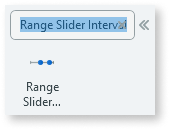
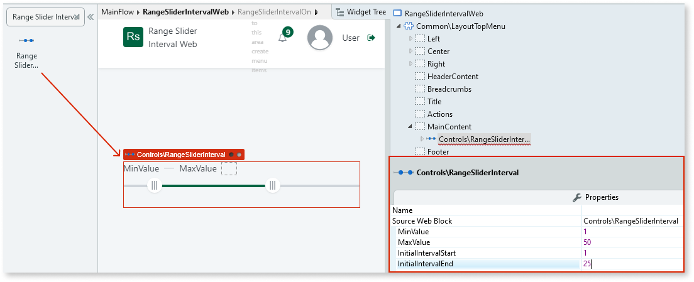
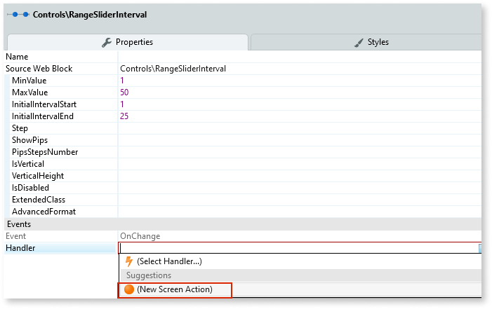
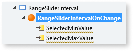
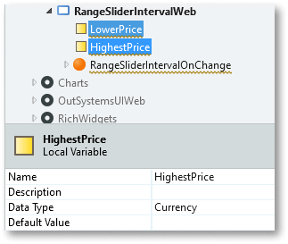
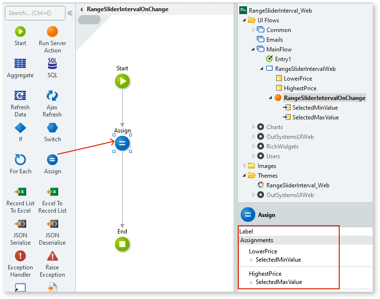
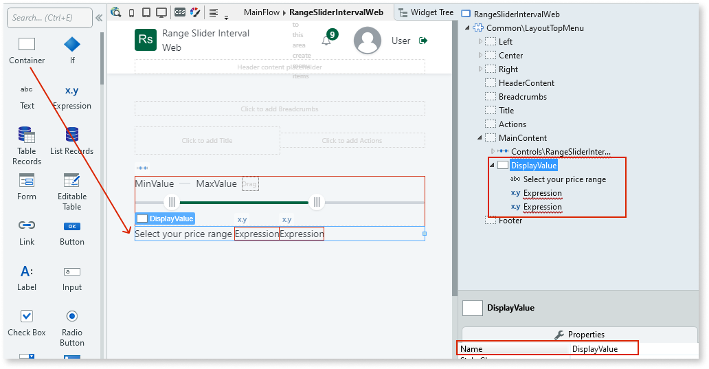
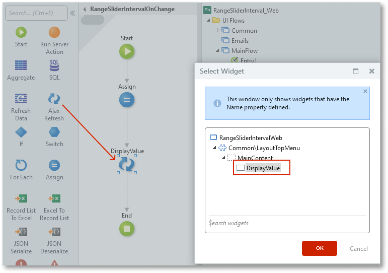
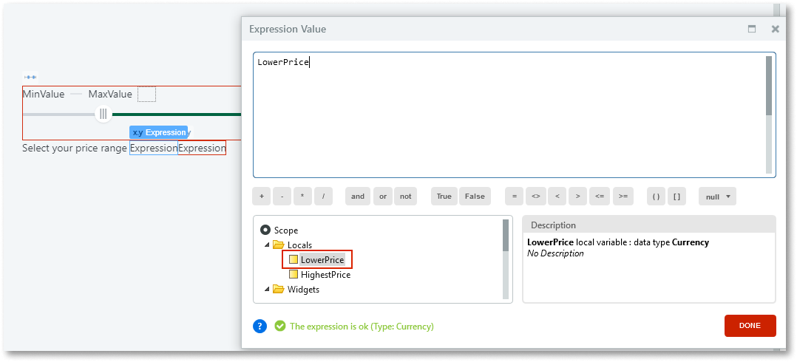
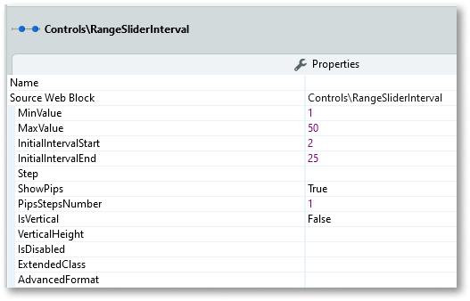

# Range Slider Interval

Applies only to Traditional Web Apps.

You can use the Range Slider Interval Pattern to allow users select a single value between two range values. This pattern enables the adjustment of content by predetermined intervals and within a chosen range. Moving the slider along the track, increases or decreases the value.

## How to use the Range Slider Interval UI Pattern

In this example, we create a Range Slider Interval that allows the user select a price range between 1-50.

1. In Service Studio, in the Toolbox, search for `Range Slider Interval`.

    The Range Slider Interval widget is displayed.

    

    If the UI widget doesn't display, it's because the dependency isn't added. This happens because the Remove unused references setting is enabled. To make the widget available in your app:

    1. In the Toolbox, click **Search in other modules**.

    1. In **Search in other Modules**, remove any spaces between words in your search text.
    
    1. Select the widget you want to add from the **OutSystemsUIWeb** module, and click **Add Dependency**. 
    
    1. In the Toolbox, search for the widget again.

1. From the Toolbox, drag the Range Slider Interval widget into the Main Content area of your application's screen, and on the **Properties** tab, enter the **MinValue**, **MaxValue**, **InitialIntervalStart**, and **InitialIntervalEnd** values. In this example, we add static values.

    

1. To create an **OnChange** event, on the **Properties** tab, from the **Handler** drop-down, select **New Screen Action**.

    

    By default, the **SelectedMinValue** and **SelectedMaxValue** input parameter are created.  

    

1. To create a variable for each of the expressions, right-click your screen name, select **Add Local Variable**, and on the **Properties** tab, enter a name and data type. In this example we create the **LowerPrice** and **HighestPrice** variables with the **Currency** data type.

     

1. So that the parameters read the range slider selections, double-click your screen action, from the Toolbox, add the **Assign** action to the screen action, and set the variable and value assignments for the Assign action. 

     

1. To display your selection, go back to your screen, and from the Toolbox, drag the Container widget into the Main Content area of your application's screen, enter a name and add your content to the Container placeholder. In this example, we enter ``DisplayValue`` for the name and add some text and an expression for each of the input parameters.

    

1. Go back to the screen action, and from the Toolbox, add the **Ajax Refresh** action to the screen action, and in the **Select Widget** pop-up, navigate to and select the Container widget name (in this example, DisplayValue), and click **OK**.

    

1. To bind the **SelectedMinValue** variable to the expression, double-click the expression widget, and in the **Expression Value** editor, select the variable you just have created, and click **Close**.

    

1. Repeat step 8 for the **SelectedMaxValue** input parameter.

1. From the **Properties** tab, you can change the Range Slider's look and feel by setting the (optional) properties.

    

After following these steps and publishing the module, you can test the pattern in your app. 

## Properties

| **Property** | **Description** |
|---|---|
| MinValue (Decimal): Mandatory | Slider's minimum value. 
Examples <ul><li>0 - The slider's minimum value is 0.</li><li>12 - The slider's minimum value is 12</li> </ul>
 |
| MaxValue (Decimal): Mandatory | Slider's maximum value. 
Examples <ul><li>100 - The slider's maximum value is 100.</li></ul>
 |
|InitialIntervalStart | Start value selected by default when the page is rendered. Must be between min and max values. 
Examples <ul><li>10 - Slider's default start value when the page is rendered is 10.</li></ul>
 
|InitialIntervalEnd | End value selected by default when the page is rendered. Must be between min and max values. 
Examples <ul><li>10 - Slider's default end value when the page is rendered is 10.</li></ul>
 
|Step (Decimal): Optional | The slider moves in increments of steps.
Examples <ul><li>Blank - The slider increases in steps of 1. This is the default value. </li><li>10 - The slider increases in steps of 10.</li></ul>

|ShowPips (Boolean): Optional | If True, pips are shown below the slider. This is the default value. If False, no pips are shown. |
|PipsStepNumber (Integer): Optional | Sets the number of Pip steps. This property is only applicable if the ShowPips property is set to True. |
|IsVertical (Boolean): Optional | If True, the slider orientation is vertical. If False, the slider orientation is horizontal. |
|VerticalHeight (Integer): Optional | If IsVertical is True, use this property to set the height (in px) of the slider. 
Examples <ul><li>Blank - The slider is 100px high. This is the default value. </li><li>250 - The slider is 250px high.</li></ul>
 |
|IsDisabled (Boolean): Optional | If True, the slider is disabled. If False, the slider is enabled. This is the default value. |
| ExtendedClass (Text): Optional | Adds custom style classes to the Pattern. You define your [custom style classes](../../../look-feel/css.md) in your application using CSS.  Examples   <ul><li>Blank - No custom styles are added (default value).</li><li>"myclass" - Adds the ``myclass`` style to the UI styles being applied.</li><li>"myclass1 myclass2" - Adds the ``myclass1`` and ``myclass2`` styles to the UI styles being applied.</li></ul>You can also use the classes available on the OutSystems UI. For more information, see the [OutSystems UI Cheat Sheet](https://outsystemsui.outsystems.com/OutSystemsUIWebsite/CheatSheet). |
|AdvancedFormat (Text): Optional | Allows you to use more options than what is provided in the input parameters. For more information, see [noUiSlider library](https://refreshless.com/nouislider/). 
 Example <ul><li> `{ pips: { density: 1 } }` </li></ul>
 |
