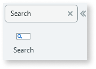
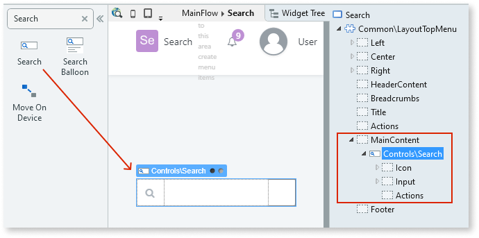
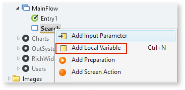
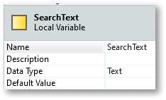

# Search

Applies only to Traditional Web Apps.

You can use the Search UI Pattern to provide users with a search field.

**How to use the Search UI Pattern**

1. In Service Studio, in the Toolbox, search for `Search`.

    The Search widget is displayed.

    

    If the UI widget doesn't display, it's because the dependency isn't added. This happens because the Remove unused references setting is enabled. To make the widget available in your app:

    1. In the Toolbox, click **Search in other modules**.

    1. In **Search in other Modules**, remove any spaces between words in your search text.

    1. Select the widget you want to add from the **OutSystemsUIWeb** module, and click **Add Dependency**.

    1. In the Toolbox, search for the widget again.

1. From the Toolbox, drag the Search widget into the Main Content area of your application's screen.

    

    By default, the Search widget contains Icon, Input, and Actions placeholders.

1. Create a local variable by right-clicking on your screen name and selecting **Add Local Variable**.

    

1. Enter a name for the variable. In this example, we enter ``SearchText``.

   

After following these steps and publishing the module, you can test the pattern in your app.

## Properties

| **Properties** | **Description** |
|---|---|
| ExtendedClass (Text): Optional | Adds custom style classes to the Pattern. You define your [custom style classes](../../../look-feel/css.md) in your application using CSS.  Examples   <ul><li>Blank - No custom styles are added (default value).</li><li>"myclass" - Adds the ``myclass`` style to the UI styles being applied.</li><li>"myclass1 myclass2" - Adds the ``myclass1`` and ``myclass2`` styles to the UI styles being applied.</li></ul>You can also use the classes available on the OutSystems UI. For more information, see the [OutSystems UI Cheat Sheet](https://outsystemsui.outsystems.com/OutSystemsUIWebsite/CheatSheet). |
