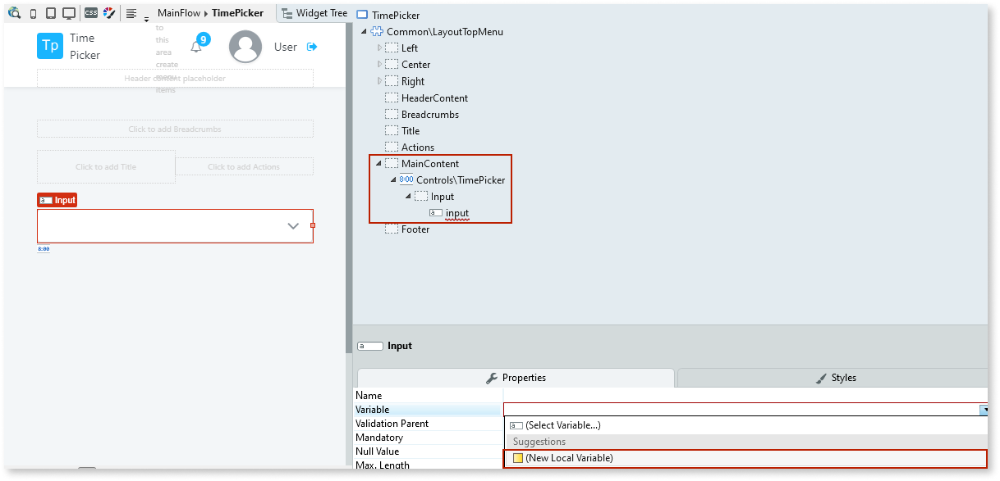
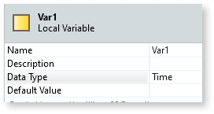
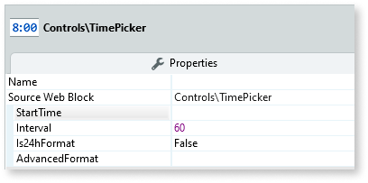

# Time Picker 

Applies only to Traditional Web Apps.

You can use the Time Picker UI Pattern to select a single time from a drop-down list.

  <iframe src="https://player.vimeo.com/video/977630997" width="750" height="281" frameborder="0" allow="autoplay; fullscreen" allowfullscreen="">Video demonstrating the interaction with the Time Picker UI Pattern in a Traditional Web App.</iframe>

**How to use the Time Picker UI Pattern**

1. In Service Studio, in the Toolbox, search for `Time Picker`.

    The Time Picker widget is displayed.

    

    If the UI widget doesn't display, it's because the dependency isn't added. This happens because the Remove unused references setting is enabled. To make the widget available in your app:

    1. In the Toolbox, click **Search in other modules**.

    1. In **Search in other Modules**, remove any spaces between words in your search text.
    
    1. Select the widget you want to add from the **OutSystemsUIWeb** module, and click **Add Dependency**. 
    
    1. In the Toolbox, search for the widget again.

1. From the Toolbox, drag the Time Picker widget into the Main Content area of your application's screen.

    

1. By default, the Time Picker widget contains an Input widget. It is mandatory to create a new local variable for this Input widget.

    

1. Set the variable **Data Type** to **Time**.

    

1. On the **Properties** tab, you can change the look and feel of the Time Picker widget by setting the (optional) properties.

    

1. After following these steps and publishing the module, you can test the pattern in your app.

## Properties

| **Property** | **Description** |
|---|---|
| StartTime (Time): Optional | The first time option that appears in the drop-down. Make sure that the time is set according to the **Interval** property (if set).   Examples  <ul><li>Blank - 12:00am is displayed as the first option in the drop-down. This is the default. </li><li>15:00 - 15:00 is displayed as the first option in the drop-down.</li></ul> |
| Interval (Integer): Optional | Interval of time (in minutes) between the drop-down options.  Example<ul><li>Blank - The interval between each option is set to 30 minutes. This is the default.</li><li>60 - The interval between each option is set to 60 minutes.</li></ul> |
| Is24hFormat (Boolean): Optional | If True, the time format is 24 hour. This is the default. If False, the time format is 12 hour. |
| AdvancedFormat (TimePickerAdvancedFormat): Optional | Allows for more options than the ones given in the input parameters.  **Inputs**  TimePickerAdvancedFormat  <ul><li> DisabledTimes (Time List)</li><li> MinTime (Time)</li> <li>MaxTime (Time)</li> <li>StartEmpty (Boolean)</li></ul> |
  