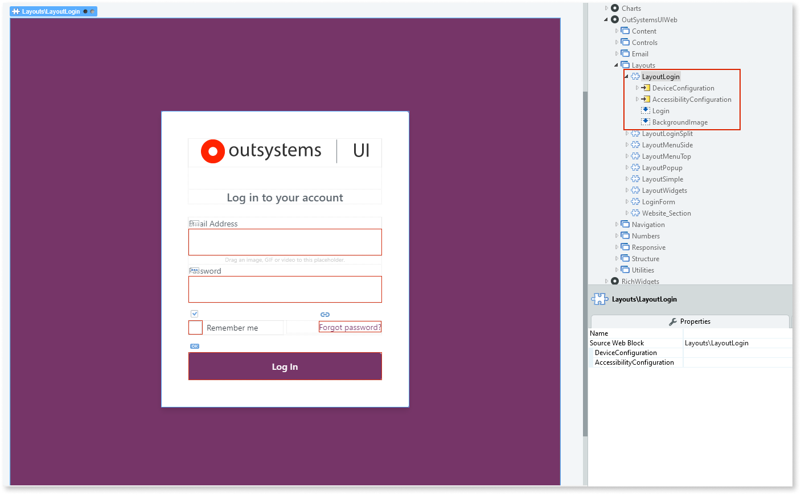

# Layout Login

Applies only to Traditional Web Apps.

The Layout Login is a pre-existing web block for a login screen. The web block is located in **UI Flows > OutSystemsUIWeb > Layouts**, and contains various placeholders and widgets that you can customize. You can then reuse and apply the web block to any of the screens in your app.

## Properties

| **Property** |  **Description** |
|---|---|
| DeviceConfiguration (DeviceConfig): Optional  |  Configuration that changes the default values that apply when the application is viewed on a phone, tablet, or desktop. |
| AccessibilityConfiguration (AccessibilityConfiguration): Optional | Configuration that changes the default values for the options that reset tab index values and the options that add a visible outline to focused elements. |
