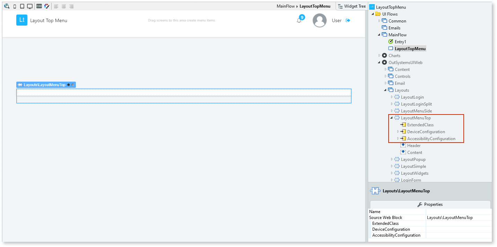

# Layout Top Menu

Applies only to Traditional Web Apps.

The Layout Top Menu is a pre-existing web block for a fixed top menu and is useful for simple apps, without a complex navigation structure. The web block is located in **UI Flows > OutSystemsUIWeb > Layouts**, and contains various placeholders and widgets that you can customize. You can then reuse and apply the web block to any of the screens in your app.

## Properties

| **Property** |  **Description** |
|---|---|
| DeviceConfiguration (DeviceConfig): Optional  |  Configuration that changes the default values that apply when the application is viewed on a phone, tablet, or desktop. |
| AccessibilityConfiguration (AccessibilityConfiguration): Optional | Configuration that changes the default values for the options that reset tab index values and the options that add a visible outline to focused elements. |
| ExtendedClass (Text): Optional  |  Adds custom style classes to the Pattern. You define your [custom style classes](../../../look-feel/css.md) in your application using CSS.  Examples   <ul><li>Blank - No custom styles are added (default value).</li><li>"myclass" - Adds the ``myclass`` style to the UI styles being applied.</li><li>"myclass1 myclass2" - Adds the ``myclass1`` and ``myclass2`` styles to the UI styles being applied.</li></ul>You can also use the classes available on the OutSystems UI. For more information, see the [OutSystems UI Cheat Sheet](https://outsystemsui.outsystems.com/OutSystemsUIWebsite/CheatSheet). |
