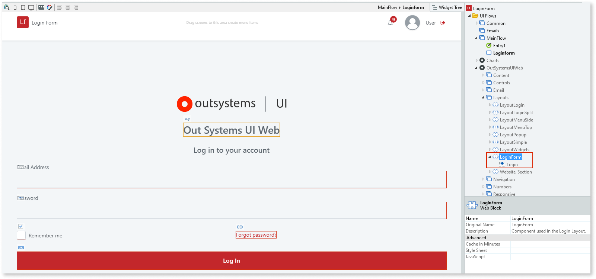

# Login Form

Applies only to Traditional Web Apps.

The Login Form is a pre-existing web block that can be used to accelerate the creation of a custom login page. The web block is located in **UI Flows > OutSystemsUIWeb > Layouts** and contains various placeholders and widgets that you can customize. You can then reuse and apply the web block to any of the screens in your app. 

