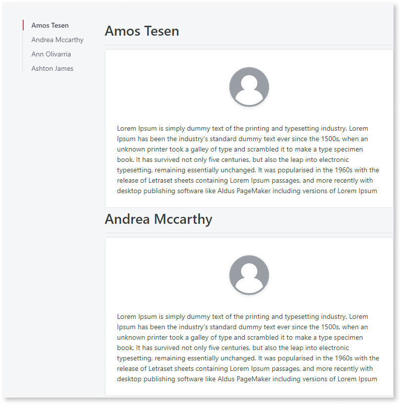
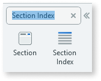
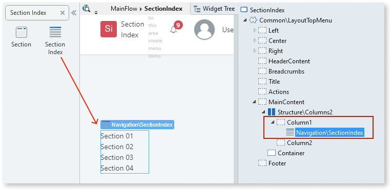
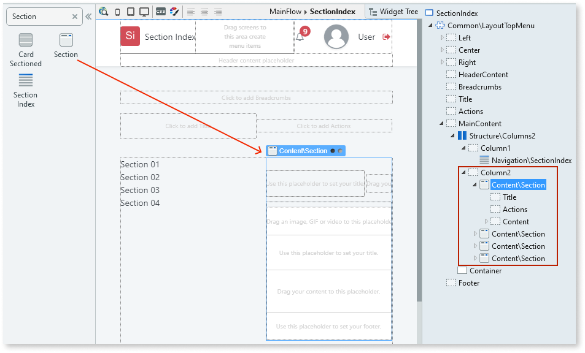
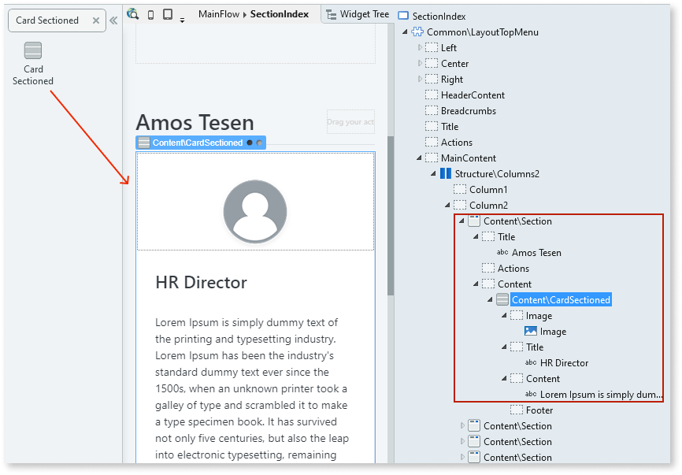
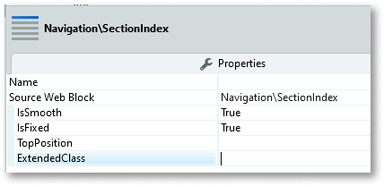

# Section Index

Applies only to Traditional Web Apps.

You can use the Section Index UI Pattern to organize the content of a screen, enabling quick navigation within the page.

**How to use the Section Index UI Pattern**

1. In Service Studio, in the Toolbox, search for `Section Index`.

    The Section Index widget is displayed.

    

    If the UI widget doesn't display, it's because the dependency isn't added. This happens because the Remove unused references setting is enabled. To make the widget available in your app:

    1. In the Toolbox, click **Search in other modules**.

    1. In **Search in other Modules**, remove any spaces between words in your search text.
    
    1. Select the widget you want to add from the **OutSystemsUIWeb** module, and click **Add Dependency**. 
    
    1. In the Toolbox, search for the widget again.

1. From the Toolbox, drag the Section Index widget into the Main Content area of your application's screen.

    In this example, we drag the Section Index widget into a column. 

    

1. In the Toolbox, search for and drag the Section widget into the Main Content area of your application's screen. Add as many sections as you require for your app.

    In this example, we drag 4 Section widgets [into a column](../../../../../building-apps/ui/patterns/web/structure/columns.md). Each section widget contains Title, Actions, and Content placeholders. 

    

1. Add the relevant content to Section widget's **Title** and **Content** placeholders.

    In this example, we add employee names to the **Title** placeholders, and Card Sectioned widgets with some text and images to the **Content** placeholder.

    

    A link is automatically created to every section you have on the screen. The name of the link is based on the text you entered in the **Title** placeholder of each section. In the following example, the links are set to the employee names we entered in step 2.

    

1. On the **Properties** tab, you can customize the Section Index's look and feel by setting any of the optional properties.

    

After following these steps and publishing the module, you can test the pattern in your app.

## Properties

| **Property**                    | **Description**                                                                                                                                                                                                                                                                                                                                                                                                                                                                                                                                                                                                                    |
|---------------------------------|------------------------------------------------------------------------------------------------------------------------------------------------------------------------------------------------------------------------------------------------------------------------------------------------------------------------------------------------------------------------------------------------------------------------------------------------------------------------------------------------------------------------------------------------------------------------------------------------------------------------------------|
| IsSmooth (Boolean): Optional    | If True, the navigation to the destination is animated. If False, the navigation is instant. This is the default.                                                                                                                                                                                                                                                                                                                                                                                                                                                                                                                  |
| IsFixed (Text): Optional        | If True, the Section Index Pattern is always in the same position on the screen. This is the default. If False, the Section Index Pattern scrolls with the page content.                                                                                                                                                                                                                                                                                                                                                                                                                                                           |
| TopPosition (Integer): Optional | Distance in pixels from the top of the page to the first item in the section index.                                                                                                                                                                                                                                                                                                                                                                                                                                                                                                                                                |
| ExtendedClass (Text): Optional  | Adds custom style classes to the Pattern. You define your [custom style classes](../../../look-feel/css.md) in your application using CSS.  Examples   <ul><li>Blank - No custom styles are added (default value).</li><li>"myclass" - Adds the ``myclass`` style to the UI styles being applied.</li><li>"myclass1 myclass2" - Adds the ``myclass1`` and ``myclass2`` styles to the UI styles being applied.</li></ul>You can also use the classes available on the OutSystems UI. For more information, see the [OutSystems UI Cheat Sheet](https://outsystemsui.outsystems.com/OutSystemsUIWebsite/CheatSheet). |
  
## Additional notes

Remember to use the **Title** placeholder in the Section Index pattern as this defines the text for each Section Index link.

## Device compatibility

In Internet Explorer, `position: fixed` is used instead of `position sticky` as the latter is unsupported.

## Compatibility with other patterns

This UI pattern only works with the Section Pattern in the same screen.
