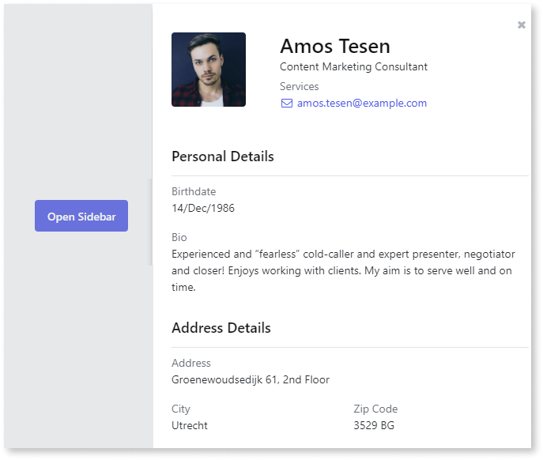
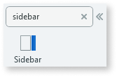
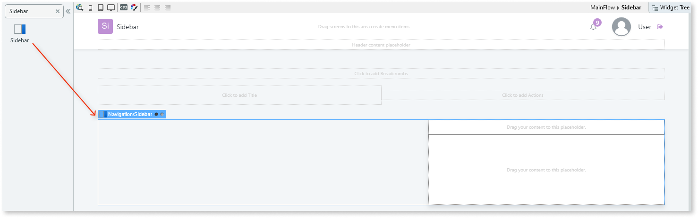
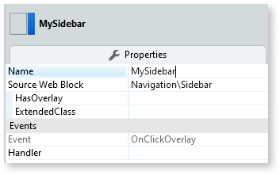
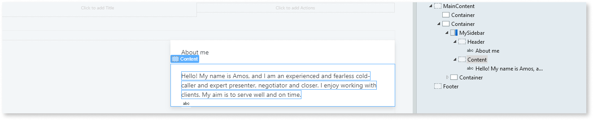
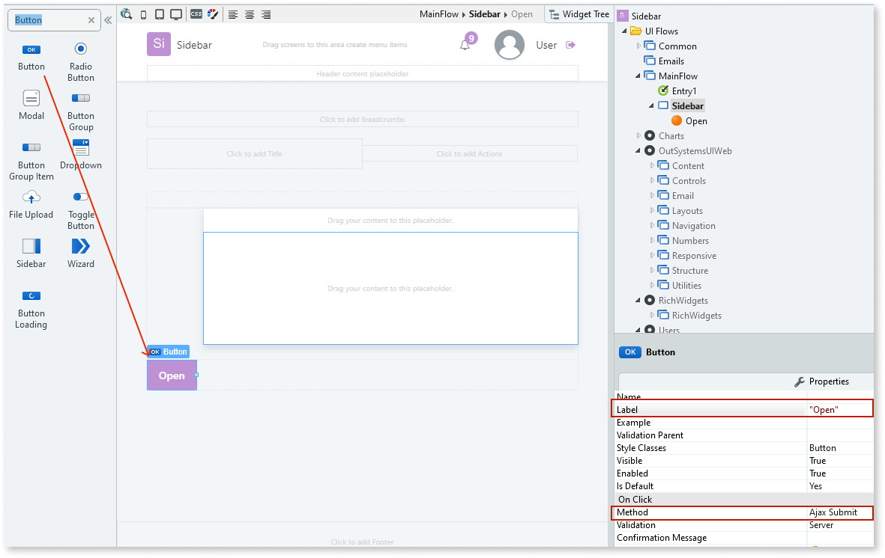
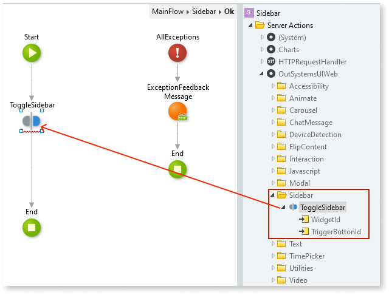
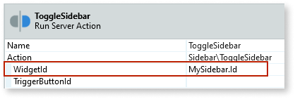

# Sidebar

Applies only to Traditional Web Apps.

You can use the Sidebar UI Pattern to display additional information in the margin of the main content. The additional information supports the user's understanding of the main content.

**How to use the Sidebar UI Pattern**

In this example, we create a button that opens and closes the Sidebar widget.

1. In Service Studio, in the Toolbox, search for `Sidebar`.

    The Sidebar widget is displayed.

    

    If the UI widget doesn't display, it's because the dependency isn't added. This happens because the Remove unused references setting is enabled. To make the widget available in your app:

    1. In the Toolbox, click **Search in other modules**.

    1. In **Search in other Modules**, remove any spaces between words in your search text.

    1. Select the widget you want to add from the **OutSystemsUIWeb** module, and click **Add Dependency**.

    1. In the Toolbox, search for the widget again.

1. From the Toolbox, drag the Sidebar widget into the Main Content area of your application's screen.

    

1. On the **Properties** tab, in the **Name** field, enter a name for the Sidebar widget. In this example, we call it **MySidebar**.

    

1. Add your content to the Header and Content placeholders, for example, forms, images, text etc. In this example we add some text.

    

1. From the Toolbox, drag the Button widget just below the Sidebar widget and on the **Properties** tab, in the **Label** field, enter the text you want to appear on the button (in this example, we enter **Open**) and from the **Method** drop-down, select **Ajax Submit**.

    

1. To create a screen action for the button, double-click the button, select the **Logic** tab, and from the **Server Actions** folder, navigate to and drag the ToggleSidebar action onto the screen action.

    

1. On the **Properties** tab, from the **WidgetId** drop-down, select the Id for the widget. In this example, **MySidebar.Id**.

    

After following these steps and publishing the module, you can test the pattern in your app.

## Properties

| **Property**                   | **Description**                                                                                                                                                                                                                                                                                                                                                                                                                                                                                                                                                                                                                    |
|--------------------------------|------------------------------------------------------------------------------------------------------------------------------------------------------------------------------------------------------------------------------------------------------------------------------------------------------------------------------------------------------------------------------------------------------------------------------------------------------------------------------------------------------------------------------------------------------------------------------------------------------------------------------------|
| HasOverlay(Boolean): Optional  | If set to True, an overlay is displayed behind the Sidebar. If set to False, there is no overlay. This is the default value.                                                                                                                                                                                                                                                                                                                                                                                                                                                                                                       |
| ExtendedClass (Text): Optional | Adds custom style classes to the Pattern. You define your [custom style classes](../../../look-feel/css.md) in your application using CSS.  Examples   <ul><li>Blank - No custom styles are added (default value).</li><li>"myclass" - Adds the ``myclass`` style to the UI styles being applied.</li><li>"myclass1 myclass2" - Adds the ``myclass1`` and ``myclass2`` styles to the UI styles being applied.</li></ul>You can also use the classes available on the OutSystems UI. For more information, see the [OutSystems UI Cheat Sheet](https://outsystemsui.outsystems.com/OutSystemsUIWebsite/CheatSheet). |
