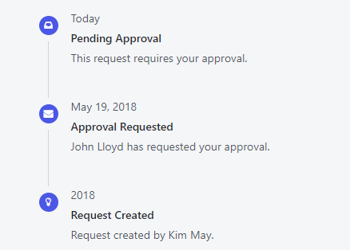
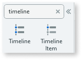
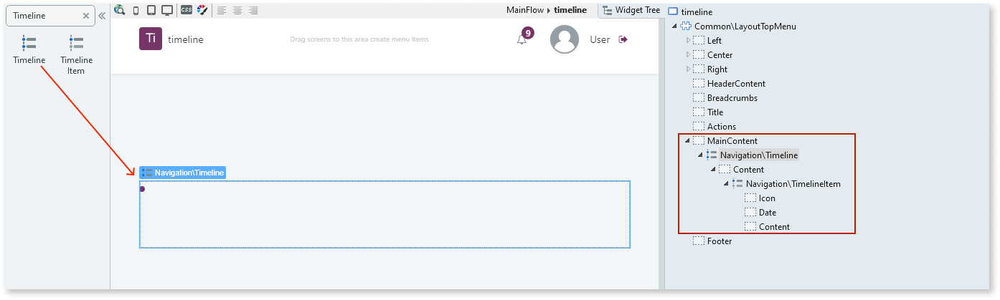
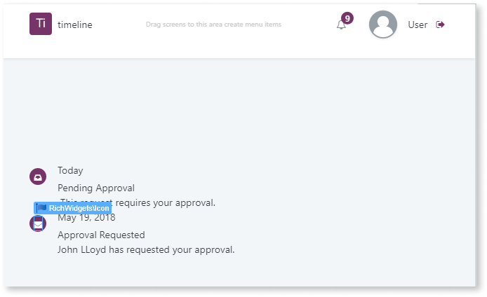

# Timeline

Applies only to Traditional Web Apps.

You can use the Timeline UI Pattern to show related events in a chronological order, such as a user’s upcoming, current, and past activities.

**How to use the Timeline UI Pattern**

1. In Service Studio, in the Toolbox, search for `Timeline`.

    The Timeline widget is displayed.

    

    If the UI widget doesn't display, it's because the dependency isn't added. This happens because the Remove unused references setting is enabled. To make the widget available in your app:

    1. In the Toolbox, click **Search in other modules**.

    1. In **Search in other Modules**, remove any spaces between words in your search text.
    
    1. Select the widget you want to add from the **OutSystemsUIWeb** module, and click **Add Dependency**. 
    
    1. In the Toolbox, search for the widget again.

1. From the Toolbox, drag the Timeline widget onto your application’s screen.

    

    By default, the Timeline widget contains a Timeline Item widget which contains an Icon, Date, and Content placeholder. You can add as many Timeline Items as required.

1. Set the required content in the Icon, Date, and Content placeholders. In this example we add some text.

    

After following these steps and publishing the module, you can test the pattern in your app.

## Properties

**Timeline**

| **Property**                   | **Description**                                                                                                                                                                                                                                                                                                                                                                                                                                                                                                                                                                                                                    |
|--------------------------------|------------------------------------------------------------------------------------------------------------------------------------------------------------------------------------------------------------------------------------------------------------------------------------------------------------------------------------------------------------------------------------------------------------------------------------------------------------------------------------------------------------------------------------------------------------------------------------------------------------------------------------|
| ExtendedClass (Text): Optional | Adds custom style classes to the Pattern. You define your [custom style classes](../../../look-feel/css.md) in your application using CSS.  Examples   <ul><li>Blank - No custom styles are added (default value).</li><li>"myclass" - Adds the ``myclass`` style to the UI styles being applied.</li><li>"myclass1 myclass2" - Adds the ``myclass1`` and ``myclass2`` styles to the UI styles being applied.</li></ul>You can also use the classes available on the OutSystems UI. For more information, see the [OutSystems UI Cheat Sheet](https://outsystemsui.outsystems.com/OutSystemsUIWebsite/CheatSheet). |

**Timeline Item**

| **Property**                       | **Description**                                                                                                                                                                                                                                                                                                                                                                                                                                                                                                                                                                                                                    |
|------------------------------------|------------------------------------------------------------------------------------------------------------------------------------------------------------------------------------------------------------------------------------------------------------------------------------------------------------------------------------------------------------------------------------------------------------------------------------------------------------------------------------------------------------------------------------------------------------------------------------------------------------------------------------|
| Color (Color Identifier): Optional | Icon background color. Red, orange, yellow, lime, green, blue, violet, and pink are just some of predefined colors available for the badge. 
Examples <ul><li>Blank - The icon background color is the color you chose when creating the app (default value).</li><li>Entities.Color.Red - The icon background color is red.</li></ul>
                                                                                                                                                                                                                                                                                       |
| ExtendedClass (Text): Optional     | Adds custom style classes to the Pattern. You define your [custom style classes](../../../look-feel/css.md) in your application using CSS.  Examples   <ul><li>Blank - No custom styles are added (default value).</li><li>"myclass" - Adds the ``myclass`` style to the UI styles being applied.</li><li>"myclass1 myclass2" - Adds the ``myclass1`` and ``myclass2`` styles to the UI styles being applied.</li></ul>You can also use the classes available on the OutSystems UI. For more information, see the [OutSystems UI Cheat Sheet](https://outsystemsui.outsystems.com/OutSystemsUIWebsite/CheatSheet). |
