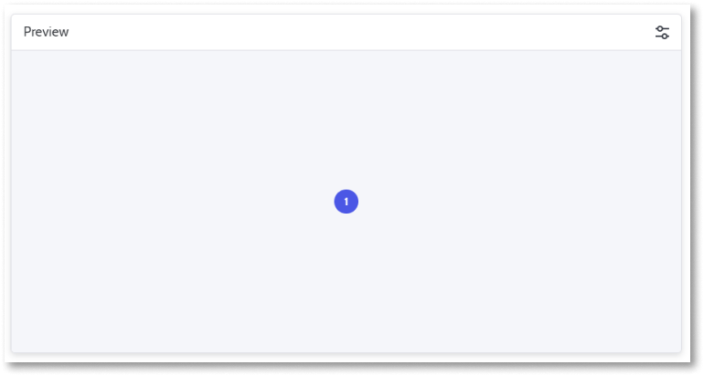
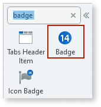
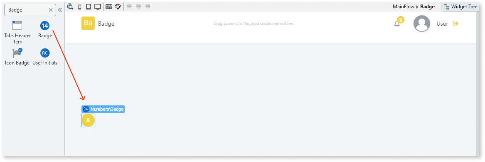
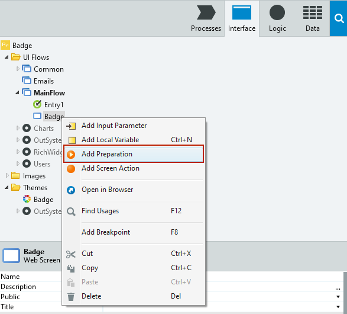
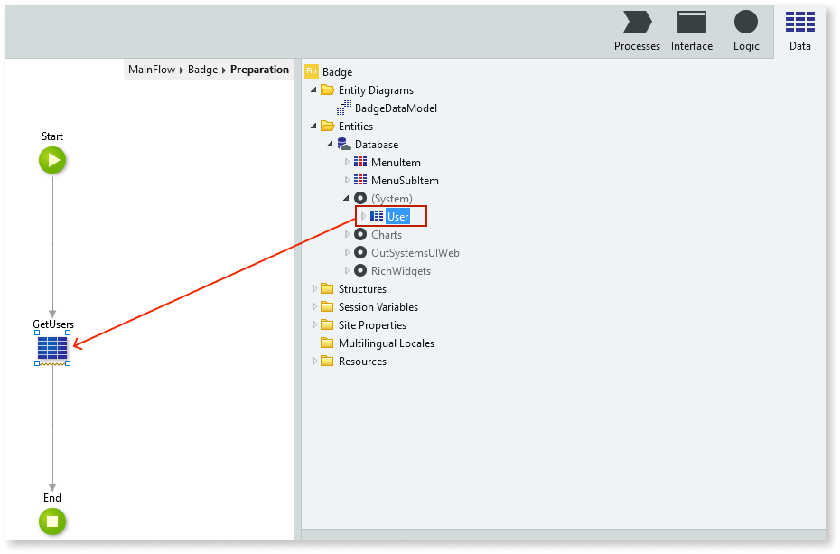
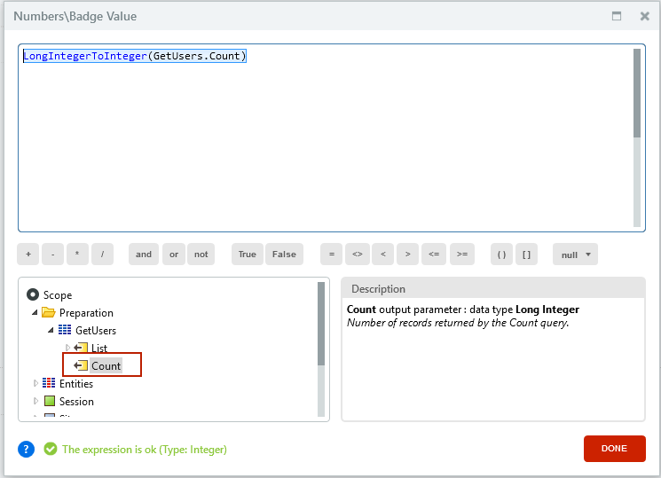
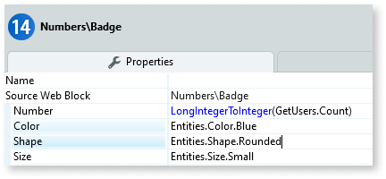
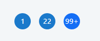

# Badge

Applies only to Traditional Web Apps.

You can use the Badge UI Pattern to display numerical information as a notification. For example, the Badge UI pattern is frequently used to notify users about the number of unread emails, unopened messages, or new tasks they may have.

**How to use the Badge UI Pattern**

The Badge UI Pattern usually displays dynamic information. In most cases, prior to using this pattern, you will need [to retrieve or update the Data](../../../../data/intro.md) that contains the information you want to display onscreen. You do this by using an [Action](../../../../logic/action-web.md). 

The following example demonstrates how you can display the number of registered users on your platform.

1. In Service Studio, in the Toolbox, search for `Badge`.

    The Badge widget is displayed.

    

    If the UI widget doesn't display, it's because the dependency isn't added. This happens because the Remove unused references setting is enabled. To make the widget available in your app:

    1. In the Toolbox, click **Search in other modules**.

    1. In **Search in other Modules**, remove any spaces between words in your search text.
    
    1. Select the widget you want to add from the **OutSystemsUIWeb** module, and click **Add Dependency**. 
    
    1. In the Toolbox, search for the widget again.

1. From the Toolbox, drag the Badge widget into the Main Content area of your application's screen.

    

1. From the Element tree, create a Preparation action by right-clicking on your screen, and from the drop-down, select **Add Preparation**.

    This Preparation action executes logic that fetches the data before the screen is displayed.

    

1. Select the **Data** tab, and from the Entities tree, navigate to the **User** entity and drag it onto the Preparation action.

    

    This creates an [aggregate](../../../../../ref/lang/auto/class-aggregate.md) that retrieves all of the users on your platform.

1. To reopen your screen, select the **Interface** tab, and double-click on your screen.

1. Select the Badge widget, and on the **Properties** tab, from the **Number** drop-down, select **Expression Editor**.

1. In the Expression Editor, enter the following expression and click **Close**.

    ``LongIntegerToInteger(GetUsers.Count)``

    Note: You can also add the expression by navigating through the Expression Editor's **Scope** tree and double-clicking on the **Count** output parameter. However, because the expected Badge [data type](../../../../../ref/data/data-types/available-data-types.md) (Integer) is different to the Count data type (Long Integer), to ensure the expression is correct, you must add `LongIntegerToInteger` to the `Get.Users.Count` expression.

   

   The **Number** property is now set to display the Count property of the Aggregate you added to the Preparation action, which gets the number of users on your platform and displays them in your Badge.

1. On the **Properties** tab, you can also customize the Badge's look and feel by setting any of the optional properties, for example, the color, shape, and size. The following example displays a blue, small sized, circle badge.  

    

After following these steps and publishing the module, you can test the pattern in your app.

## Properties

| Property                           | Description                                                                                                                                                                                                                                                                                                                                                                                                                                                                                                                                                                                                                                                            |
|------------------------------------|------------------------------------------------------------------------------------------------------------------------------------------------------------------------------------------------------------------------------------------------------------------------------------------------------------------------------------------------------------------------------------------------------------------------------------------------------------------------------------------------------------------------------------------------------------------------------------------------------------------------------------------------------------------------|
| Number (Integer): Optional         | Number that appears inside the badge. Set this to a Data source that contains the value that the Badge will display. Common use cases include displaying a value contained in a Variable or the result of an Aggregate (for instance, querying a 'Messages' table for the current user to return the count of new messages). 
Examples <ul><li>Blank - displays the number 8 (default value)</li><li>22 - displays the number 22</li><li>VariableName - displays the value that the variable "VariableName" holds at that time </li><li>ExampleAggregate.Count - displays the number of records returned by the "ExampleAggregate" aggregate execution</li></ul>
 |
| Color (Color Identifier): Optional | Set the badge color. Red, orange, yellow, lime, green, blue, violet, and pink are just some of predefined colors available for the badge. 
Examples <ul><li>Blank - displays the badge in the color you chose when creating the app (default value)</li><li>Entities.Color.Red - displays a red badge</li></ul>
                                                                                                                                                                                                                                                                                                                                                  |
| Shape (Shape Identifier): Optional | Set the badge shape. Rounded, soft rounded, and sharp are the predefined shapes available for the badge. 
Examples <ul><li>Blank - displays a rounded badge (default value)</li><li>Entities.Shape.Sharp - displays a square badge</li></ul>
                                                                                                                                                                                                                                                                                                                                                                                                                     |
| Size (Size Identifier): Optional   | Set the badge size. Small and medium are the predefined sizes available for the badge. 
Examples <ul><li>Blank - displays a medium sized badge (default value)</li><li>Entities.Size.Small - displays a small sized badge</li></ul>
                                                                                                                                                                                                                                                                                                                                                                                                                              |
| IsLight (Boolean): Optional        | Specify the badge's background color. 
Examples <ul><li>Blank - A darker hue of the color is applied to the badge and a lighter color to the text (default value)</li><li>True - A brighter hue of the color is applied to the badge and a darker color to the text.</li><li>False - A darker hue of the color is applied to the badge and a lighter color to the text</li></ul>
                                                                                                                                                                                                                                                                                 |
| ExtendedClass (Text): Optional     | Adds custom style classes to the Pattern. You define your [custom style classes](../../../look-feel/css.md) in your application using CSS.  Examples   <ul><li>Blank - No custom styles are added (default value).</li><li>"myclass" - Adds the ``myclass`` style to the UI styles being applied.</li><li>"myclass1 myclass2" - Adds the ``myclass1`` and ``myclass2`` styles to the UI styles being applied.</li></ul>You can also use the classes available on the OutSystems UI. For more information, see the [OutSystems UI Cheat Sheet](https://outsystemsui.outsystems.com/OutSystemsUIWebsite/CheatSheet).                                     |

## Additional notes

If the number on Badge Pattern is greater than 99, it is displayed as 99+.

