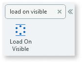
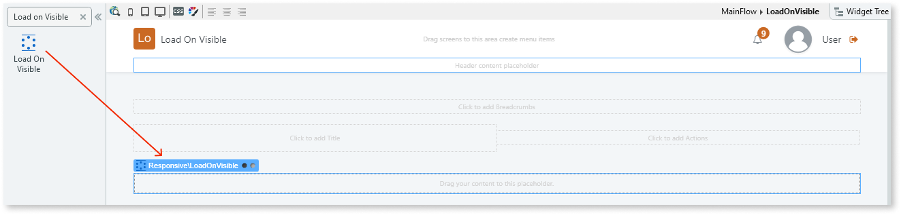
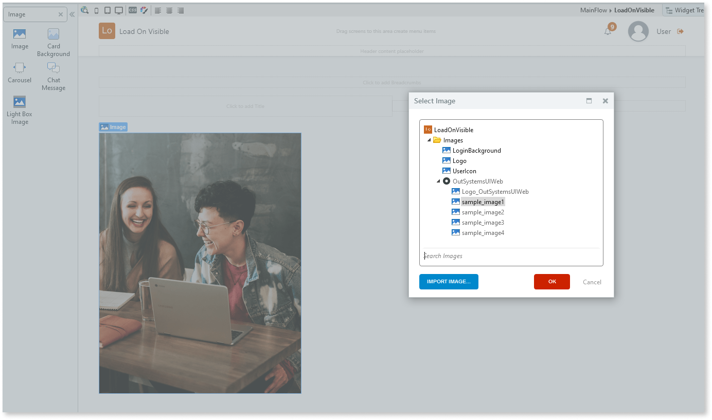

# Load on Visible

Applies only to Traditional Web Apps.

You can use the Load on Visible UI Pattern to enhance the speed of your application as well as improve user experience. Using this UI pattern, information is loaded onto the page only when it is visible to the user. For example, instead of loading all text and images onto a page at once, they only appear when the user scrolls down the page and the information/image becomes visible.

**How to use the Load on Visible UI Pattern**

1. In Service Studio, in the Toolbox, search for `Load on Visible`.

    The Load on Visible widget is displayed.

     

    If the UI widget doesn't display, it's because the dependency isn't added. This happens because the Remove unused references setting is enabled. To make the widget available in your app:

    1. In the Toolbox, click **Search in other modules**.

    1. In **Search in other Modules**, remove any spaces between words in your search text.

    1. Select the widget you want to add from the **OutSystemsUIWeb** module, and click **Add Dependency**.

    1. In the Toolbox, search for the widget again.

1. From the Toolbox, drag the Load on Visible widget into the Main Content area of your application's screen.

    

1. Add the required content to the placeholder inside the Load on Visible widget.

    In this example, we add images by dragging the Image widget into the Load on Visible widget and selecting an image from the sample OutSystems UI images.

    

After following these steps and publishing the module, you can test the pattern in your app.
