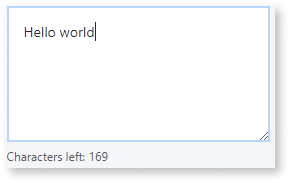
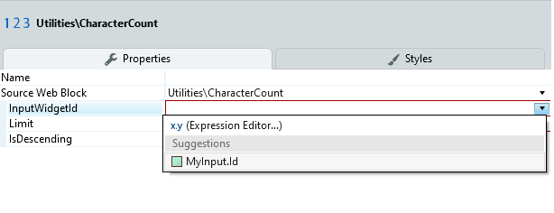
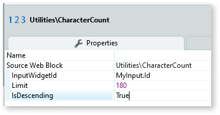

# Character Count

Applies only to Traditional Web Apps.

You can use the Character Count UI Pattern to display the number of characters a user has entered or has remaining for an onscreen text area.

**How to use the Character Count UI Pattern**

**Prerequisites:** You have created an [Input widget](<../../../../../ref/lang/auto/class-input-widget.md>) called MyInput and created a Local Variable called MyInputVariable with its Data Type set to Text.

1. In Service Studio, in the Toolbox, search for `Character Count`.

    The Character Count widget is displayed.

    

    If the UI widget doesn't display, it's because the dependency isn't added. This happens because the Remove unused references setting is enabled. To make the widget available in your app:

    1. In the Toolbox, click **Search in other modules**.

    1. In **Search in other Modules**, remove any spaces between words in your search text.

    1. Select the widget you want to add from the **OutSystemsUIWeb** module, and click **Add Dependency**.

    1. In the Toolbox, search for the widget again.

1. From the Toolbox, drag the Character Count widget into the Main Content area of your application's screen.

    

1. On the **Properties** tab, from the **InputWidgetId** drop-down, select the Input widget Id you have already created (MyInput).

    

1. In the **Limit** property, enter the maximum number of characters allowed, for example, 180, and set the **IsDescending** property to True.

    

    By setting the **Limit** property to 180, the user can enter up to 180 characters, and by setting the **IsDescending** property to True, the character count will go from 180 to 0.

After following these steps and publishing the module, you can test the pattern in your app.

## Properties

| Property                         | Description                                                                                                                                                                                                                                                                          |
|----------------------------------|--------------------------------------------------------------------------------------------------------------------------------------------------------------------------------------------------------------------------------------------------------------------------------------|
| InputWidgetId (Text): Mandatory  | The Input widget name that counts the characters. 
 Examples <ul><li>MyInput.Id - Counts the characters in the MyInput input widget.</li></ul> 
                                                                                                                                |
| Limit (Integer): Mandatory       | Character count limit. This value should be the same as the maximum length of the Input widget. 
 Examples <ul><li>180 - Sets the maximum number of characters a user can enter into the Input widget to 180</li></ul> 
                                                        |
| IsDescending (Boolean): Optional | Defines whether the count is ascending or descending. 
 Examples <ul><li>_False_ - The count goes from 0 to the value set for the **Limit** property</li><li>_True_ - The count goes from the value set in the **Limit** property to 0. This is the default setting.</li></ul>
 |
