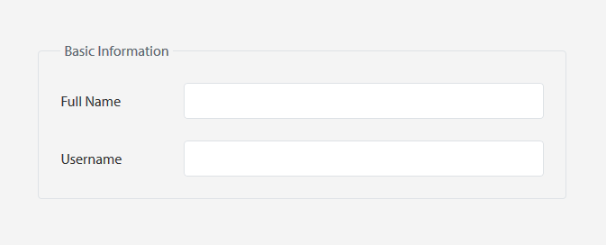
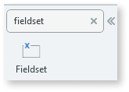
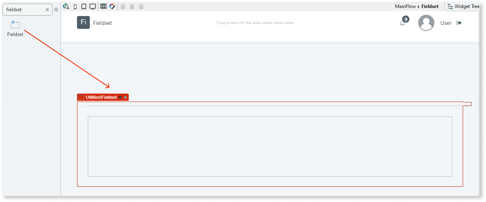
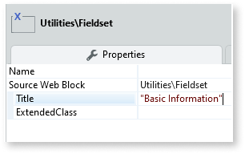

# Fieldset

Applies only to Traditional Web Apps.

You can use the Fieldset UI Pattern to group and label related information, such as a users personal details, improving the overall look and layout of your application.

**How to use the Fieldset UI Pattern**

1. In Service Studio, in the Toolbox, search for `Fieldset`.

    The Fieldset widget is displayed.

    

    If the UI widget doesn't display, it's because the dependency isn't added. This happens because the Remove unused references setting is enabled. To make the widget available in your app:

    1. In the Toolbox, click **Search in other modules**.

    1. In **Search in other Modules**, remove any spaces between words in your search text.
    
    1. Select the widget you want to add from the **OutSystemsUIWeb** module, and click **Add Dependency**. 
    
    1. In the Toolbox, search for the widget again.

1. From the Toolbox, drag the Fieldset widget into the Main Content area of your application's screen.

    

1. On the **Properties** tab, set the Title property.

    In the following example, we set the Title to `Basic Information`.

    

1. Add the relevant content to the placeholder, for example, text boxes and labels.

    

After following these steps and publishing the module, you can test the pattern in your app.

## Properties

| Properties                     | Description                                                                                                                                                                                                                                                                                                                                                                                                                                                                                                                                                                                                                        |
|--------------------------------|------------------------------------------------------------------------------------------------------------------------------------------------------------------------------------------------------------------------------------------------------------------------------------------------------------------------------------------------------------------------------------------------------------------------------------------------------------------------------------------------------------------------------------------------------------------------------------------------------------------------------------|
| Title (Text): Mandatory        | The Fieldset title.  
Examples <ul><li>"Basic Information" - the title is set to Basic Information</li></ul>
                                                                                                                                                                                                                                                                                                                                                                                                                                                                                                                 |
| ExtendedClass (Text): Optional | Adds custom style classes to the Pattern. You define your [custom style classes](../../../look-feel/css.md) in your application using CSS.  Examples   <ul><li>Blank - No custom styles are added (default value).</li><li>"myclass" - Adds the ``myclass`` style to the UI styles being applied.</li><li>"myclass1 myclass2" - Adds the ``myclass1`` and ``myclass2`` styles to the UI styles being applied.</li></ul>You can also use the classes available on the OutSystems UI. For more information, see the [OutSystems UI Cheat Sheet](https://outsystemsui.outsystems.com/OutSystemsUIWebsite/CheatSheet). |
