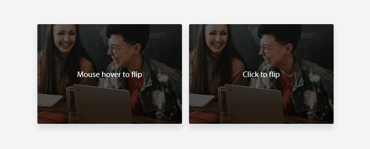
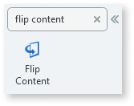
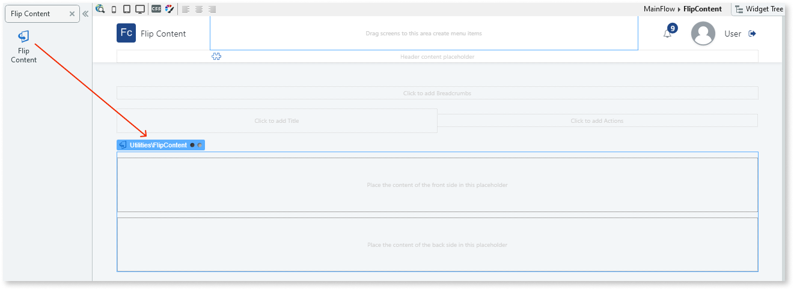
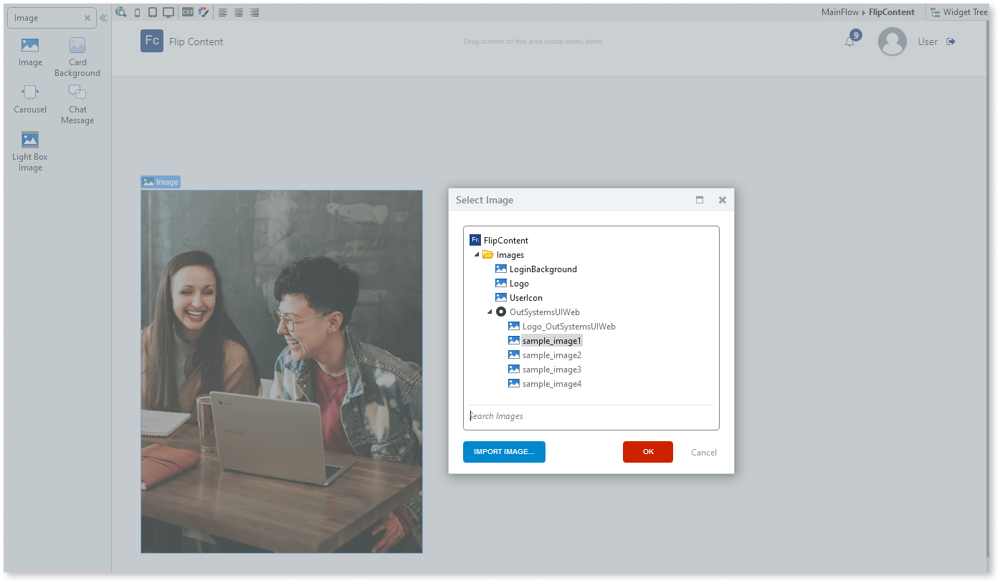
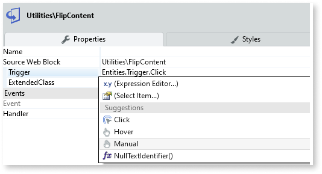

# Flip Content

Applies only to Traditional Web Apps.

 You can use the Flip Content UI Pattern to display information that when, for example, is clicked, flips and displays different information.

**How to use the Flip content UI Pattern**

1. In Service Studio, in the Toolbox, search for `Flip Content`.

    The Flip Content widget is displayed.

    

    If the UI widget doesn't display, it's because the dependency isn't added. This happens because the Remove unused references setting is enabled. To make the widget available in your app:

    1. In the Toolbox, click **Search in other modules**.

    1. In **Search in other Modules**, remove any spaces between words in your search text.
    
    1. Select the widget you want to add from the **OutSystemsUIWeb** module, and click **Add Dependency**. 
    
    1. In the Toolbox, search for the widget again.

1. From the Toolbox, drag the Flip Content widget into the Main Content area of your application's screen.

    

1. Add the required content for the front and back placeholders inside the Flip Content widget.

    In this example, we add images by dragging the Image widget into the front and back placeholders in the Flip Content widget and selecting an image from the sample OutSystems UI images.

    

1. On the **Properties** tab, from the **Trigger** drop-down, you can customize when the Flip Content widget is triggered, for example, when it is clicked.  

    

After following these steps and publishing the module, you can test the pattern in your app.

## Properties

| **Property**                           | **Description**                                                                                                                                                                                                                                                                                                                                                                                                                                                                                                                                                                                                                    |
|----------------------------------------|------------------------------------------------------------------------------------------------------------------------------------------------------------------------------------------------------------------------------------------------------------------------------------------------------------------------------------------------------------------------------------------------------------------------------------------------------------------------------------------------------------------------------------------------------------------------------------------------------------------------------------|
| Trigger (Trigger Identifier): Optional | Define when the flip event is triggered. The predefined options are:
<ul><li>Click</li><li>Hover</li><li>Manual</li></ul>

Examples <ul><li>Blank - The flip event is triggered when the hovers over it (default value).</li><li>Entities.Trigger.Click - The flip event is triggered when the user clicks it.</li><li>Entities.Trigger.Hover -  The flip event is triggered when the user hovers over it.</li></ul>
                                                                                                                                                                                                    |
| ExtendedClass (Text): Optional         | Adds custom style classes to the Pattern. You define your [custom style classes](../../../look-feel/css.md) in your application using CSS.  Examples   <ul><li>Blank - No custom styles are added (default value).</li><li>"myclass" - Adds the ``myclass`` style to the UI styles being applied.</li><li>"myclass1 myclass2" - Adds the ``myclass1`` and ``myclass2`` styles to the UI styles being applied.</li></ul>You can also use the classes available on the OutSystems UI. For more information, see the [OutSystems UI Cheat Sheet](https://outsystemsui.outsystems.com/OutSystemsUIWebsite/CheatSheet). |
