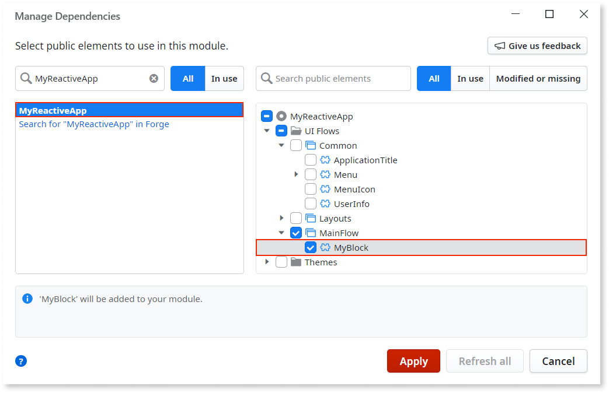
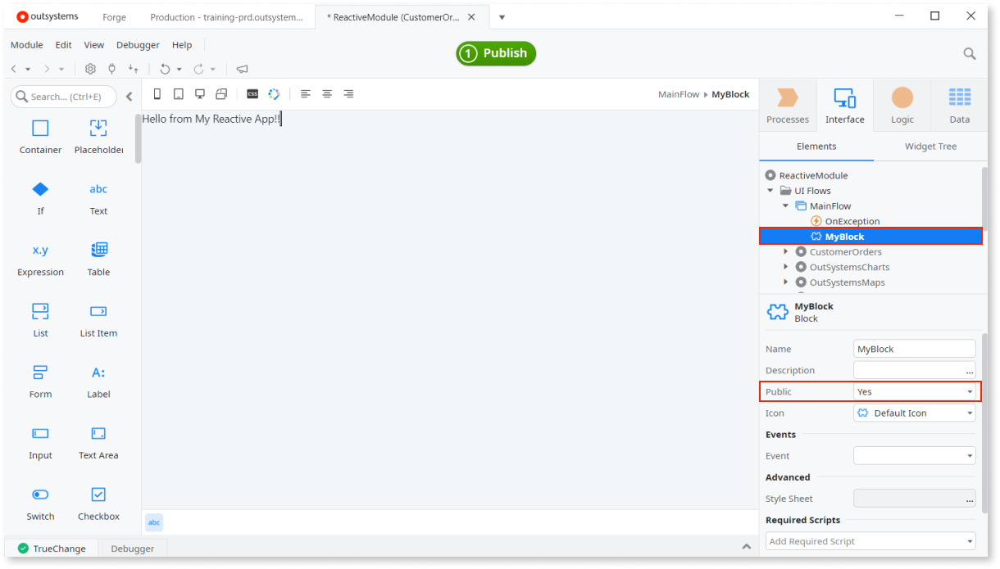
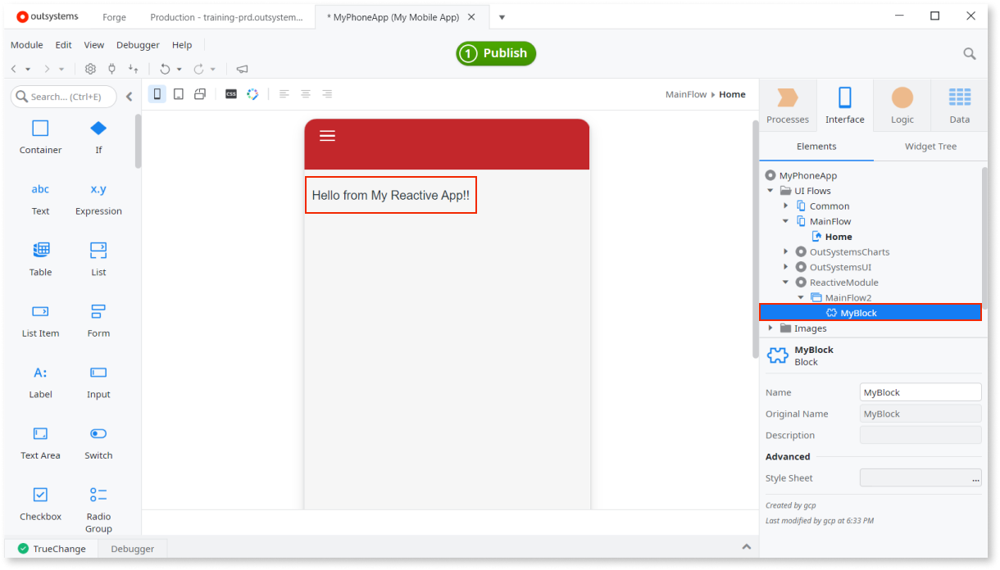

# Create and Reuse Screen Blocks

Use Blocks to reuse parts of UI across your apps. With Blocks you can have part of the UI in one place, so changes to the Blocks are automatically visible in all Screens that use it.

## Creating Blocks

To create a Block in your module:

1. In a UI Flow, add a Block (in Reactive Web and Mobile Apps) or a Web Block (in Traditional Web Apps).
1. Implement the user interface and logic in the new Block.
1. Set the Block as public if you want to reuse it across apps.

## Reusing Blocks

To reuse a Block, drag it from the elements tree to the Screen where you want to use it.

When [reusing Blocks across different apps](../../reuse-and-refactor/expose-and-reuse.md#reuse), consider the following:

* Blocks must be public.
* You can reuse Reactive Web Blocks in Reactive Web Apps and Mobile Apps.
* You can reuse Traditional Web Blocks in Traditional Web Apps.
* The user adding a Block to a module must have at least [**Monitor and Add Dependencies** permission](../../../manage-platform-app-lifecycle/manage-it-teams/about-permission-levels.md#env-permission-levels) over the Block's producer module.
* If the reused Block includes another Block from a different producer module, the user must also have at least **Monitor and Add Dependencies** permission over the producer module of that inner Block. 

If you want to [reuse a Block from a different app](../../reuse-and-refactor/expose-and-reuse.md#reuse), first you need to add that Block to your module.

If you don't have the required permissions over the producer modules of all inner Blocks within the Block you want to use, adding that Block to your module fails due to missing dependencies.

### Advanced use cases to pass data between blocks

For more advanced use cases to pass data between blocks and using block events, please get more info on [Pass Data Between Blocks](block-communicate.md). This article explains how to create a block that communicate between them and pass data. For example, a block containing a date picker that, when changed, requires updating a chart plotted by another block.

## Example

Here is an example, with two sample apps, of how you can reuse a Block from Reactive Web App in a Mobile App.

**Create MyReactiveApp and a public Block in it:**

1. Create a new Reactive Web App, and add a default Module to it.
1. In the Module, go to **Interface** > **UI Flows** > right-click **MainFlow** > select **Add Block**. Name the Block **MyBlock**.
1. Set the **Public** property of Block to **Yes**.
1. Add some content to the Block. In our example we dragged a Text Widget and entered sample text "Hello from My Reactive App!".

    

1. Publish the app.

**Reuse the Block in MyPhoneApp:**

1. Create a new Mobile App and add a default Module to it.
1. Add a Screen to the app.
1. Open **Manage Dependencies** (CTRL+Q) and search producers for our app "MyReactiveApp". Select the app.
1. In left pane navigate to **UI Flows** > **Main Flow** > select **MyBlock**. Click **Apply** to confirm and close.

    

1. In the Mobile App, navigate to **Interface** > **MyReactiveApp** (name of our example app) > **MainFlow2** > **MyBlock**.
1. Drag MyBlock to the Screen. You should see "Hello from My Reactive App!" in the preview.

    

1. Publish the app.
