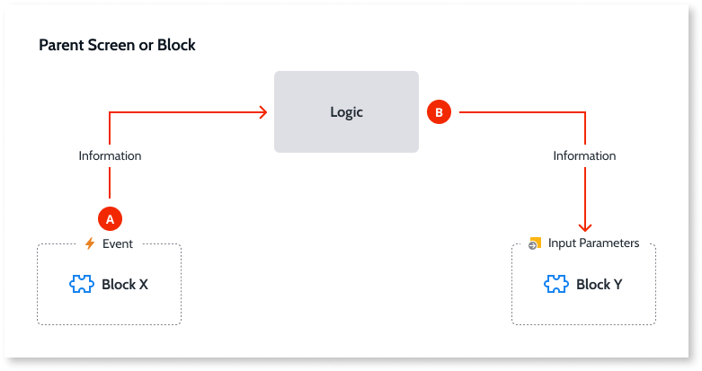

# Reuse UI

When designing interfaces it's frequent to have parts that are common to some of those interfaces. In OutSystems, it is possible to refactor and implement those common parts using widgets like **Blocks** (in Reactive Web and Mobile apps) and **Web Blocks** (in Traditional Web apps) and then reuse them on screens and other blocks.

An immediate advantage of using blocks is improving the reusability of screen elements and, therefore, the maintainability of applications. For example, the header and footer of an application can be implemented using blocks that are reused in all screens of the application. If there are any changes to the header or footer, you only need to update the blocks and those changes are automatically propagated to all the screens of the application.

Implementing blocks in OutSystems involves the following two stages:

Creation
:   You create a new block and implement the interface and logic elements of the block.

Usage
:   You instantiate the block on screens or other blocks of your application.

Refer to [Create and Reuse Screen Blocks](block-create-reuse.md) for further details.

## Communication between Blocks

When something happens in a block it is possible to communicate that event to the parent screen or block so that it executes an action. In the same way, parent screens or blocks can also communicate with child blocks so that they execute an action. Using these two mechanisms together it is possible for a block to communicate with a sibling block.

### (A) Communication between a Block and the Parent Screen or Block

A block triggers an event that can be handled by its parent screen or block to execute an action. The block can send data together with the event.

### (B) Communication between the Parent Screen or Block and a child Block

A parent screen or block updates the input parameters of a child block, which can trigger an action from the child block.

### (A + B) Communication between Blocks

In this case, a parent screen or block contains two blocks and one of them needs to communicate with the other. This is done [using the two previous techniques in sequence](<block-communicate.md>):

1. A block communicates with the parent.
1. The parent communicates with the other block.
