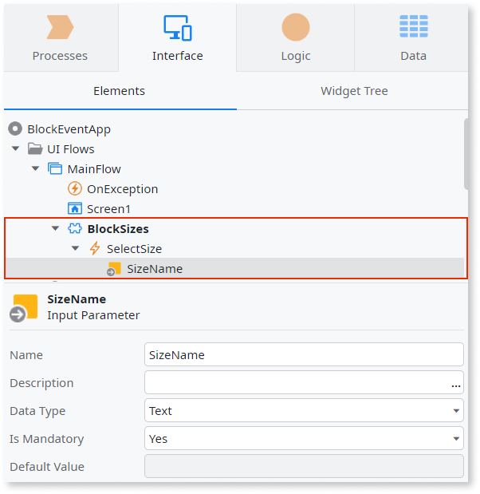
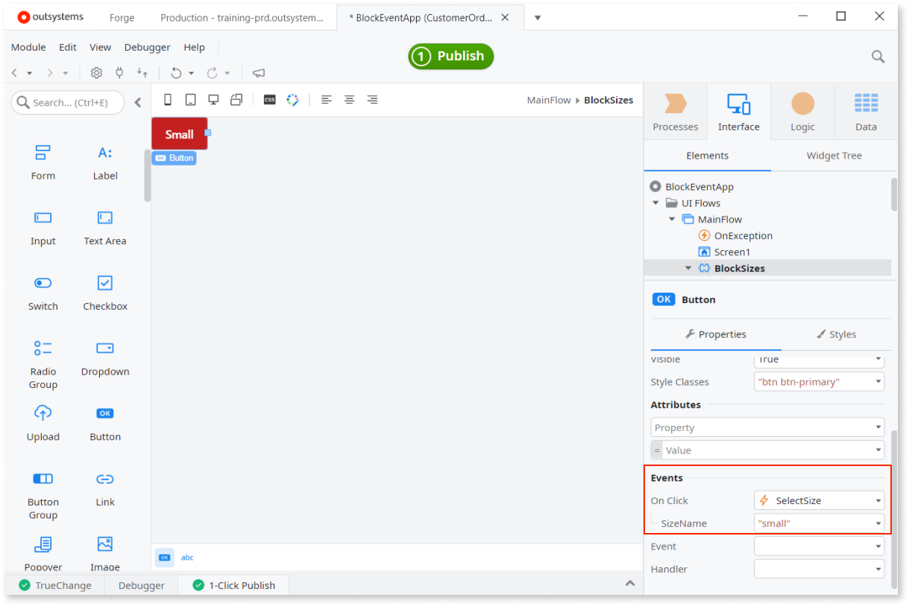
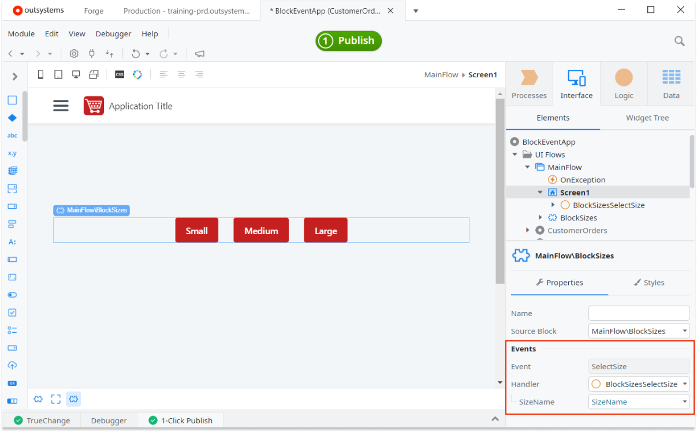
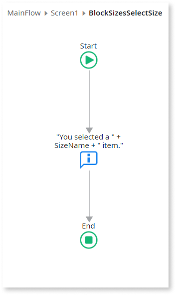
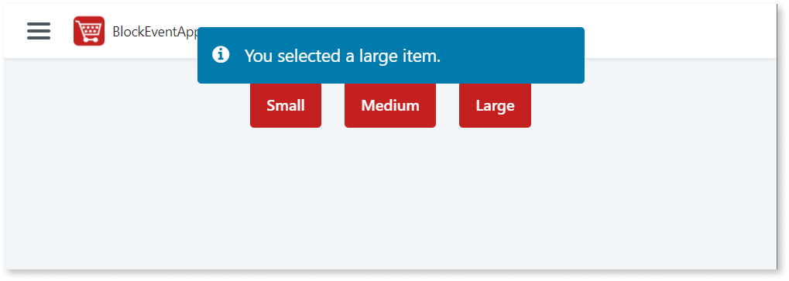

# Use Events to Propagate Changes From a Block to the Parent

You can notify a parent Block or Screen about an event in a Block. You do that by:

* defining an Event in the Block, and then
* defining handler Action that is triggered by the Event

Here is an overview:

1. Create a Block and add an Event to it. You can also add Input Parameters to the Event, if you want to pass values to the parent element.
1. Drag the Block to a Screen or another Block. Once this block has an event defined and the mandatory property set as YES, you need to define an Action in the parent element that is triggered by the Event. If the Event has parameters, you need to pass them to the Action as well.
1. Once the app is running, the Block triggers the Actions in its parent Screen and passes the parameters.

## Example: Buttons with size labels

Here is a working example with more details. We're creating a Block that can be reused in a Screens so users can select one of the three available sizes.

### Define a Block with an Event

Let's first create a Block with "Small", "Medium", and "Large" buttons that, when clicked, send the text identifying the size to an Event. In a real app we would add an item of this size to an order, but in our example, we're showing a message after the selection.

1. Right-click a Flow and select **Add Block**. Name it Sizes.
1. Right-click the Sizes Block and select **Add Event**. Name it SelectSize.
1. Right-click the SelectSize Event and select **Add Input Parameter**. Name it SizeName.

    

1. Double-click the Block and drag a Button Widget to it. In the Button properties, locate **Events** and under **On Click** select the **SelectSize** Event. In the **SizeName** Input Parameter enter "Small". Finally, edit the Text of the Button so it also says "small".

    

1. Using the same steps, add two more buttons, for "Medium" and "Large".

### Use the Block with the Event in a Screen

1. Drag Block Sizes to a Screen. The Block has an Event that needs to be handled, so Service Studio warns about it.
1. Select the Block in the Screen and in the Handler property select **New Client Action**. You can now edit this new Action BlockSizesSelectSize.

    

1. Drag **Message** Tool to the flow and enter in the **Message** property: `"You selected a " + SizeName + " item."`. SizeName is the parameter from the Block.

    

1. Publish your sample app. Click the button with the label "Large" and you should see the message "You selected a large item.".

    
