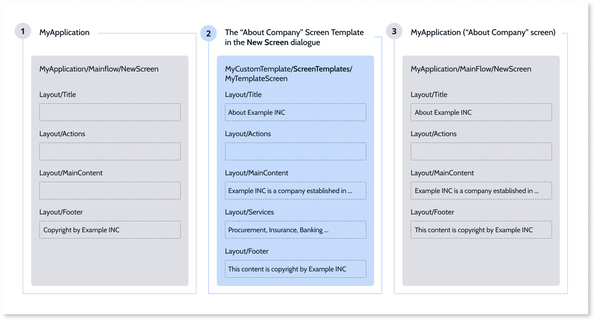
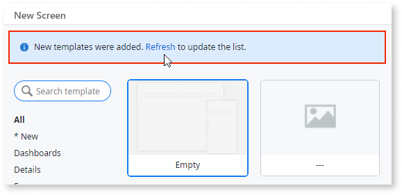

# How Screen Templates work

OutSystems Screen Templates provide several benefits. Screen Templates abstract the UI patterns and ensure the consistency of look and feel, enabling you to speed up the work of developers who create Screens in apps.

It is important that you, as a Screen Template creator, understand how Screen Templates work. The flexibility of Service Studio as an IDE requires of you knowledge of the key concepts, to deliver Screen Templates which developers can use to create Screens of solid UX characteristics and performance.

## Screen Template structure

A Screen Template, like any other OutSystems component, has its source module. The Screen Templates live in the special modules that you can clone from a Custom Screen Template Module. These modules are the sources of information for the Theme and the root Layout Block required in the final Screen.

Typically, a Screen Template has of root Layout Block defined by the Theme. Of particular importance in the Layout Block are the names of the Placeholders. Screen Templates can also contain logic, content, and data, either referenced or local. This has important usability and performance considerations.

## Copied and referenced elements

How the Screen elements are instantiated depends on where they are in the Screen Template:

* The local Screen elements in the Screen Template are local to the Custom Screen Template Module and belong to the root of the Screen. They are copied to the target module.
* The referenced Screen elements in the Screen Template contain references to other producers outside the Custom Screen Template Module. These references are added to the target module.
* The local module elements are not the children of the Screen but they are local to the Custom Screen Template Module (for example, Server Actions, Block). They are copied to the target module. If you want to avoid copying of these elements, add them as references.

## Theme compatibility

The Screen Template Theme must be referenced in the hierarchy of the target module Theme. If that is not the case, the developers see a Theme compatibility warning because there are no guarantees that the Theme in the target module contains the CSS classes needed for the UI Patterns of the Screen.

The Theme of the target module is determined by the Theme defined in the App Template. The target module must have the same Theme for the resulting Screen to be compatible.

## Screen instantiation

When a developer confirms the creation of a Screen based on a Screen Template, Service Studio does the following:

  1. If the Layout Blocks are the same in the Screen Template and the target module, a blank Screen with the root Layout Block is created in the target module. If the Layout Blocks are not the same, the Layout set in Theme Layout Property is selected as the root Layout Block.
  1. The Placeholders are compared. If the Placeholders have the same names, the content of the target Placeholders is replaced by the content of the source Placeholders. The Placeholders that do not exist in the target Layout Block are ignored.
  1. The references from the Screen Template are added to the target module, while local content is copied to the target module.
  1. The Screen becomes available in the target module. The developer can proceed with data replacement and further adjustments.

Here is a simplified overview of the Screen Template instantiation:

  1. Developers are developing an app and decide to insert the About page.
  1. They open a **New Screen** dialog, select "About Company" Screen Template and confirm the selection. In the background, Service Studio changes the structure of this Screen to match the app structure.
  1. A new About Screen is available for the developers in the app.

## The Replace Data feature

Screen Templates come with the feature that enables the developers to replace the sample data with the business data in the Screen by dragging and dropping. The following Widgets support the Data Replacement by default:  

* Chart
* Form
* Table
* List

If you want other UI containers to support the Data Replacement, add the `servicestudio-showRecord` Property and set it to **True** in the **Extended Properties** pane.

The Replace Data algorithm works with data sources in the Screen Template, and this data can originate from OutSystems Sample Data modules or your data modules. This dictates the level of logic you can implement to edit the data in Screens. In general, knowing the data model in the target module enables you to create business logic that can support some advanced features.

## Sample Data

The built-in Screen Templates use the [Sample Data](<sample-data.md>) that you can manage and reuse in your development. You can also use your data in Screen Templates, as long as it's public in the environment.

## Screen Templates availability in the environment

The Screen Templates you create are available to all developers logged into the environment. For all the developers who have Service Studio open when you add a Screen Template, that Screen Template is available after they refresh the Screen Templates list. They can do it by clicking the refresh message in the **New Screen**.

