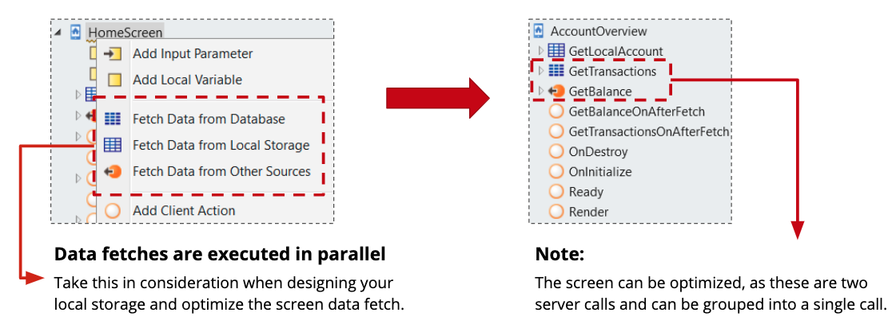
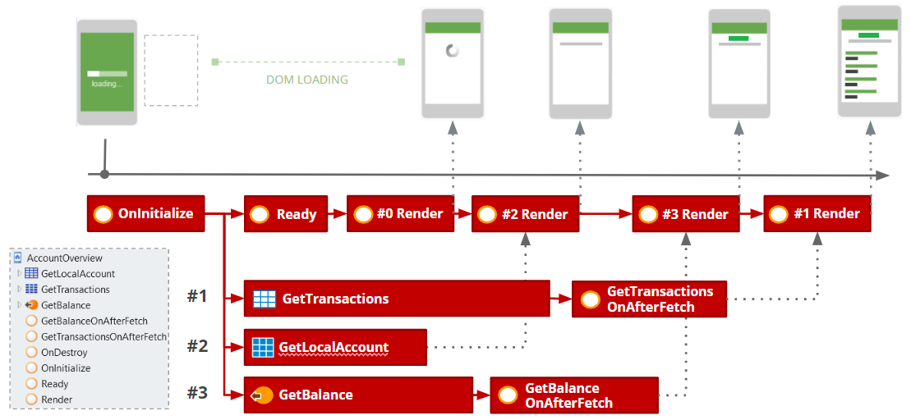
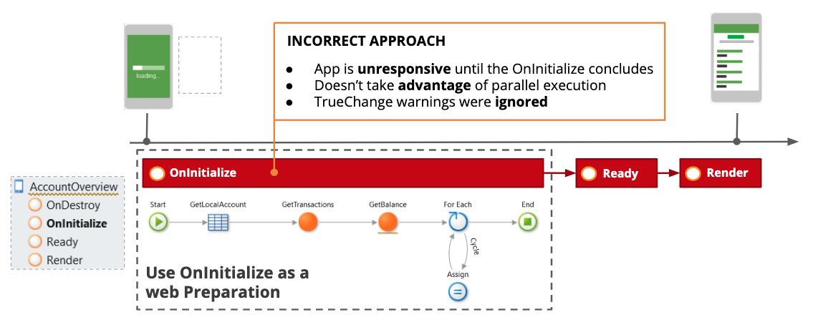

# Best practices for loading data on mobile screens

## Pre-requisites

You need to be a [Mobile Web Developer](https://learn.outsystems.com/training/journeys/mobile-developer-679).

## Loading Data Into Mobile Applications

This article introduces the Best Practices for loading data on a mobile screen.

Loading data for a mobile screen is a common scenario. This pattern explains how to retrieve data with the least possible impact on the overall user experience.

Consider a Home banking mobile application where you need to display the account summary and latest transactions on the ‘AccountOverview’ screen.

Take the following actions into account:

* Use `Fetch Data` actions to take advantage of parallel and asynchronous execution
* Use the `On After Fetch` event for post-processing
* **Group server calls** in a single server call to decrease request latency and the number of server calls

The following diagram shows an example of a timeline for events and actions:

The following diagram shows an example of a timeline for events and actions:

Proceed with the following instructions by order:

1. Start by running **OnInitialize** without executing any actions
1. Execute three parallel asynchronous Fetch Data actions to retrieve the account #2, balance #3 and the list of transactions #1.
1. **OnReady** and **OnRender** #0 are triggered and the screen is now responsive to the user.
1. **GetLocalAccount** #2 response arrives and the UI reacts to display the local account information on **OnRender** #2.
1. **GetBalance** #3 response arrives and **GetBalanceOnAfterFetch** is triggered, after executing the logic a new **OnRender #3** is executed and the balance is displayed on the screen.
1. **GetTransactions** #1 response arrives and we execute the **OnRender** #1 and finally display the list of transactions.

With this approach, the screen quickly responds and reacts to new data. Using UI patterns like Lazy Load while loading data guarantees a smooth user experience.

**Benefits**

The benefits of this approach are the following:

* You get improved performance with parallel Data Fetch actions
* By avoiding synchronous server calls, you get non-blocking screens
* You get a smooth experience as you gradually present new data to the user

### Common pitfall scenario

Most typical bad practices occur when developers try to use the **OnInitialize** or **OnRender** events to retrieve screen information.

In the following example, the screen rendering is delayed and blocks the user until all actions end. This results in a blocking screen with unnecessary high loading time.

## Additional Information

To learn more about optimizing Data Load, go to [Screen and Block Lifecycle Events](https://success.outsystems.com/Documentation/11/Developing_an_Application/Implement_Application_Logic/Screen_and_Block_Lifecycle_Events).
