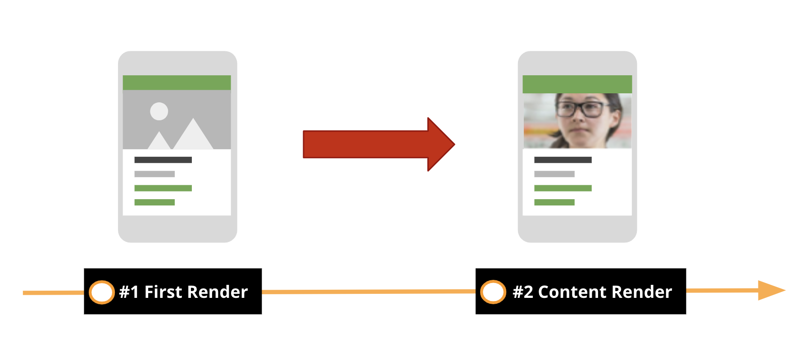
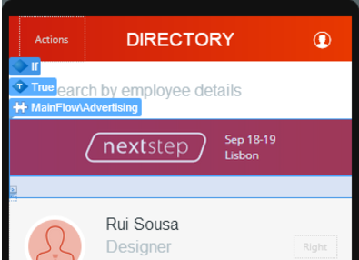
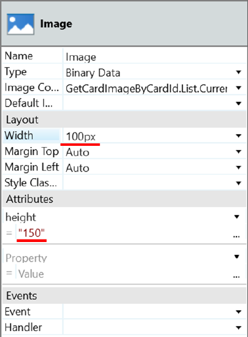
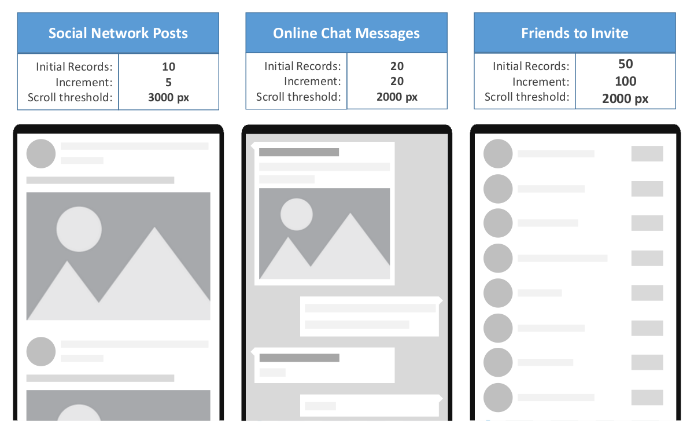

# Best practices for rendering data on mobile screens 

## Pre-requisites

You need to be a [Mobile Web Developer](https://learn.outsystems.com/training/journeys/mobile-developer-679).

## Data Rendering

This article introduces the Best Practices for data rendering on mobile applications.

### Empty State

Improve the user experience by designing and displaying an empty state image while the dynamic content is being fetched. A couple of good examples are Facebook or LinkedIn.

This strategy is valid for all dynamic content in the screen such as blocks, cards or list items. When the empty state turns into the fetched content you may experience some flickering. To avoid flickering when the empty state turns into the fetched content, choose one image that assures a smooth transition, such as a blurred gray line or a spinner.

## Prioritize Screen Content

Delay the rendering of the secondary content so that the main content is rendered first. To do this, proceed as follows:

1. Place the secondary content in a Block inside the **True** branch of an **If** widget. The Block must enclose all the logic to fetch the secondary content so that data fetching of the secondary content only runs when the Block is rendered.

1. On the **False** branch of the **If** widget, place an empty state to avoid content from moving around when the secondary content is fetched.

1. Set the **If** condition to a variable holding **False** by default.

1. In the **On Render** event of the screen, add logic to set the variable to True so that the secondary content starts to render.

### Set the Width and Height of Image Widgets

Set the width and height of the Image widget to the expected size of the final image.

### Optimize List Load

To get the most out of lists and provide a good experience, follow these rules:

#### Fetch Data on Demand

Fetch records as you need them instead of all at once. Start with a minimum set, for example, 10 records. As the user scrolls down, use the **On Scroll Ending** event to fetch the next set of records — for example, the following 10 records.
To understand how this works, scaffold a list on a screen and this mechanism is provided by default.

#### Keep List Items Simple

Avoid designing list items with complex logic or complex widgets like JavaScript to load a map from Google Maps, for example. That complexity is multiplied by the number of items being rendered in the list.

#### Avoid Expanding Content in List Items

Do not design list items with expandable content, such as a trimmed description that has a 'Show All...' link. This impacts the behavior of the list while rendering. Use OutSystems UI patterns such as [MasterDetail](https://success.outsystems.com/Documentation/11/Developing_an_Application/Design_UI/Patterns/Using_Mobile_and_Reactive_Patterns/Adaptive/Master_Detail) instead.

#### Fine-Tune How Lists Fetch Data on Demand

Adjust the number of records that are initially loaded, the increment when scrolling down, and the scroll threshold to trigger the **On Scroll Ending** event. It provides a better user experience when using lists by avoiding visual glitches and slow list scrolls.

The values to use depend on the size of the records:

* The **initial number of fetched items** should ensure a balance between a fast data fetch and a sensible amount of scrolling until a request for more data occurs;

* The **incremental number of fetched items** triggered by scrolling should generally be similar to the initial amount of fetched items, but you may need to tune it according to the usage of your app. If users will frequently use the list to search for entries, your app should be prepared to fetch data faster and load more items at a time;

* The **scroll threshold** that triggers fetching new items is the distance in pixels before the scroll hits the end of the list and should be set to 2000 pixels. If you need to tune this threshold to improve the usability of your application, you can add the attribute **infinite-scroll-threshold** to the list widget with a new integer value in pixels.

The following figure shows examples of values to use in different situations. Start with these as initial guidelines and then test and adjust to your specific case.

## Benefits

Following the good practices of data rendering, provides you with the following benefits:

* Improved performance
* Smooth transitions between screens
* State of the art UX

## Common Pitfall Scenarios

### Empty State

When a user navigates to a screen, the static content is usually rendered first, while the dynamic content takes more time since it is fetched asynchronously. This results in a poor UI experience, where an apparently incomplete screen is displayed with content moving around while the dynamic data is being rendered.

### Prioritize Screen Content

By default, OutSystems mobile apps fetch screen data without a specific priority. If your screen has relevant content that you should display first but you are not prioritizing its rendering, it may lead to bad user experience. For example, displaying an advertising banner before the main information of the screen.

### Set the Width and Height of Image Widgets

If you do not set the width and height of an Image widget, the user can get a flickering effect while the final image downloading. For example, not setting the image height might cause the total height of the screen to change until the image loads completely since the widget height will be changing from 0px to the height of the final image.

### Optimize list load

Lists involve fetching and rendering multiple records at the same time. If you don’t do it carefully, the experience can become cumbersome, especially on low-end devices or with poor network connectivity.

## Additional Information

To learn more about optimizing Data Rendering, read the [From Web to Mobile Development: 5 Things to Consider](https://www.outsystems.com/blog/from-web-to-mobile-development-5-things-to-consider.html) blog post.
