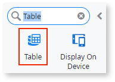
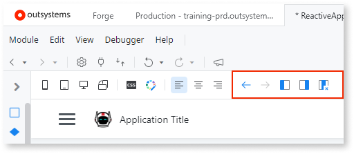
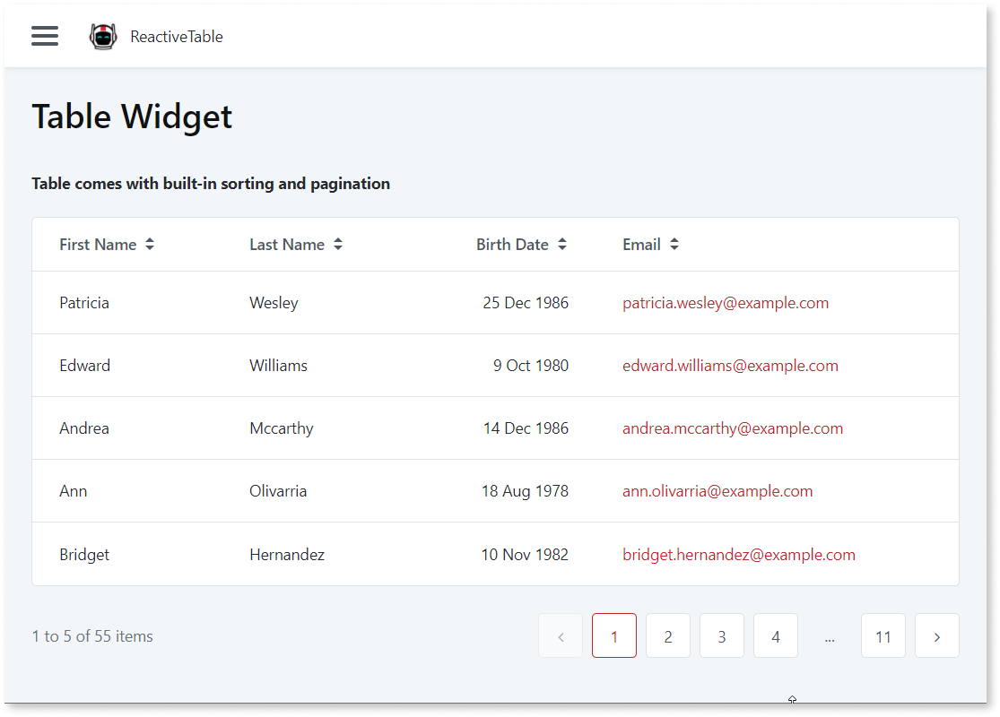
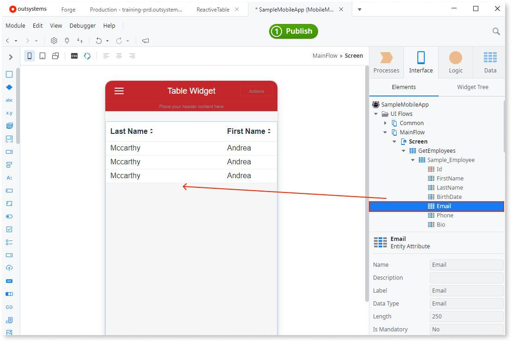

# Creating and editing tables

You can use the Table Widget to create a table on your app screens, when you want to show data in cells distributed in rows and columns. This widget is available in Reactive Web Apps.

## Table Toolbar

When you select a table created with Table Widget, you can use the Table toolbar in the main editor to move, add, or delete the columns.

## Create a table in Reactive Web App

The quickest way to create a table in Reactive Web App is by dragging an Entity to a Screen. When you create a table by dragging an Entity, the table comes with the built-in features sorting and pagination.

To change the default number of records to show, edit the value of the **MaxRecords** Local Variable associated with the Screen where you dropped the Entity. 

## Create a table in Mobile and Progressive Web App

To create a Table in a Mobile App, which you distribute as a native mobile app or Progressive Web App (PWA), fetch some data to the Screen and then add Table to the Screen. Here is an example.

1. Right-click the Screen in the **Interface** tab and select **Fetch Data from Database** or **Fetch Data from Local Storage**. The Aggregate editor opens.
2. Drag an Aggregate from the **Data** tab to the Aggregate editor. The data preview now shows.
3. Go back to the Screen. Search for Table in the widget toolbox. Drag the Table to the Screen.
4. Select the Table. From the list in **Table** > **Properties** > **Source** select the List that was created previously by adding the Aggregate.
5. Expand the Aggregate and Entity associated with the Screen. To create the columns, drag the Entity Attributes to the Table. The Table preview populates with sample the data preview.

    

## Add a new column

Drag an Attribute to the table to add a new column automatically. Or, follow these steps to add new columns step-by-step.

1. Select the table and click **Add New Column Left** or **Add New Column Right** in the main editor toolbar.
1. Drag a **Text** widget to the header and enter the header text.
1. Drag an **Expression** widget to the column cell and edit the **Expression** to show the data.