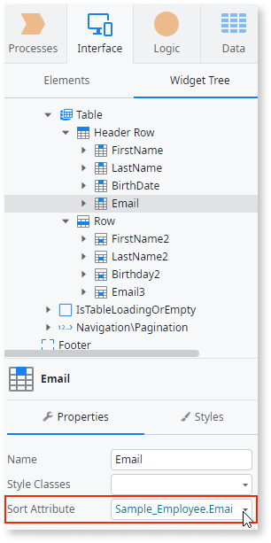
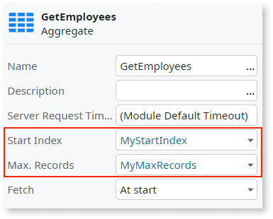
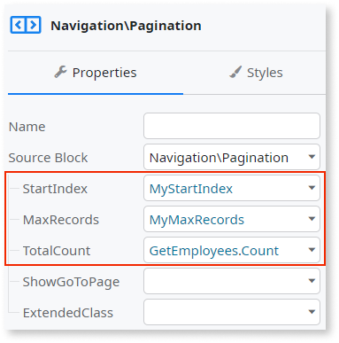
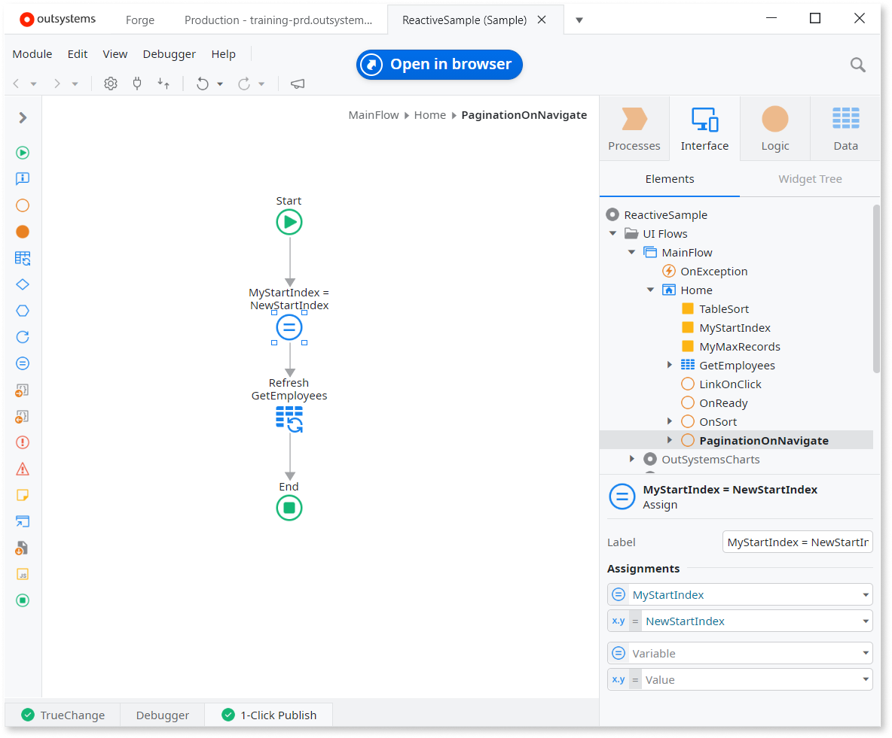

# Table pagination and sorting

Pagination and sorting are the features you get automatically if you create a table by dragging an Entity to the Screen. However, you may choose to implement pagination and sorting manually. Here are the instructions to help you with that.

## Sorting

Service Studio automatically creates Actions for sorting the columns in a Table. This makes it quick to change how the sorting works, or remove it completely.

### Add sorting to a Table

1. In the **OnSort** drop-down list box of your Table Widget properties, select **New On Sort Client Action**. This automatically creates a new Client Action with the necessary logic to sort your table. This logic includes capturing the sort attribute and order, updating the **TableSort** local variable, and refreshing the data source of your table to display the sorted results.
1. At this step, all table columns are sortable, and you can publish the module.

### Change sorting Attribute 

You can change the Attribute used for sorting.

1. In the **Widget Tree**, locate the **Header Cell** of the row you want to sort by (or select the cell in the content editor).
1. In the **Sort Attribute** drop-down combo box select the Attribute for sorting.

    
    
    **Note.** With nested structure as the table **Source** variable, to select a nested item as **Sort Attribute**, the **Data Type** of the **Source** needs to be a **List of Record** with your structure. Also, when using a structure **List** instead of **Record List**, you can only select the first level attributes as the **Sort Attribute**.

1. Publish the module.

### Remove sorting

To remove the sorting feature from the table column, delete the value of the **Sort Attribute** parameter of the **Header Cell** element.

## Pagination

Follow these steps to add pagination to your table. You should already have an Aggregate and a Table Widget added to your Screen.

1. Create **MyStartIndex** and **MyMaxRecords** Local Variables of the Integer Data Type. Set the default values of these variables.
1. In the properties of the Aggregate that fetches your data set **StartIndex** to **MyStartIndex**, **Max. Records** to **MyMaxRecords**.

    

1. Drag the Pagination Widget below the Table Widget and set  **StartIndex** to **MyStartIndex**, **MaxRecords** to **MyMaxRecords**. Also, set **TotalCount** to the Output Parameter `.Count` of the Aggregate.

    

1. Still in the Pagination Widget properties, from the **Handler** drop-down list box select **New Client Action**. Action **PaginationOnNavigate** opens.
1. In the Action **PaginationOnNavigate** assign the value of the **NewStartIndex** Input Parameter to **MyStartIndex** (MyStartIndex = NewStartIndex). Drag a Refresh Data Tool to the Flow and set it to refresh the Aggregate.

    

1. Go back to the Pagination Widget properties and confirm that the **NewStartIndex** property is set to **NewStartIndex** from the Event.
1. Publish the module.
