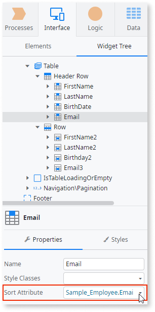
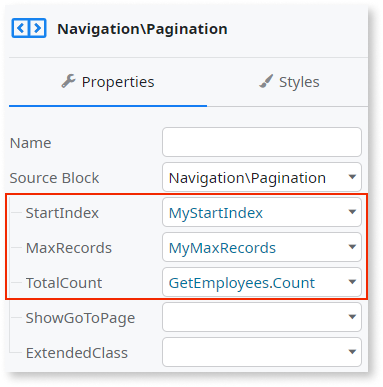
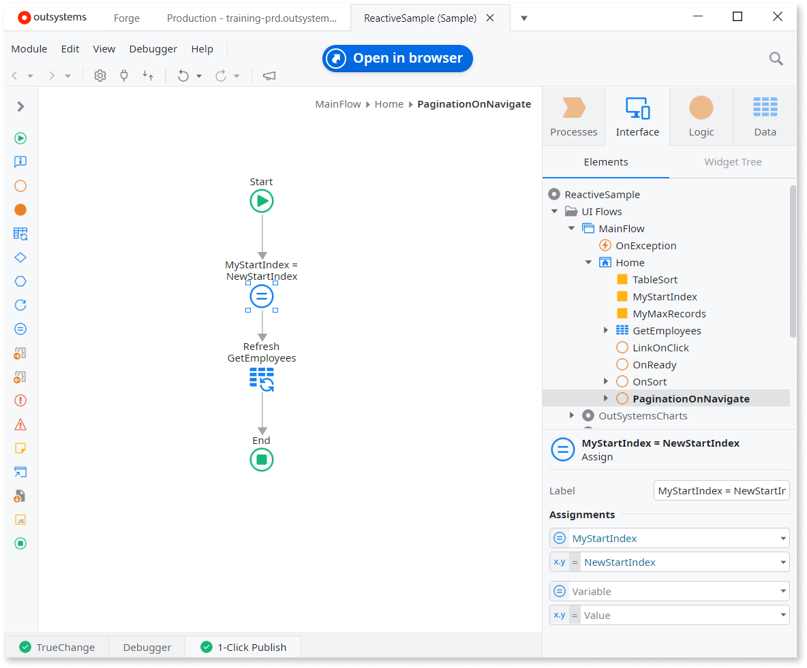
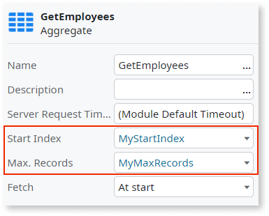

# Table pagination and sorting

Pagination and sorting are the features you get automatically if you create a table by dragging an Entity to the screen. For cases where you need to implement them manually, follow the instructions in this article.

## Sorting

### In Reactive Web and Mobile

Service Studio automatically creates a Client Action with the full sort logic when you wire up the OnSort event. Before doing that, set the sort attribute on each column header you want to make sortable.

#### Add sorting to a table

1. In the **Widget Tree**, select the **Header Cell** of each column you want to make sortable. In the **Sort Attribute** property, select the entity attribute to sort by. Repeat for each sortable column.

    This associates each column with the database attribute that controls the sort order. The `ClickedColumn` Input Parameter of the OnSort event automatically receives the Sort Attribute value of the header cell the user clicks.

    

    

    With a nested structure as the table **Source** variable, to select a nested item as **Sort Attribute**, set the **Data Type** of the **Source** to a **List of Record** with your structure. When using a structure **List** instead of **Record List**, you can only select the first-level attributes as the **Sort Attribute**.

    

1. Select the Table widget. In the **OnSort** drop-down list box of the properties, select **New On Sort Client Action**.

    Service Studio creates a Client Action with the sort logic already implemented:

    * A `TableSort` Local Variable on the screen to hold the current sort attribute.
    * An **If** node that checks whether the user clicked the same column again. If yes, it appends `" DESC"` to toggle descending order. If no, it sets `TableSort` to the new column's sort attribute.
    * A **Dynamic Sort** on the Aggregate set to `TableSort`.
    * A **Refresh Data** node to re-execute the Aggregate and update the table.

1. Publish the module.

#### Remove sorting

To remove sorting from a table column, delete the value of the **Sort Attribute** parameter of the **Header Cell** element.

### In Traditional Web

In Traditional Web apps, sorting is a built-in feature of the **Table Records** widget. When you create a screen by dragging an Entity onto a web flow, Service Studio scaffolds the table with sortable column headers automatically. Refer to [Table Records Widget](../../../ref/lang/auto/class-table-records-widget.md) for details on configuring fixed and dynamic sorting.

## Pagination

Follow these steps to add pagination to your table. You should already have an Aggregate and a Table widget added to your screen.

### In Reactive Web and Mobile

1. Create **StartIndex** and **MaxRecords** Local Variables of the Integer data type. Set the default value of **StartIndex** to `0` and the default value of **MaxRecords** to the number of records to display per page (for example, `50`).

1. Drag the **Pagination** widget below the Table widget.

1. In the **Pagination** widget properties, set the following:

    * **StartIndex** to `StartIndex`
    * **MaxRecords** to `MaxRecords`
    * **TotalCount** to the `.Count` Output Parameter of your Aggregate (for example, `GetEmployees.Count`)

    

1. In the **Handler** drop-down list box, select **New Client Action**. The new action opens.

1. In the action, add an **Assign** node and set `StartIndex = NewStartIndex`. Then drag a **Refresh Data** node to the flow and set it to refresh the Aggregate.

    The `NewStartIndex` Input Parameter holds the index of the first record on the page the user navigated to.

    

1. In the Aggregate properties, set **Start Index** to `StartIndex` and **Max. Records** to `MaxRecords`.

    

1. Publish the module.

### In Traditional Web

The Table Records widget uses the **Start Index** and **Line Count** properties for pagination. Pass the current page offset as a screen Input Parameter and use Previous and Next links to navigate between pages.

1. Select the Table Records widget. In the properties, set **Line Count** to the number of records to display per page.
1. Add a **StartIndex** Input Parameter of the Integer data type to the screen. Set its default value to `0`.
1. Set the **Start Index** property of the Table Records widget to the `StartIndex` Input Parameter.
1. Open the Preparation Aggregate. Set **Max. Records** to `StartIndex + TableRecords.LineCount + 1`. This limits the database query to only the records needed for the current page.
1. Add **Previous** and **Next** Link widgets below the Table Records widget. For each link, set the destination to the same screen and pass a new `StartIndex` value:

    * **Previous**: `StartIndex = StartIndex - TableRecords.LineCount`
    * **Next**: `StartIndex = StartIndex + TableRecords.LineCount`

1. Publish the module.
