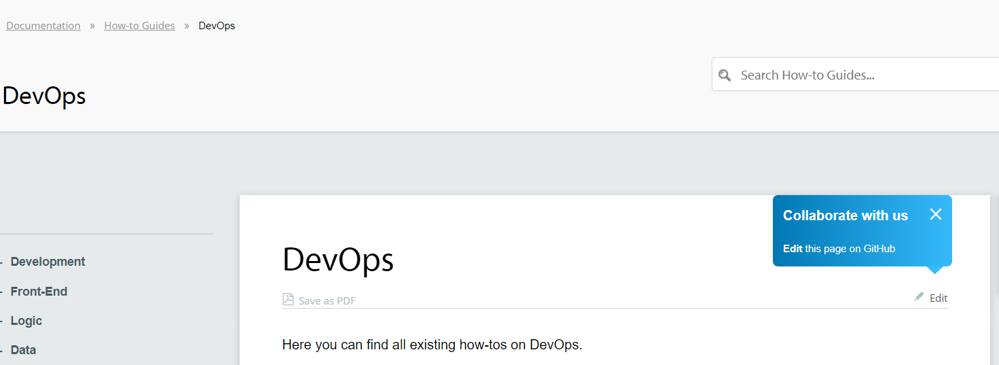
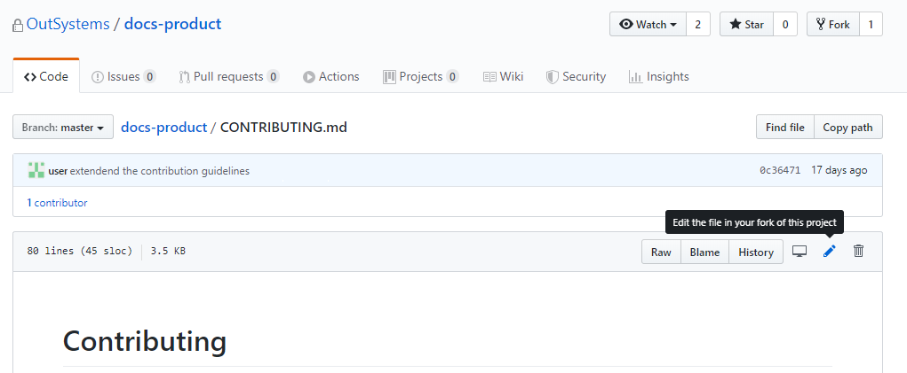
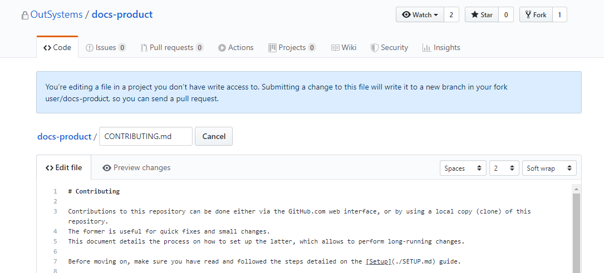
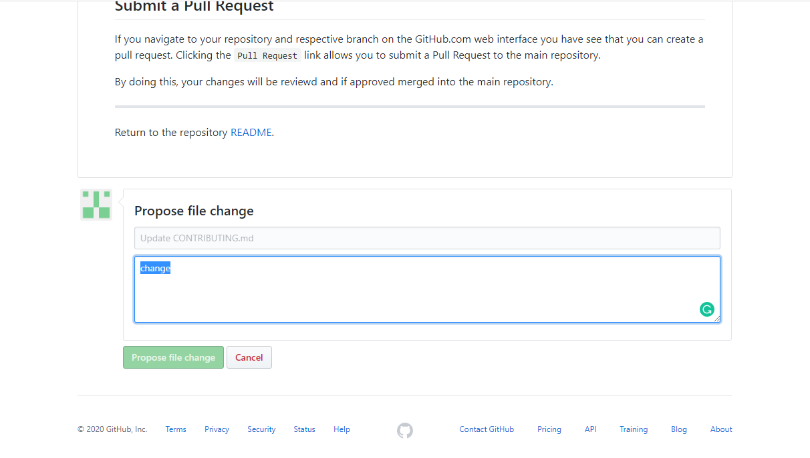
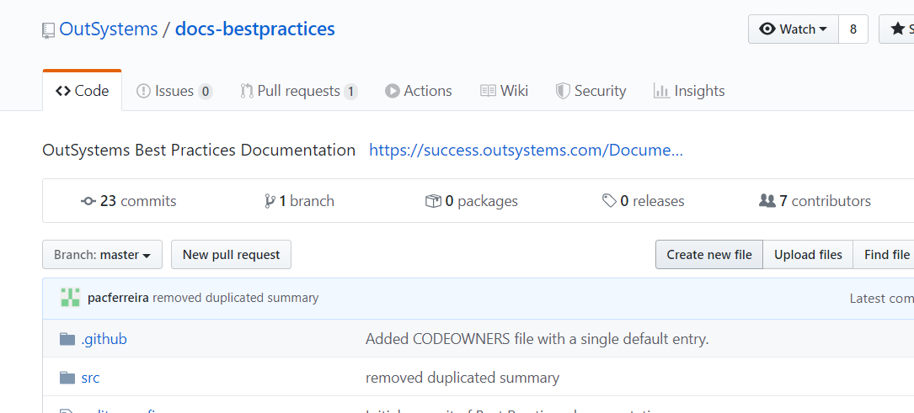
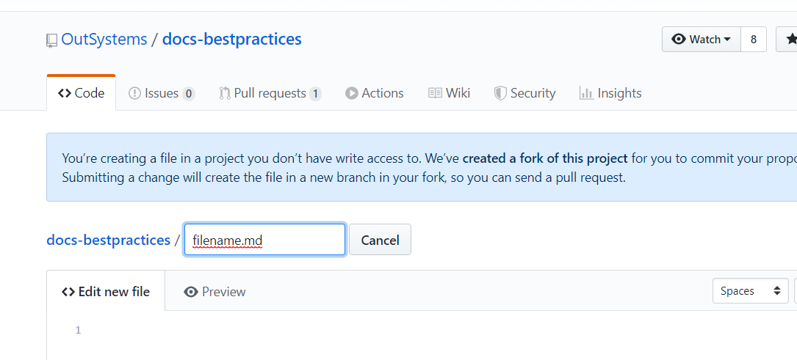
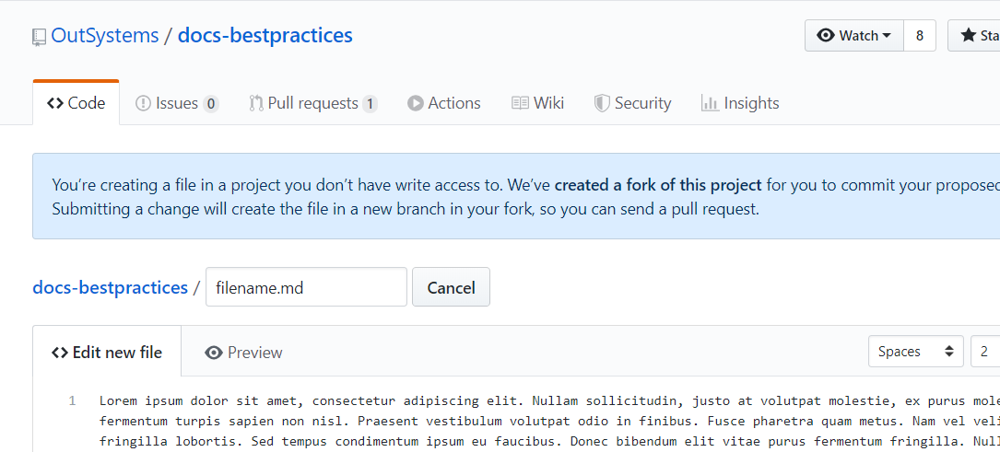
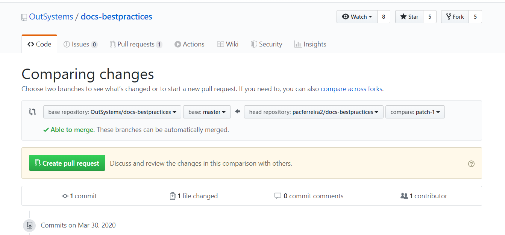

# How to contribute # How to Collaborate with our Documentation
 
## Overview
The OutSystems community is the reason we keep developing an amazing platform. We want you to be successful, so with that in mind, we want to give back even more.
 
We’ve decided to make our product documentation available to all of the community, letting you contribute and collaborate with us.
 
Have you found inaccurate information? Have you seen a how-to that needs to be updated? Now you can easily make these corrections yourself in GitHub.
 
Help us make our documentation even more useful for everyone!
 
## How to contribute?
 
All edits, contributions, and corrections are made through GitHub - one of the most collaborative platforms for software projects.
 

Don't have a GitHub account? Sign up [here](https://github.com/join).

 
All of our documentation is available in the following GitHub repositories:
 
- [Product Documentation](https://github.com/OutSystems/docs-product/)
- [Best Practices](https://github.com/OutSystems/docs-bestpractices/)
- [How-tos](https://github.com/OutSystems/docs-howtos/)
 
In these repositories, you can make the following types of contributions:
 
- **Propose a change**. You can propose changes to address inconsistencies or to improve/update existing content.
- **Propose new content**. You can propose new knowledge content, such as how-tos or best practices, that might help other members of the community.
 
All contributions are done in GitHub using Markdown - a simple, lightweight markup language with plain-text-formatting syntax. To see how easy it is to master Markdown, check out our specific writing guidelines [here](markdown-quick-guide.md) or [this guide](https://guides.github.com/features/mastering-markdown/).
 

Don't want to contribute via GitHub? Send us your contribution to knowledge@outsystems.com.

 
## Proposing a change
 
Anytime you stumble upon something that you feel could be better, here’s how you can propose a change:
 
1. Click the Edit button. 

The corresponding page opens in the GitHub repository.
 
2. On the GitHub page, click the Edit icon. 

 
3. A text editor opens. Make your changes in it.
 

 
4. When you have finished your changes, scroll down in the editor, add a comment about your change and click Propose File Change. 

 
And that's it! Your proposed changes are processed by our team and, **if approved**, made part of the documentation.
 
## Proposing new content
Creating new content for our knowledge ecosystem is invaluable to us. It means that you are both knowledgeable and care about our community. 
 

If you have any doubt about how to contribute or where, drop us a line at knowledge@outsystems.com

 
You can contribute to our community by doing the following:
 
1. In the [GitHub repository](https://github.com/OutSystems?q=docs) to which you want to contribute,select the folder you want to add your new document to..
 
2. Click Create new file:

 
3. Give a name to your file in the format `[filename].md`:

 
4. Add your content to the new file. To preview the content, click Preview.

 
5. After you have added all the content, scroll down, add a description, and click Propose new file:

 
6. To submit your new content for approval, click Create Pull Request:

 
And that's it! Your proposed changes are processed by our team and, **if approved**, made part of the documentation.
 
## Doing it like we do
 
If you plan on contributing frequently, we advise a more bulletproof setup. This takes a bit more time to put in place, but in the end it makes it easier for you to contribute in the future.
 
### Setup
 
The main steps in setting up your environment are:
 
1. Set up Virtual Studio Code
2. Fork the repositories
3. Clone your forks to your computer
 
Note: This article details the process of how to install and set up the required tools to contribute. Other tools can be used, however, these are the ones we recommend.
 
#### 1. Setting up Visual Studio Code
 
Follow the steps below to get your Visual Studio Code environment up and running.
 
**Needed tools**
 
The tools you will need to setup Visual Studio Code are:
- GitHub desktop version, for source control purposes. 
- Visual Studio Code, to edit the markdown files.
- Visual Studio Code extensions, to aid you while editing.
 
**Installing GitHub**
1. Download the latest (stable) version from https://git-scm.com/download/ 
2. Run the installer and follow the installation steps.
 
 
**Installing Visual Studio Code**
Visual Studio Code is available for Windows, Linux, and Mac. 
1. Download the latest (stable) release of Visual Studio Code from https://code.visualstudio.com/ 
2. Run the binary and follow the installation steps.
 
**Visual Studio Code extensions**
We recommend the following extensions:
- SpellChecker - v1.2.13 [Michael Vernier]
- Markdown Shortcuts - v0.12.0 [mdickin]
- Relative Path - v1.4.0 [jakob101]
- Github Markdown Preview - v0.0.2 [Matt Bierner]
- Git Graph - v1.18.0 [mhutchie]
 
***Installing an extension**
1. Open the View menu and select Extensions. Alternatively, use the keyboard shortcut CTRL+Shift+X
2. Search for the extension and install it. 
 

Note: Make sure you are installing the correct extension and respective versions. Newer versions may also work.

 
#### 2. Forking the repositories
To fork our repositories to your account, repeat the following steps for each repository:
 
1. In GitHub.com select [one of our repositories](https://github.com/OutSystems?q=docs).
2. Click the Fork icon.
3. Select your account in the pop-up.
4. A copy of the repository is created within your account.
 
#### 3. Cloning a Git repository
Now that you have a fork of the repositories and Visual Studio Code set up, you can clone your fork. To do this:
1. Open the Command Palette using the keyboard shortcut CTRL+Shift+P
2. Enter *clone*
3. Select the Git: Clone option.
4. Paste the URL of your fork, and press ENTER
5. Select a folder on your computer to save the repository files.
6. Wait until the repository is cloned (If you haven't already logged into GitHub, you may need to do so at this point.).
7. After the cloning completes a notification appears, click Open.
 
For more information about cloning a Git repository in Visual Studio Code, see [Cloning a repository](https://code.visualstudio.com/docs/editor/versioncontrol#_cloning-a-repository).
 
### Contributing
 
Now that you are set up and ready to contribute, we recommended the following:
 
1. Sync with your GitHub repository copy
2. Create Branches for bigger contributions
3. Submit a Pull Request (from your fork to the main repository)
 
#### 1. Sync your local copy with GitHub
We recommend you regularly sync your changes with GitHub. This ensures that you are working with the latest version of the master repository.
 
To sync your changes with Github, click the refresh icon on the bottom toolbar of Visual Studio Code.
 
#### 2. Create branches for bigger contributions
If you are creating a lot of content, we recommend creating a new branch. One of the main reasons for this is to keep working materials separate from the existing ones, which, if needed, makes it easier to discard them completely.
 
1. From the Command Palette (CTRL+Shift+P),select Git: Create Branch. 
2. After you have completed your work in the branch, you should merge it with the master in your fork.
 
### 3. Submit a pull request
After you have completed your work and committed it to GitHub, you must submit a pull request.
 
1. From the GitHub.com web interface, navigate to the master repository. (The one from where you created your fork.)
2. Click New Pull Request.
3. On the Compare page, click compare across forks.
4. In the base branch drop-down menu, select the branch of the upstream repository you want to merge the changes into.
5. In the head fork drop-down menu, select your fork, and then use the compare branch drop-down menu to select the branch you made your changes in.
6. Enter a title and description for your pull request.
7. Click Create Pull Request.
 
Your changes will be reviewed and, **if approved**, merged into the main repository.
