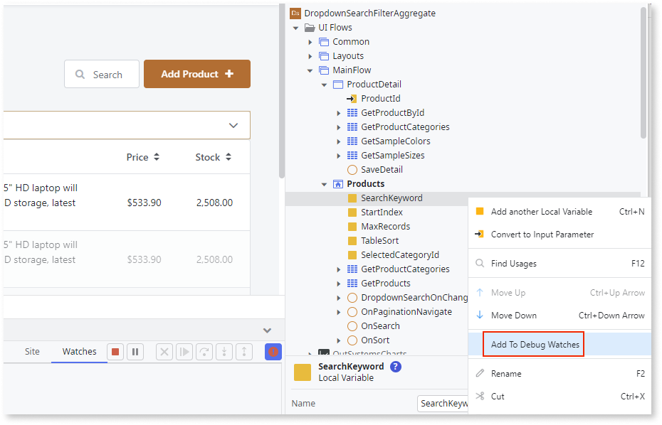
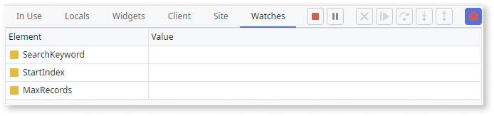
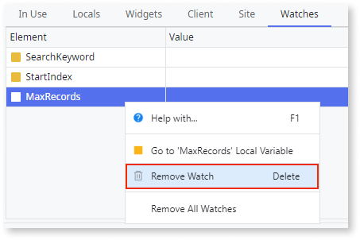
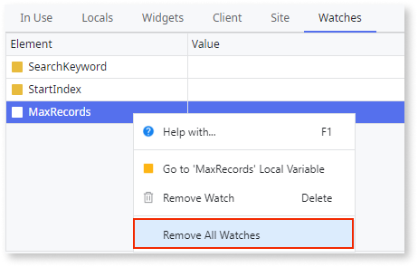

# Watches

Watches allow you to examine module elements in Service Studio while debugging your module. These elements are always displayed in the **Watches** tab, regardless of being in or out of the scope of the element being debugged. This behavior contrasts with the rest of the [scope tabs](<debugger-ui-reference.md#scope-tabs-area>), where the displayed content depends on the current scope.

Using watches, you can inspect the following:

* Parameter values
* Variables
* Screen widgets

## Add a Watch

To watch a module element, follow these steps:

1. Run the module in Debug mode.
1. Right-click the element you want to watch.
1. Select the **Add To Debug Watches** option. 

    

All watched module elements are alphabetically listed in the **Watches** tab. 

## Remove a Watch

To remove a watch from a module element, follow these steps:

1. In the **Watches** tab, right-click the watched element you want to remove.
1. Select the **Remove Watch** option.

    

## Remove All Watches

To remove all watches, follow these steps:

1. Right-click anywhere in the **Watches** tab area.
1. Select the **Remove All Watches** option. 

    

Alternatively, you can select the **Remove All Watches** option available in the **Debugger** menu.

