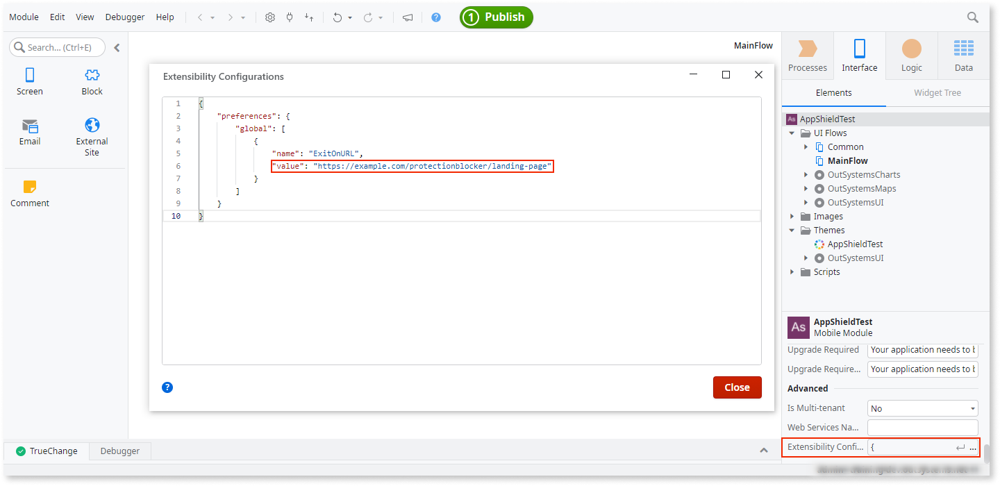

# Configuring an exit URL for a blocked app

In the event that **AppShield** detects an untrusted configuration and blocks an app, you can use an **AppShield** configuration called ```ExitOnURL``` to inform the user about what just happened. The ```ExitOnURL``` configuration allows you to define an **Exit URL** that is opened by the user’s default browser when the app is blocked and to explain the issue.

<div class="info" markdown="1">

This landing page can be invoked only when the end user is working online with an active internet connection.

</div>

## Prerequisites

Before beginning, make sure that:

* You’re working with mobile apps
* You have a licensed copy of **Appshield**
* You are working with an **AppShield** version 1.4.0 or above
* You have prepared a landing page to which the user will be directed in the event that **Appshield** blocks the app

    <div class="info" markdown="1">

    If no ```ExitOnURL``` value is configured the browser will not be invoked upon a blockage of the app.

    </div>

## Define and enable your exit URL

To enable the ```ExitOnURL``` feature, first copy the JSON code snippet below and continue with the following steps:

```javascript
{
    "preferences": {
        "global": [
            {
                "name": "ExitOnURL",
                "value": "https://example.com/protectionblocker/landing-page" 
            }
        ]
    }
}
```

1. From **Service Studio** go to the **Interface** tab, select the app name, and click **…** on the right side of the **Extensibility Configuration** field to open the **Extensibility Configuration** window. Then paste the JSON code snippet in the window to define the ```ExitOnURL``` property as a new global preference.

    

1. In the ```ExitOnURL``` value string replace ```example.com``` with the correct domain name and ```landing-page``` with the path and name that suits your needs. A typical **Exit URL** may be ```https://example.com/errors/protectionblocker/why-cant-i-use-my-app```. Then click **Close**.

    <div class="info" markdown="1">

    The **Exit URL** value must not contain any URL parameters. For example, appending ```&param=1``` to the **Exit URL** value prevents the page from being invoked upon a blockage of the app.

    </div>

1. Design your landing page to display an informative message, such as the following example for a bank app:

    _Sorry to see that your app shut down. It's a security feature designed to protect your data and money. We suggest scanning your phone, and, in the meantime, please use our web portal._


## Enhance the experience of your **Exit URL**

When  **Appshield** blocks an app it generates query parameters that you may use to present the user with a comprehensive explanation for why the app was blocked.

For example, a landing page for a blocked Android device might be something like the following:

```https://example.com/errors/protectionblocker/why-cant-i-use-my-app?reason=6&manufacturer=Google&model=Pixel4a&ANDROID=31```

You may incorporate these generated query parameters into your informative message.

_We're sorry! We shut your app down because we detected native code hooks, possibly inserted by a malicious app, on your Android Pixel device. This is a security feature designed to protect your data and money. We suggest scanning your phone, and, in the meantime, please use our web portal._

### AppShield query parameters

The following parameter information is included in the generated **Exit URL**.


| Query Parameter | Description | 
| -------------- | ------------ |
|  %REASON% | The reason of the shutdown in decimal. See the tables below for explanations of these values.| 
| %MANUFACTURER%| The manufacturer of the device| 
| %MODEL%| The model name of the device| 
| %ANDROID%| The Android API level of the device| 
| %IOS%| The iOS API level of the device| 

### Shutdown reasons: iOS

| Decimal        |  Explanation |
| -------------- | ------------ |
| 0 | Device is jailbroken/rooted |
| 1 | Application is being debugged |
| 2 | Application is modified or repackaged |
| 3 | A screenshot of the application was taken |
| 4 | An injected library was found in the process |
| 5 | A hooking framework was found in the process |
| 6 | A screen recording of the application was started |

### Shutdown reasons: Android

| Decimal        |  Explanation |
| -------------- | ------------ |
| 0 | Device is rooted. |
| 1 | Application is modified or repackaged |
| 2 | Application is being run in an emulator |
| 3 | Java debugger attached to app |
| 4 | Untrusted keyboard found |
| 5 | Untrusted screen reader found |
| 6 | Native code hooks, possibly inserted by malicious app |
| 8 | Shield could not read configuration file |
| 9 | Problem with Native Debugger Protection |
| 13 | Problem initializing Shield |
| 14 | App received termination signal |
| 15 | Application crashed outside of Java-code, either native library or Shield |
| 16 | Hooking frameworks detected |
| 17 | Native debugger prevention not possible on this device |
| 18 | Screen Mirroring in use |
| 1A | Developer Options enabled on device |
| 1B | Untrusted Installer found on device |
| 1C | Android Developer Bridge active on device |

## Considerations

**AppShield** cannot guarantee that the **Exit URL** page will load in all instances in the event that an attacker is probing the app's defenses. For example, attempting to attach a debugger to the application causes **AppShield** to shut the application down and open the configured **Exit URL**. There are, however, a number of ways that the attacker can  prevent this page from opening in the main browser, such as putting the device in flight mode. Should this happen the end user cannot depend on this data and and cannot presume that such hacking attempts will always be reported and seen on the server.

**Exit URL** events do not provide precise metrics of security issue events, since a single user can trigger multiple **Exit URL** events. This feature is primarily designed to provide useful feedback to the end user about why the application stopped working, rather than a reliable reporting mechanism for the app owner.

**Exit URL** is loaded in the device’s default browser and may remain in an open tab or window until the user closes it. This may cause a number of effects, including the following:

* The **Exit URL** page may cause the browser to trigger additional page loads of the configured URL when the user launches the browser at a later time.
* The **Exit URL** page, when it appears as the user clicks the back button or flips through the various browser tabs or windows, may lead to misleading statistics if you are tracking page views on your server.
