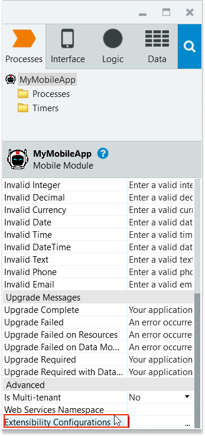

# Creating custom obfuscation rules

<div class="info" markdown="1">

Applies only to Mobile Apps.

</div>

This article is for developers who are familiar with mobile development and AppShield and are responsible for securing their apps from tampering. Code obfuscation is a protection feature that makes learning about how an app works difficult for people and systems.

In this article learn about obfuscating code and logs of non-OutSystems plugins. Since obfuscating non-supported plugins isn't fully automatic in OutSystems, you need to configure obfuscation inclusion/exclusion rules.

## Prerequisites

Before beginning, make sure:

* You're working with mobile apps
* You have a licensed copy of AppShield
* You have custom plugins either from Forge or developed in-house

## Overall process

At a high-level, you:

1. [Create your own obfuscation rules](#create-your-own-obfuscation-rules).

1. Verify and encode the obfuscation rules to base64 using the OutSystems Obfuscation Helper. See: [Obfuscation Helper](#obfuscation-helper)

1. Add new settings to your mobile app using the Extensibility Configuration field in Service Studio. See: [Add custom obfuscation rules to your app](#add-custom-obfuscation-rules-to-your-app)

1. [Generate your app and try it out](#generate-your-app-and-try-it-out)

## Create your own obfuscation rules

To begin, use your favorite editor to create your rules. Or try our editor which has a validation feature for custom obfuscation rules. For more information, see the [Obfuscation Helper](https://enmobile11.outsystemsenterprise.com/ObfuscationHelper/).

Be sure to include [OutSystems obfuscation base rules](files/default-obfuscation-rules.txt). Base rules are a set of mandatory obfuscation rules that guarantee that the obfuscation process correctly obfuscates native code from the shell and OS-Supported plugins. When you're defining custom rules for non-supported plugins, you must include OutSystems Obfuscation rules.

### OutSystems syntax for custom obfuscation rules

OutSystems syntax starts with a fully inclusive declaration. This means you are obfuscating everything. You can remove statements by excluding them and only obfuscating  specific parts of the app.

Following is an example of how to obfuscate everything and then only keep some default exceptions. Remember, this means exceptions aren't  obfuscated.

```
# Include default exceptions
include builtin:default-unobfuscate.cfg;
# Started by obfuscating all classes
obfuscate class *;
```

### Exclusion syntax

The following table shows how you can match classes, fields, and methods in an exclusion declaration to obfuscate specific parts of the app.

| Class_operation (class_op) | Opposite of | Description                                        |
| -------------------------- | ----------- | -------------------------------------------------- |
| match                      |             | Specify the rules to operate on a given class      |
| preserve                   | obfuscate   | Specify a class member to exclude from obfuscation |

### Obfuscation syntax example

The following is an example of how you might use obfuscation. Suppose you start by obfuscating every class in your app using obfuscate class*; but then decide you want to single out one or two classes that you want to preserve.

```
# Started by obfuscating all classes
obfuscate class *;

# we want to preserve specific classes names
preserve class com.outsystems.MyClass1 ;
preserve class com.outsystems.MyClass2 ;
```

Then you want to obfuscate a given class while preserving some of its members.

```
# Started by obfuscating all classes
obfuscate class *;

# Preserve specific methods and fields inside a given class
match com.outsystems.MyClass3 {   
  preserve myFirstMethod(); 
  preserve mySecondField; 
}

# Obfuscate MyClass3 but preserve all its members
obfuscate com.outsystems.MyClass3 {   
  preserve <members>; 
}
```

Then you find you need more detail to preserve a specific element, such as the public methods of a given class. For that, you can use a **specifier**.

```
# preserve all the public methods of MyClass1
preserve class com.outsystems.MyClass1;

match class com.outsystems.MyClass1.** {   
  preserve public* ;
```

The following is a list of the specifiers with a short description.

**Class_op**
:    preserve or obfuscate

**member_name**
:    name of the class fields and `/` or methods. Supports wildcards. Additional match are available: `<any>` and `<members>` matches any or all fields and methods; `<fields>` matches all fields, `<methods>` matches all methods.

**annotation**
:  `@<class_name>` is a qualified class name, such as `@com.example.myannotation`

**access**
:   access modifier for class fields and `/` or methods. It can be public, private, or protected

**class-spec**
:   class, enum or interface

**extension**
:   extends or implements

**flag**
:   static, abstract, final, or native

**member_type**
:   method or field

**value**
:   A double quoted string, any integer or Boolean (true or false)

**return_type**
:    void, primitive or fully qualified name of a java class. Supports wildcards.

## Obfuscation Helper

Using the Obfuscation [Helper tool](https://enmobile11.outsystemsenterprise.com/ObfuscationHelper/) you can verify the syntax of your custom obfuscation rules and encode them in a base64 format. The Helper tool automatically checks your rules, encodes your script, and defines the value of your AppShieldObfuscationRules in the Extensibility Configuration.

## Additional syntax guidance

Keep the following in mind as you create your rules:

* Prefix comments with **#** to ignore everything in the line.
* You can create any number of rules.
* Rules are matched from top to bottom.
* Newer rules overwrite older rules.
* **class_name**, **return_type**, **argument_type**, and name can use wild cards.
* For wild cards, an asterisk (*) matches zero or more characters, a plus (**+**) matches one or more characters, and a question mark (**?**) matches exactly one character.

## Add custom obfuscation rules to your app

To enable custom code obfuscation, follow these steps to add a property to the Extensibility Configuration of your app, and then verify the syntax of your custom obfuscation rules.

1. From Service Studio, select **your module name**, go to the properties, and double-click **Extensibility Configuration**.

    

1. In the **Extensibility Configuration** field, enter the obfuscation property as a new global preference. Call the new property in the Extensibility Configuration JSON **AppShieldObfuscationRules**, and its value is a base64 encoding of your custom obfuscation rules. The following code snippet is an example of the JSON implementation.

        {
            "preferences": {
                "global": [
                    {
                        "name": "AppShieldObfuscationRules",
                        "value": (bases64-encoded rules)
                    }
                ]
            }
        }

<div class="info" markdown="1">

Optionally, you can use the [Obfuscation Helper](https://enmobile11.outsystemsenterprise.com/ObfuscationHelper/) to verify the syntax of your custom obfuscation rules and encode them in a bae64 format.

</div>

## Generate your app and try it out

After you add your AppShieldObfuscationRules preference and value, you must perform a new build. The new build activates your custom obfuscation.

The code obfuscation process generates a mapping file that maps original names to obfuscated names. With this file, developers can de-obfuscate backtraces from the app. To get a mapping file you need to contact OutSystems support.

If you have a syntax error on your custom obfuscation rules, the base64 encoding of your file propagates the error and the build fails. Verify the syntax of your custom obfuscation rules is correct. You can use Code Obfuscation Helper tool which provides a validator for the syntax of your custom code obfuscation rules and an encoder to base64. If you write your code using the code editor, after each input, the validator runs. Upon completion, a success or error message displays.

If you have a runtime error caused by the obfuscation, have someone on your team review the device logs.
