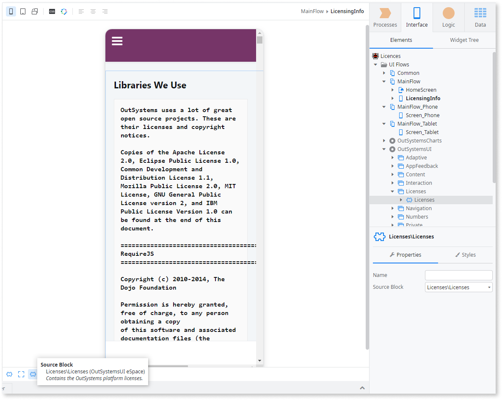
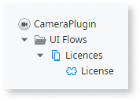
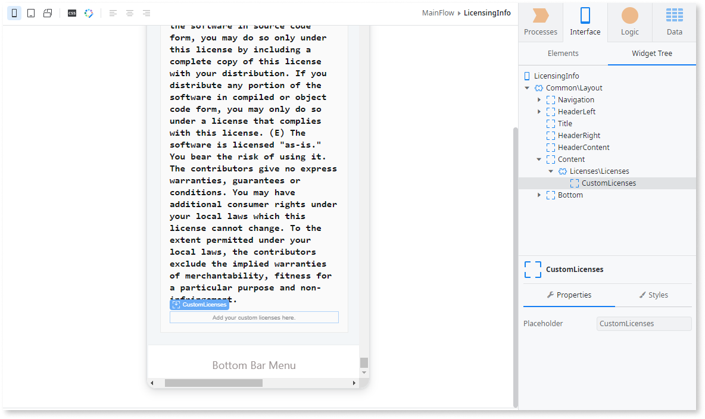

# Compliance with Third Party Licenses

OutSystems apps use several great third party components, whose licenses require publishing a copy of the license itself and/or copyright notices. Your apps must have the copies of these licenses available to the end users to be compliant with those requirements.

If you are using other custom plug-ins or components in your app, you must also check their licenses to verify if they have the same requirements and ensure that your mobile apps are compliant with them.

## Include the Third Party Licenses Used by OutSystems

The **MobilePatterns** module from OutSystems UI Mobile Framework provides you a block with the text of the licenses and copyright notices of the third party components used by OutSystems that you must include in your mobile app.

If your app is not using the **MobilePatterns** module, you must add that dependency first:

1. Go to **Manage Dependencies…**. 
1. Find the module **MobilePatterns** and add the block **Licenses** from the flow **Licenses**.   
  
      

Then, you will be able to use the block **Licenses** in your app:

1. Create a new screen in your app to display the licensing information. 
1. Expand the module **MobilePatterns** and the flow **Licenses**.
1. Drag and drop the block **Licenses** to the Content placeholder of your new screen.   
  
      

Make the screen available in your app, so the end users can access the licensing information.

## Include the Third Party Licenses Used by Plug-ins or Components

If you are using additional plug-ins or components in your app with the same licensing requirements, you must also have the copies of those licenses available in your app.

### Plug-ins Supported by OutSystems

The plug-ins supported by OutSystems, which you can install from OutSystems Forge, provide you a block named License with the text of the licenses and copyright notices that you must include in your mobile app.

You can add the licensing information of an OutSystems plug-in by doing the following:

1. Go to the screen you previously created to display the OutSystems third party licensing information.
1. Within the **Licenses\Licenses** block of the **MobilePatterns** module, locate the placeholder **CustomLicenses**. 
1. Drag and drop the block **License** from the OutSystems plug-in to the placeholder **CustomLicenses**. 

    

### Other Plug-ins or Components

For other plug-ins or components that don’t provide a block with the licensing information, you can adopt a usage similar to OutSystems plug-ins:

1. In the plug-in or component you are using, create your own block with the text of the licenses that need to be available to the end user. 
1. In your app, go to the screen you created to display the licensing information.
1. Within the **Licenses\Licenses** block of the **MobilePatterns** module, locate the placeholder **CustomLicenses**. 
1. Drag and drop your block to the placeholder **CustomLicenses**. 
