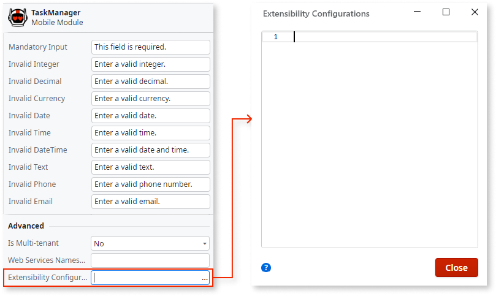

# Configure Accessible Domains for Your Mobile App

<div class="info" markdown="1">

Applies only to Mobile Apps.

</div>

To enhance your mobile app's security, you can create a allowlist of domains that your mobile app can access. The `access` extended configuration entry allows you to define the allowlist. After this, when using HTTP connections, all non-allowlisted domains will be blocked. 

To define the list of accessible domains for your mobile app do the following:

1. In Service Studio, select the module element (root item in the module tree), next in the properties editor, double-click on Extensibility Configurations. This opens the property editor window: 

    

1. Add new entries following the [JSON template](<#accessible-domains-json-template>) to configure the allowed domains and sub-domains for your mobile app. If you have already defined extensibility configurations previously, make any necessary adjustments. Each entry must have at least an `origin` field containing the allowed URL schema and the allowed domain or sub-domains, you can use wildcards.

    In the next example below, the first entry will allow the mobile app to communicate with `assets.mycompany.com` using HTTP, while the second entry will allow the app to connect to all the sub-domains of `google.com`. All HTTP connections to any other domains will be blocked.

        {
            "access": [{
                "origin": "http://assets.mycompany.com"
            },{
                "origin": "http://*.google.com"
            }]
        }

1. After defining the domains that are accessible, users must install an [updated build of the mobile app](<../mobile-app-update-scenarios.md#situations-when-the-user-must-install-a-new-build>) on their devices for the changes to take effect. 

## Default Configuration

When no `access` JSON extensibility configuration entry is defined, the accessible domains by default, match the result of defining an entry with the following single list element:

```javascript
{
    "access": [{
        "origin": "*"
    }]
}
```

In other words, by default all domains are accessible, regardless of the exact protocol (HTTP or HTTPS) and domain name.

## Blocking HTTP Connections 

Using extended configuration entries to limit the domains that are accessible is useful when using **HTTP connections**. Since all domains accessed through HTTPS are already using a secure transport channel, when using HTTPS your application will be able to access any domains. To define limitations to the content that is loaded when using HTTPS connections, consider using [Content Security Policy directives](<../../managing-the-applications-lifecycle/secure-the-applications/apply-content-security-policy.md>).

To block **all** HTTP connections (to any domain), use a configuration similar to the next example:

```javascript
{
    "access": [{
        "origin": "https://*/*"
    }]
}
```

In the previous example, by declaring that the only allowed origin must have an HTTPS protocol (regardless of the exact domain and URL), you will be effectively blocking all HTTP connections to every domain.

## Optional Fields 

<div class="info" markdown="1">

Applies only to **iOS**.

</div>

The only mandatory field in each list element (for both iOS and Android) is the `origin` field containing the allowed URL schema and domain. If this field is missing, your mobile app will not be generated successfully.

The following table lists the other available optional fields, for specific iOS configurations:

Field Name                              | Applies to | Allowed Origin Values | Default Value
----------------------------------------|:----------:|:---------------------:|-------------- 
`minimum-tls-version`                   | iOS 9+     | Any | `TLSv1.2`
`requires-forward-secrecy`              | iOS 9+     | Any | `true`
`requires-certificate-transparency`     | iOS 10+    | Any | `false`
`allows-arbitrary-loads-for-media`      | iOS 10+    | `*` | `false` 
`allows-arbitrary-loads-in-web-content` | iOS 10+    | `*` | `false`
`allows-local-networking`               | iOS 10+    | `*` | `false`

Note that the last three fields can only be included in an `access` list element whose `origin` field contains an `*` value.

Check the relevant Cordova ([Allow List Guide](<https://cordova.apache.org/docs/en/latest/guide/appdev/allowlist/>)) and Apple ([App Transport Security](<https://developer.apple.com/library/content/releasenotes/General/WhatsNewIniOS/Articles/iOS9.html#//apple_ref/doc/uid/TP40016198-SW14>)) documentation topics for more information on these fields.

## Accessible Domains JSON Template { #accessible-domains-json-template }

```javascript
{
    "access": [
        // Use the entries below to define which domains your mobile app can connect to
        {
            "origin": "<Protocol and URL of accessible domain>",
            "minimum-tls-version": "<Minimum required TLS version>",
            "requires-forward-secrecy": "<true_or_false>",
            "requires-certificate-transparency": "<true_or_false>"
        },
        // use the following template to set these three iOS-only fields
        {
            "origin": "*",
            "allows-arbitrary-loads-for-media": "<true_or_false>",
            "allows-arbitrary-loads-in-web-content": "<true_or_false>",
            "allows-local-networking": "<true_or_false>"
        }
    ]
}
```
