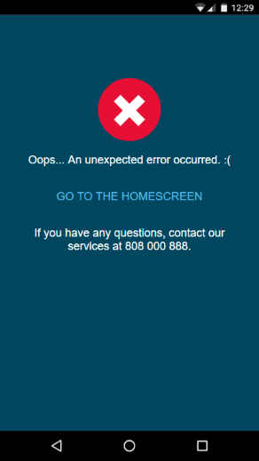
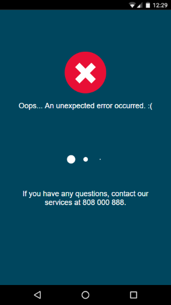

# Customize the Errors Screen

You can customize the error screen that your mobile app displays when there is an unhandled exception. Do it by editing a JSON configuration file in Service Studio. Note that, according to best practices, an error screen should have as less dependencies as possible. That is why the theme CSS is not applied in the error screens (error screens use CSS in the HTML head element instead). The images are base64 encoded.

Changing the looks of error pages and changing the messages are both done in the same JSON.

Add or edit the JSON for the customizing error screen:

1. In the module properties, locate section Advanced and click on **Extensibility Configuration**.

1. Add or edit [the JSON string](<#sample-json-for-configuring-the-error-screen>).

1. Enter the messages for the type of error you would like to customize. Refer to the JSON example and `errorPage.messages` block. The explanation of the keys is in [Reference table for the custom error JSON](<#reference-table-for-the-custom-error-json>).

1. Enter the CSS for the error screens in JSON, in `clientRuntime.errorPage.css`. Refer to [HTML structure of the error page](<#html-structure-of-the-error-page>) and [CSS selectors in the error page](<#css-selectors-in-the-error-page>) for more information. Note that if you enter your own CSS the default CSS does not load.

## Sample JSON for configuring the error screen { #sample-json-for-configuring-the-error-screen }

Add or edit this JSON string in **Extensibility Configuration** to customize the error screen.

```javascript
{
    "clientRuntime": {
        "errorPage": {
            "messages": {
                "defaultMessage": "Oops... An unexpected error occurred. :(",
                "screenNotFound": "The screen you're trying to access does not exist.",
                "noDefaultScreen": "There is no home screen defined in the application.",
                "appOffline": "The application is currently offline. Try again later.",
                "incompatibleProducer": "A producer is not compatible with this module."
            },
            "extraMessage": "If you have any questions, try contacting our services at 808 000 888.",
            "reloadLabel": "GO TO HOME SCREEN",
            "css": "body { background-color: red; }"
        }
    }
}
```

## HTML structure of the error page { #html-structure-of-the-error-page }

This is the structure of the HTML error page. To simplify the overview only the content of the body element is shown, while the styles and JS are removed.

```html
<body>
    <div id="error-screen-wrapper">
        <div id="error-screen-message-wrapper">
            <div id="error-screen-message-text">There was an error processing your request.</div>
            <button class="error-screen-button" id="error-screen-message-reload-button" style="display: inline;"></button>
            <div id="error-screen-spinner" style="display: none;"></div>
            <div id="error-screen-message-text-extra"></div>
        </div>
        <div id="exception-detail" style="display: none">
            <button class="error-screen-button" id="error-screen-show-detail-button">Show Detail</button>
            <div id="exception-detail-text" hidden>
                <div id="error-screen-exception-message"></div>
                <pre id="error-screen-exception-stack"></pre>
            </div>
        </div>
    </div>
</body>
```

## Reference table for the custom error JSON { #reference-table-for-the-custom-error-json }

This is the reference table for the JSON keys you can use to customize the error screen in **Extensibility Configuration** property within Service Studio.

<table>
<thead>
<tr>
<th>Property</th>
<th>Purpose</th>
</tr>
</thead>
<tbody>
<tr>
<td>clientRuntime.errorPage.messages.defaultMessage</td>
<td>The message that is displayed to the end user when a generic error occurs.</td>
</tr>
<tr>
<td>clientRuntime.errorPage.messages.screenNotFound</td>
<td>The message displayed when the end user navigates to a screen that does not exist.</td>
</tr>
<tr>
<td>clientRuntime.errorPage.messages.noDefaultScreen</td>
<td>The message displayed when a default screen was not configured in the application.</td>
</tr>
<tr>
<td>clientRuntime.errorPage.messages.appOffline</td>
<td>Error message shown when the server is offline.</td>
</tr>
<tr>
<td>clientRuntime.errorPage.messages.incompatibleProducer</td>
<td>Message shown when the application uses an outdated and incompatible producer module.</td>
</tr>
<tr>
<td>clientRuntime.errorPage.extraMessage</td>
<td>An extra message that is always displayed in the error screen.</td>
</tr>
<tr>
<td>clientRuntime.errorPage.reloadLabel</td>
<td>The text for the button used that reloads the application.</td>
</tr>
<tr>
<td>clientRuntime.errorPage.css</td>
<td>CSS rules to be included in the error page. When this field is defined, the default error stylesheet is not included in the error page.</td>
</tr>
</tbody>
</table>


## CSS selectors in the error page { #css-selectors-in-the-error-page }

These are the CSS selectors for custom error HTML page.

<table>
<thead>
<tr>
<th>CSS Identifier/Class</th>
<th>HTML Element</th>
<th>Inline CSS</th>
<th>Purpose</th>
</tr>
</thead>
<tbody>
<tr>
<td>#error-screen-wrapper</td>
<td>div</td>
<td> </td>
<td>Container that wraps the whole error screen HTML body.</td>
</tr>
<tr>
<td>#error-screen-message-wrapper</td>
<td>div</td>
<td> </td>
<td>Container that wraps user-visible content (error message, extra details, reload button).</td>
</tr>
<tr>
<td>#error-screen-message-text</td>
<td>div</td>
<td> </td>
<td>Main error message. It shows one of the messages defined in the configuration JSON detailed above, based on the nature of the error.</td>
</tr>
<tr>
<td>.error-screen-button</td>
<td>button</td>
<td> </td>
<td>Class used by the two error screen buttons (reload and show details).</td>
</tr>
<tr>
<td>#error-screen-message-reload-button</td>
<td>button</td>
<td>display: inline</td>
<td>Reload button displaying the text defined in the customization JSON. Clicking this button changes its inline style to “display: none” and the spinner’s to “display: inline-block”.</td>
</tr>
<tr>
<td>#error-screen-spinner</td>
<td>div</td>
<td>display: none</td>
<td>Container for the loading animation that plays after clicking reload (by default, it is a spinner animation).</td>
</tr>
<tr>
<td>#error-screen-message-text-extra</td>
<td>div</td>
<td> </td>
<td>The extra message defined in the JSON is displayed in this container.</td>
</tr>
<tr>
<td>#exception-detail</td>
<td>div</td>
<td>display: none</td>
<td>Wrapper for the exception message and stack trace. It is only shown when the “Remote Stack Display” option is enabled in Service Center.</td>
</tr>
<tr>
<td>#error-screen-show-detail-button</td>
<td>button</td>
<td> </td>
<td>Button used to show/hide the stack trace.</td>
</tr>
<tr>
<td>#exception-detail-text</td>
<td>div</td>
<td>hidden</td>
<td>Wrapper for the exception message and stack trace.</td>
</tr>
<tr>
<td>#error-screen-exception-message</td>
<td>div</td>
<td> </td>
<td>Exception message.</td>
</tr>
<tr>
<td>#error-screen-exception-stack</td>
<td>pre</td>
<td> </td>
<td>Stack trace.</td>
</tr>
</tbody>
</table>

## Example of a custom error screen configuration

Here is an example of a JSON and the resulting screen. The CSS was minified to fit easier into the value of the css key.

```
{
    "clientRuntime": {
        "errorPage": {
            "messages": {
                "defaultMessage": "Oops... An unexpected error occurred. :(",
                "screenNotFound": "The screen you're trying to access does not exist.",
                "noDefaultScreen": "There is no home screen defined in the application.",
                "appOffline": "The application is currently offline. Try again later.",
                "incompatibleProducer": "A producer is not compatible with this module."
            },
            "extraMessage": "If you have any questions, try contacting our services at 808 000 888.",
            "reloadLabel": "GO TO HOME SCREEN",
            "css": "body{background-color:#00465e}#error-screen-wrapper{position:absolute;top:0;left:0;width:100%;height:100%;font-family:Open Sans,Helvetica,Arial,sans-serif;font-size:18px;font-weight:400;color:#fff}#error-screen-message-text:before{content:url('data:image/png;base64,iVBORw0KGgoAAAANSUhEUgAAADIAAAAyCAYAAAAeP4i xAAAABGdBTUEAALGPC/xhBQAAAAlwSFlzAAAuIQAALiEBB1v8/wAAABl0RVh0U29mdHdhc mUAcGFpbnQubmV0IDQuMC4xNzNun2MAAASYSURBVGhDzZrbixNXHMfjW60vLbR0c2Z213q tJucksl6WWlEEFaoPQv+BolDvUur/oGBBHwSLolYFqa6IoCKC+tJWXC9QWh+VKquru5lJs tsouzWN098ve466yW8u52Q2yRe+sMm5/T4z5/KbzCbikJdITMt3ZlIFO7Mzb4kTeSZu5xk fdBh/DZ89tIt/M/4c3A+ff3YtsTtvc45tZTetk5NMf+Fa/EcI7rEKWNfQfiDP0gfwQshum 6fhZGq5a4urcFXfUMGZ2rHE9VxHeqUcZupUSPZ0wdW/QAURr/mloS4+Sw4bn3Aeu0mxGQb 5p37QqTFMuVewxrbHtoYG7N7pcBdOU4M1w47F+158JmbIcMw00sU/hivzOzVAU83E3ecd2 U9lWHpCCOjgPtlxCwzT7IE2jNe98oO2uBM1hrPortY0A/pTVEft4ILFz0XaAFyW3kR10E6 GC71Dhksrz1KdsC5GqcbtZf5quDM1W4ZdL4A4TzdsR/PLMuzJgsXdCykH0SDcpU07vZEVG 8iyIBeXrfNKm3eRZVHsWJlVMvx3ApDLVOUwl7773vPKZa/yYkgLBiEqA88877+yV9q2h6w TasZvyvAnlLOyc00SQAWhFBWm2CshlAxhcAYNWWkhMXCn4vuoikGuhVAKg6mDUKrC/EC2C TQTByUGgohHZCUf+0Eo+cH4QighzFZNGMafVc8V2JPnkxV8PLJ6YyCEUi1MKIQSwIyu/Wb SmGHOMbEokbcyW6jCII8dOiJHDZaCiQwBGjt8nBwzyPjYjNPqCFUYZh2YytOpg0DDGj8N2 674lSqM4qgwUWQKgQaG+3h+PKEKozoOmLGfzCHQwJBDkJdUoY4bgWkUAg13pJJwYvolxAQ mDghlXCOx/aQzfvKMDDFc42f6yD5MHcvUQutssaiJrXk92ZeugaHS8GJH60IoxQUjF7v59 os2hVCqzQBMXN1+4Xg3OhDRjUIoNQzD+CnYtdLaKQr67fNETGoExk1CigJ3ZB5VGGQdCNx iddIZE5hhlsnKNJ4/pCpQLi5ZowWh2mnBLP960piBVmk8Cj7sJSsRLsxb5pXv3JPD+os67 KLAlP/40yss+LKura+ZOFCFQI3Yi+boHIxhMEEJYBCMLkQ1ZptziTEhfCdBVfZzFaa/HiZ KFkvBaN8JMIDckOG/k2tnlkIB2cDPtTA6qfj7MCYQ6Jydpd9uwQl5jmoQZAVj8jyBMKYQE OslGXa9oNCGSto/mRZm9ZDfR3Fh9mLy+yBDnC+LXeJzGTYt2Iq/pRq3kx0mtslwgwXPKCe pDtrBbpKfjfxe8XF3N77o+Y3qqJV2GL8zmOz5UIYZTcXuzEdwUN6jOmyFXZb+CyA+keHpa QKmsTQ/FjPebwyhhNMMOmvZmoEp/ov2dApSEXczxpv5NqvkWJktsf3DwPuqvpqzRJ9OXqZ rmV1chGk9Uw47dYLb3esycSVOIOwL+r1W6BRfyWGap1F4KMN3K+C/qeAi+glA7Hc7sgtlt 62V25FaACfuVtcWRyGwW/jAA3dtXAUMf/8L3w1CnduQaR+DM2E7/o9WPGsgkfgfuIXTKdr F2vwAAAAASUVORK5CYII=');display:block;margin-bottom:15px}#error-screen-message-wrapper{position:absolute;top:100px;height:150px!important;width:80%;right:10%;text-align:center}.error-screen-button{margin-top:2em;margin-bottom:2em;color:#5DBDE6;font-size:18px;border:none;background-color:transparent}#error-screen-spinner,#error-screen-spinner:after,#error-screen-spinner:before{border-radius:50%;width:2.5em;height:2.5em;-webkit-animation:load 1.8s infinite ease-in-out;animation:load 1.8s infinite ease-in-out}#error-screen-spinner{color:#fff;font-size:10px;margin:80px auto;position:relative;text-indent:-9999em;-webkit-transform:translateZ(0);-ms-transform:translateZ(0);transform:translateZ(0);-webkit-animation-delay:-.16s;animation-delay:-.16s}#error-screen-spinner:after,#error-screen-spinner:before{content:'';position:absolute;top:0}#error-screen-spinner:before{left:-3.5em;-webkit-animation-delay:-.32s;animation-delay:-.32s}#error-screen-spinner:after{left:3.5em}@-webkit-keyframes load{0%,100%,80%{box-shadow:0 2.5em 0 -1.3em}40%{box-shadow:0 2.5em 0 0}}@keyframes load{0%,100%,80%{box-shadow:0 2.5em 0 -1.3em}40%{box-shadow:0 2.5em 0 0}}"
        }
    }
}
```

The resulting error page looks like this:



