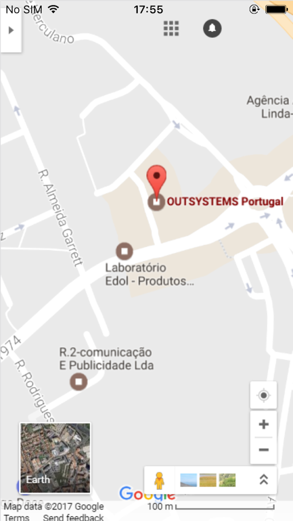

# Customize the Application Status Bar

Status bar customization requires [SILK UI Mobile](https://www.outsystems.com/forge/component/1385/silk-ui-mobile/ "https://www.outsystems.com/forge/component/1385/silk-ui-mobile/") version 1.1.1 or higher.

When your mobile app is executed, the application status bar is painted black by default and it is always visible. This behavior is customizable without using any plugin by following the instructions presented in the next section.

## Customizing the Status Bar

1. In Service Studio, open the **home module** of your mobile app. 

2. In the module tree, select the module and, in the properties editor, open the Extensibility Configurations property editor window: 

    

3. Add the JSON properties to customize your application status bar according to the reference information presented below.  
    If you already have some extensibility configurations defined in the module, add the new content making the necessary adjustments.

4. After customizing the status bar you must install an [updated build of the mobile app](<../mobile-app-update-scenarios.md#situations-when-the-user-must-install-a-new-build>) on the devices for the changes to take effect. 

## Status Bar Customization Reference

Property  |  Values  |  Description  
---|---|---  
StatusBarOverlaysWebView  | `true`  <br/> `false` |  Defines whether the content of your app starts after the status bar or can appear behind the status bar.<br/>If set to `true` , the content will appear behind the status bar.  
StatusBarBackgroundColor  |`#000000` to `#FFFFFF` |  The background color of the status bar. To have the status bar transparent, do not set this property.<br/>Expected color format: `#RRGGBB`.  
StatusBarStyle  | `default` <br/>`lightcontent` |  Defines the style of the status bar text. When set to`default` (or **not set**), the status bar text appears with the mobile platform's default color.<br/>When set to `lightcontent`, the status bar text is shown in a light color defined by the mobile platform (usually white).  
  
## Status Bar JSON Template

Use the following template as a reference for defining a custom behavior for the application status bar. Depending on your use case, you can include just one of the properties in your extensibility configurations:

```javascript
{
    "preferences": {
        "global": [{
            "name": "StatusBarOverlaysWebView",
            "value": "<value>"
        },
        {
            "name": "StatusBarBackgroundColor",
            "value": "<#RRGGBB>"
        },
        {
            "name": "StatusBarStyle",
            "value": "<value>"
        }]
    }
}
```

## Examples

### Transparent Status Bar in Full Screen App



```javascript   
{
    "preferences": {
        "global": [{
            "name": "StatusBarOverlaysWebView",
            "value": "true"
        }]
    }
}
```

### Status Bar with a Different Color


```javascript        
{
    "preferences": {
        "global": [{
            "name": "StatusBarOverlaysWebView",
            "value": "false"
        },
        {
            "name": "StatusBarBackgroundColor",
            "value": "#AF9200"
        }]
    }
}
```

### Known Issues

In iOS 13, when using dark mode, it's not currently possible to use a status bar text color other than white, even when setting the StatusBarStyle to `default`.  
This is an [issue in Cordova's Status Bar plugin](https://github.com/apache/cordova-plugin-statusbar/issues/148) and should be fixed in a future release.
