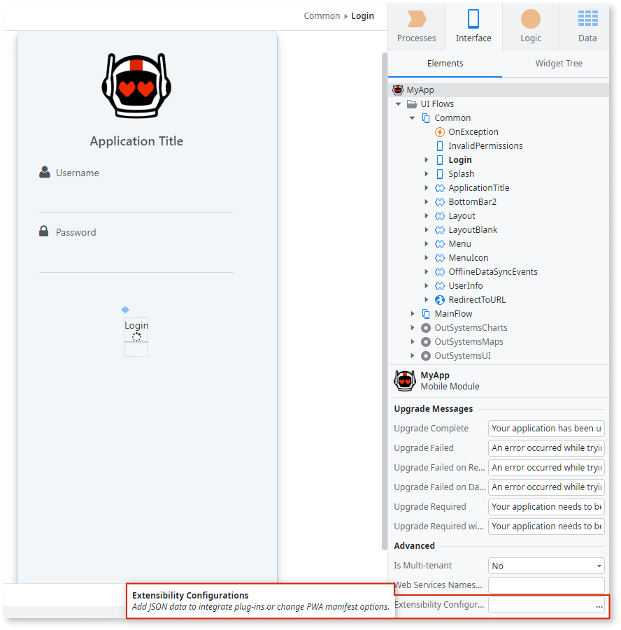

# Customize Your Mobile App

Applies only to Mobile Apps.

Mobile apps can be customized, allowing you to define global or mobile platform specific configurations, fulfill business requirements, or improve the experience of your users for all different screen sizes.

The configurations you can define for your app are:

* The preferences and configurations for your app (as the app orientation and minimum acceptable operating system version) 
* Icons of the app to display in the iOS and Android menus 
* Custom splash screens for all available screen sizes 
* Customized application status bar, such as changing  background color or making it transparent 
* [Create a plugin to extend the capabilities of your mobile apps](<../../extensibility-and-integration/mobile-plugins/using-cordova-plugins.md>)

To define these advanced configurations during development, go to the **Interface** tab, select the app name, and click **…** on the right side of the **Extensibility Configuration** field to open the **Extensibility Configuration** window. The extensibility configuration property is a JSON object that defines the configurations you want.

Once you have typed in the JSON string click **Close** to save the new extensibility configuration.

See [Extensibility Configurations JSON Schema](<extensibility-configurations-json-schema.md>) for information about configuration schema and constraints.

You may change these default extensibility configurations when it is necessary to have different configurations for different environments. For example, the development team may want to increase the plugin logging level in the development environment in order to troubleshoot an issue, while keeping the default logging level in the quality and production environments.

Using **LifeTime**, you can override the default extensibility configurations for a specific environment, with no need to manually change and deploy the application in that environment.

