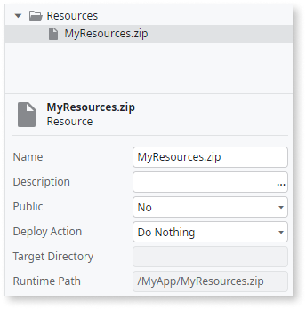

# Modify the App Icon

<div class="info" markdown="1">

Applies only to Mobile Apps.

</div>

When you create a mobile application, the icon for the app is generated automatically in the app creation wizard. This icon is then used to identify the app in the devices, being automatically adapted to all aspects of the device or context as the density or screen size of the device’s screen or the size of the place where the icon is displayed.


## Define Custom Icons for Your App

To change the default icon and use your own icon image, providing multiple versions regarding the icon's context, device screen size or density:

1. Create (if not yet created) a ZIP file and add all the [Android/iOS icons](<#icon-sizes-and-densities>) (.png image format).

1. Open the main application module and import the new or the updated ZIP file to the resources folder.

    

1. Select the application module, go to its properties and open the Extensibility Configurations property.

    

1. In the Extensibility Configurations value window, you must create a JSON object (if not created) where you can specify all the information about the icons to use. If not yet specified, start by indicating the resource file that contains the icons.

    

1. Add the “icons” tag to the JSON to indicate that you want to use your own icons for your application.
For each mobile platform, specify the size (iOS) and density (Android) and the correspondent icon location in the ZIP folders. Ensure that you define icons for all size and densities available, otherwise, you'll get an error (the example below is just for reference). Check the [JSON template for the icons](<#icons-json-template>) to avoid mistakes.

    

1. To make this change available for the users, [publish and generate a new mobile application](<../generate-distribute-mobile-app/intro.md>) and distribute it.

    

## Icon Sizes and Densities { #icon-sizes-and-densities }

### For iOS

Width | Height | Displayed on
:----:|:------:|-------------
20    | 20     | iPad Notifications (iOS 7–11)
29    | 29     | iPhone Spotlight (iOS 5, 6) <br/> iPhone Settings (iOS 5–11) <br/> iPad Settings (iOS 5–11)
40    | 40     | iPhone Notifications (iOS 7–11) <br/> iPad Notifications (iOS 7–11) <br/> iPad Spotlight (iOS 7–11)
48    | 48     | Apple Watch Notification Center
50    | 50     | iPad Spotlight (iOS 5, 6)
55    | 55     | Apple Watch Notification Center
57    | 57     | iPhone App (iOS 5, 6)
58    | 58     | iPhone Spotlight (iOS 5, 6) <br/> iPhone Settings (iOS 5–11) <br/> iPad Settings (iOS 5–11)
60    | 60     | iPhone Notifications (iOS 7–11)
72    | 72     | iPad App (iOS 5, 6)
76    | 76     | iPad App (iOS 7–11)
80    | 80     | iPhone Spotlight (iOS 7–11) <br/> iPad Spotlight (iOS 7–11)
87    | 87     | iPhone Spotlight (iOS 5, 6) <br/> iPhone Settings (iOS 5–11)
88    | 88     | Apple Watch Long Look
100   | 100    | iPad Spotlight (iOS 5, 6)
114   | 114    | iPhone App (iOS 5, 6)
120   | 120    | iPhone Spotlight (iOS 7–11) <br/> iPhone App (iOS 7–11)
144   | 144    | iPad App (iOS 5, 6)
152   | 152    | iPad App (iOS 7–11)
167   | 167    | iPad Pro App (iOS 9–11)
172   | 172    | Apple Watch Short Look
180   | 180    | iPhone App (iOS 7–11)
196   | 196    | Apple Watch Short Look
1024  | 1024   | App Store iOS

### For Android

Width | Height | Density | Displayed on
:----:|:------:|:-------:|-------------
36    | 36     | ldpi    | Notification icons
48    | 48     | mdpi    | Launcher icons <br/> Action bar, Dialog and Tab icons <br/> Small Contextual Icons
72    | 72     | hdpi    | Launcher icons <br/> Notification icons
96    | 96     | xhdpi   | Launcher icons <br/> Action bar, Dialog and Tab icons <br/> Notification icons
144   | 144    | xxhdpi  | Launcher icons
192   | 192    | xxxhdpi | Launcher icons
  
## Icons JSON Template { #icons-json-template }

```javascript
{
    "resource": "<path_to_resource_file>",
    "icons": {
        "android": [{
            "resource": "<path_to_icon_image>",
            "density": "ldpi"
        },
        {
            "resource": "<path_to_icon_image>",
            "density": "mdpi"
        },
        {
            "resource": "<path_to_icon_image>",
            "density": "hdpi"
        },
        {
            "resource": "<path_to_icon_image>",
            "density": "xhdpi"
        },
        {
            "resource": "<path_to_icon_image>",
            "density": "xxhdpi"
        },
        {
            "resource": "<path_to_icon_image>",
            "density": "xxxhdpi"
        }],
        "ios": [{
            "resource": "<path_to_icon_image>",
            "width": "20",
            "height": "20"
        },
        {
            "resource": "<path_to_icon_image>",
            "width": "29",
            "height": "29"
        },
        {
            "resource": "<path_to_icon_image>",
            "width": "40",
            "height": "40"
        },
        {
            "resource": "<path_to_icon_image>",
            "width": "48",
            "height": "48"
        },
        {
            "resource": "<path_to_icon_image>",
            "width": "50",
            "height": "50"
        },
        {
            "resource": "<path_to_icon_image>",
            "width": "55",
            "height": "55"
        },
        {
            "resource": "<path_to_icon_image>",
            "width": "57",
            "height": "57"
        },
        {
            "resource": "<path_to_icon_image>",
            "width": "58",
            "height": "58"
        },
        {
            "resource": "<path_to_icon_image>",
            "width": "60",
            "height": "60"
        },
        {
            "resource": "<path_to_icon_image>",
            "width": "72",
            "height": "72"
        },
        {
            "resource": "<path_to_icon_image>",
            "width": "76",
            "height": "76"
        },
        {
            "resource": "<path_to_icon_image>",
            "width": "80",
            "height": "80"
        },
        {
            "resource": "<path_to_icon_image>",
            "width": "87",
            "height": "87"
        },
        {
            "resource": "<path_to_icon_image>",
            "width": "88",
            "height": "88"
        },        
        {
            "resource": "<path_to_icon_image>",
            "width": "100",
            "height": "100"
        },
        {
            "resource": "<path_to_icon_image>",
            "width": "114",
            "height": "114"
        },
        {
            "resource": "<path_to_icon_image>",
            "width": "120",
            "height": "120"
        },
        {
            "resource": "<path_to_icon_image>",
            "width": "144",
            "height": "144"
        },
        {
            "resource": "<path_to_icon_image>",
            "width": "152",
            "height": "152"
        },
        {
            "resource": "<path_to_icon_image>",
            "width": "167",
            "height": "167"
        },
        {
            "resource": "<path_to_icon_image>",
            "width": "172",
            "height": "172"
        },
        {
            "resource": "<path_to_icon_image>",
            "width": "180",
            "height": "180"
        },
        {
            "resource": "<path_to_icon_image>",
            "width": "196",
            "height": "196"
        },
        {
            "resource": "<path_to_icon_image>",
            "width": "1024",
            "height": "1024"
        }]
    }
}
```
