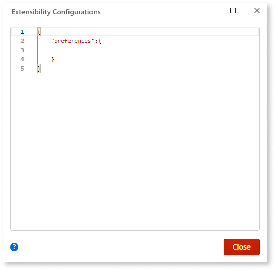

# Set the Preferences for Your Mobile App

You may want your mobile application to have some configurations and preferences that allow you to better guarantee behavior requirements and improve the user experience. For example, define mobile app preferences when the app should only work in a specific orientation (portrait or landscape), or when it should only be available on devices holding, at least, a specific minimum mobile platform version to ensure a great experience to your users.

To specify the preferences for your mobile app:

1. Select the application module, go to its properties and open the Extensibility Configurations property. 

    

2. In the Extensibility Configurations value window, you must create a JSON object (if not created) where you can specify the preferences. Add the “preferences” tag to the JSON to indicate that you will set preferences for the app.

    

3. Introduce the preferences you want from the [available preferences](https://cordova.apache.org/docs/en/latest/config_ref/#preference) in the JSON value: 

    1. Each preference you want to define is represented as a name/value pair, where the name is the preference name and the value (specified as a string) is its parameter. The preference name is case-sensitive. Check the  preferences JSON template  to avoid mistakes. 

        

    2. You can set a preference to work only for a target mobile platform or apply it to all. Be aware that some [preferences may not work on every mobile platform](https://cordova.apache.org/docs/en/latest/config_ref/#preference). 

        

4. To make this change available for the users, [publish and generate a new mobile application](<../generate-distribute-mobile-app/intro.md>) and distribute it. 

    

## Preferences JSON Template

```javascript    
{
    "preferences": {
        "global": [{
            "name": "<preference_name>",
            "value": "<preference_value>"
        }],
        "android": [{
            "name": "<preference_name>",
            "value": "<preference_value>"
        }],
        "ios": [{
            "name": "<preference_name>",
            "value": "<preference_value>"
        }]
    }
}
```
