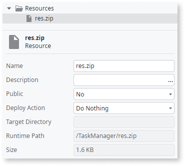
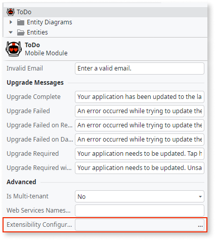
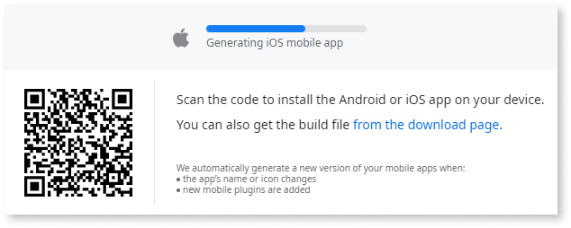

# Use Custom Splash Screens

By default, mobile applications have a custom splash screen displaying the main color defined in the app creation wizard. This splash screen is displayed after the Operating System loads your app (black screen) and after the WebView finishes loading the content (white screen). 

It is possible to change the look of your app even before it is fully loaded by customizing the native splash screen. This way you make sure that the end user has a fluid experience from the moment they open your app by replacing the black to white screen transition with an image of your choice.

## Before you start

To use a custom image as the native splash screen of your app, you need to create PNG versions of your custom image for **all** the [Android/iOS splash screen sizes](#devices-screen-sizes-and-densities).


## Customizing the native splash screen

To use a custom image as the native splash screen of your app:

1. Create a ZIP file containing all the PNG versions of your custom image for all the Android/iOS splash screen sizes. 

1. In the Data tab of the main Module of your app, right-click the Resources folder and import the ZIP file as a Resource. 

    

    Leave the `Deploy Action` property as `Do Nothing`.

1. In the properties of the app module add the [Splash Screens JSON template](#splash-screens-json-templates) to the **Extensibility Configurations** property:

    

1. In the JSON template that you added to the **Extensibility Configurations** property, replace `<path_to_resources_file>` with the name of the ZIP file and replace each one of the `<path_to_splash_screen_image>.png` with the corresponding splash screen PNG image location inside the ZIP file. After this step, you should get a JSON similar to the following:

    

    <div class="warning" markdown="1">
    
    Ensure that you define the splash screen and the PNG image path for all sizes and densities available, otherwise, you'll get an error when generating your mobile application.
    
    </div>

1. To make this change available to users, [publish and generate a new mobile application package](<../generate-distribute-mobile-app/intro.md>) and distribute it. 

    

## Devices screen sizes and densities { #devices-screen-sizes-and-densities }

### For Android

Width%%(px)|Height%%(px)|Density
---|---|---
240|360|port-ldpi (120 dpi)
320|480|port-mdpi (160 dpi)
480|720|port-hdpi (240 dpi)
640|960|port-xhdpi (320 dpi)
960|1440|port-xxhdpi (480 dpi)
1280|1920|port-xxxhdpi (640 dpi)
360|240|land-ldpi (120 dpi)
480|320|land-mdpi (160 dpi)
720|480|land-hdpi (240 dpi)
960|640|land-xhdpi (320 dpi)
1440|960|land-xxhdpi (480 dpi)
1920|1280|land-xxxhdpi (640 dpi)

### For iOS

For iOS, the splash screen sizes depend on the [Mobile Apps Build Service (MABS) version](https://www.outsystems.com/goto/mabs) that you use to generate your mobile app packages.

#### MABS 4.0 or later

If you are using MABS 4.0 or later, you must use splash screen sizes [based in launch storyboard images](https://cordova.apache.org/docs/en/latest/reference/cordova-plugin-splashscreen/index.html#launch-storyboard-images).

Width%%(px)|Height%%(px)|Default Filename
---|---|---
2732|2732|`Default@2x~universal~anyany`
1278|2732|`Default@2x~universal~comany`
1334|750|`Default@2x~universal~comcom`
2208|2208|`Default@3x~universal~anyany`
2208|1242|`Default@3x~universal~anycom`
1242|2208|`Default@3x~universal~comany`
1334|1334|`Default@2x~iphone~anyany`
750|1334|`Default@2x~iphone~comany`
1334|750|`Default@2x~iphone~comcom`
2208|2208|`Default@3x~iphone~anyany`
2208|1242|`Default@3x~iphone~anycom`
1242|2208|`Default@3x~iphone~comany`
2732|2732|`Default@2x~ipad~anyany`
1278|2732|`Default@2x~ipad~comany`

#### MABS 3.3

If you are using MABS 3.3, you must use splash screen sizes [based on the legacy launch images](https://cordova.apache.org/docs/en/latest/reference/cordova-plugin-splashscreen/index.html#legacy-launch-images).

Width%%(px)|Height%%(px)|Device
---|---|---
320|480|All non-retina iPhones and iPods
640|960|iPhone 4/4s (portrait)
640|1136|iPhone 5/5s/SE (portrait)
750|1334|iPhone 6/6s/7/8 (portrait)
1242|2208|iPhone 6+/6s+/7+/8+ (portrait)
2208|1242|iPhone 6+/6s+/7+/8+ (landscape)
1125|2436|iPhone X (portrait)
2436|1125|iPhone X (landscape)
768|1024|All non-retina iPads (portrait)
1024|768|All non-retina iPads (landscape)
1536|2048|All retina iPads (portrait)
2048|1536|All retina iPads (landscape)

## Splash screens JSON Templates { #splash-screens-json-templates } 

Find below two templates that you can copy and paste to the **Extensibility Configurations** property of your module. Choose only one of them, depending on the [Mobile Apps Build Service (MABS) version](https://www.outsystems.com/goto/mabs) you are using to generate your mobile app packages, and copy the whole template. The templates include definitions for both Android and iOS.

* In each template, `<path_to_resources_file>` is the path to the ZIP file and each `<path_to_splash_screen_image>.png` is the path to the PNG version of your custom image specific to a certain splash screen size.

* The snippet inside the `"splashscreens"` tag defines the splash screen image location in the ZIP file for every splash screen size for both platforms (`"android"` and `"ios"`).

* The last part of the template uses a `"preferences"` tag to set a preference, `"SplashScreenDelay"`, that applies to both mobile platforms (`"global"` tag), and that displays the native splash screen for 3 seconds before automatically hiding it. To make sure the native splash screen is shown, you **must** define this preference since the default value for `"SplashScreenDelay"` is `0`.

### JSON template for Android and iOS using MABS 4.0 or later

```javascript
{
    "resource": "<path_to_resources_file>",
    "splashscreens": {
        "android": [{
            "resource": "<path_to_splash_screen_image>.png",
            "density": "port-ldpi"
        },
        {
            "resource": "<path_to_splash_screen_image>.png",
            "density": "port-mdpi"
        },
        {
            "resource": "<path_to_splash_screen_image>.png",
            "density": "port-hdpi"
        },
        {
            "resource": "<path_to_splash_screen_image>.png",
            "density": "port-xhdpi"
        },
        {
            "resource": "<path_to_splash_screen_image>.png",
            "density": "port-xxhdpi"
        },
        {
            "resource": "<path_to_splash_screen_image>.png",
            "density": "port-xxxhdpi"
        },
        {
            "resource": "<path_to_splash_screen_image>.png",
            "density": "land-ldpi"
        },
        {
            "resource": "<path_to_splash_screen_image>.png",
            "density": "land-mdpi"
        },
        {
            "resource": "<path_to_splash_screen_image>.png",
            "density": "land-hdpi"
        },
        {
            "resource": "<path_to_splash_screen_image>.png",
            "density": "land-xhdpi"
        },
        {
            "resource": "<path_to_splash_screen_image>.png",
            "density": "land-xxhdpi"
        },
        {
            "resource": "<path_to_splash_screen_image>.png",
            "density": "land-xxxhdpi"
        }],
        "ios": [{
            "resource": "<path_to_splash_screen_image>.png",
            "defaultName": "Default@2x~universal~anyany"
        },
        {
            "resource": "<path_to_splash_screen_image>.png",
            "defaultName": "Default@2x~universal~comany"
        },
        {
            "resource": "<path_to_splash_screen_image>.png",
            "defaultName": "Default@2x~universal~comcom"
        },
        {
            "resource": "<path_to_splash_screen_image>.png",
            "defaultName": "Default@3x~universal~anyany"
        },
        {
            "resource": "<path_to_splash_screen_image>.png",
            "defaultName": "Default@3x~universal~anycom"
        },
        {
            "resource": "<path_to_splash_screen_image>.png",
            "defaultName": "Default@3x~universal~comany"
        },
        {
            "resource": "<path_to_splash_screen_image>.png",
            "defaultName": "Default@2x~iphone~anyany"
        },
        {
            "resource": "<path_to_splash_screen_image>.png",
            "defaultName": "Default@2x~iphone~comany"
        },
        {
            "resource": "<path_to_splash_screen_image>.png",
            "defaultName": "Default@2x~iphone~comcom"
        },
        {
            "resource": "<path_to_splash_screen_image>.png",
            "defaultName": "Default@3x~iphone~anyany"
        },
        {
            "resource": "<path_to_splash_screen_image>.png",
            "defaultName": "Default@3x~iphone~anycom"
        },
        {
            "resource": "<path_to_splash_screen_image>.png",
            "defaultName": "Default@3x~iphone~comany"
        },
        {
            "resource": "<path_to_splash_screen_image>.png",
            "defaultName": "Default@2x~ipad~anyany"
        },
        {
            "resource": "<path_to_splash_screen_image>.png",
            "defaultName": "Default@2x~ipad~comany"
        }]
    },
    "preferences": {
        "global": [
            {
                "name": "SplashScreenDelay",
                "value": "3000"
            }
        ]
    }
}
```

### JSON template for Android and iOS using MABS 3.3

```javascript
{
    "resource": "<path_to_resources_file>",
    "splashscreens": {
        "android": [{
            "resource": "<path_to_splash_screen_image>.png",
            "density": "port-ldpi"
        },
        {
            "resource": "<path_to_splash_screen_image>.png",
            "density": "port-mdpi"
        },
        {
            "resource": "<path_to_splash_screen_image>.png",
            "density": "port-hdpi"
        },
        {
            "resource": "<path_to_splash_screen_image>.png",
            "density": "port-xhdpi"
        },
        {
            "resource": "<path_to_splash_screen_image>.png",
            "density": "port-xxhdpi"
        },
        {
            "resource": "<path_to_splash_screen_image>.png",
            "density": "port-xxxhdpi"
        },
        {
            "resource": "<path_to_splash_screen_image>.png",
            "density": "land-ldpi"
        },
        {
            "resource": "<path_to_splash_screen_image>.png",
            "density": "land-mdpi"
        },
        {
            "resource": "<path_to_splash_screen_image>.png",
            "density": "land-hdpi"
        },
        {
            "resource": "<path_to_splash_screen_image>.png",
            "density": "land-xhdpi"
        },
        {
            "resource": "<path_to_splash_screen_image>.png",
            "density": "land-xxhdpi"
        },
        {
            "resource": "<path_to_splash_screen_image>.png",
            "density": "land-xxxhdpi"
        }],
        "ios": [{
            "resource": "<path_to_splash_screen_image>.png",
            "width": "320",
            "height": "480"
        },
        {
            "resource": "<path_to_splash_screen_image>.png",
            "width": "640",
            "height": "1136"
        },
        {
            "resource": "<path_to_splash_screen_image>.png",
            "width": "640",
            "height": "960"
        },
        {
            "resource": "<path_to_splash_screen_image>.png",
            "width": "750",
            "height": "1334"
        },
        {
            "resource": "<path_to_splash_screen_image>.png",
            "width": "1242",
            "height": "2208"
        },
        {
            "resource": "<path_to_splash_screen_image>.png",
            "width": "2208",
            "height": "1242"
        },
        {
            "resource": "<path_to_splash_screen_image>.png",
            "width": "1125",
            "height": "2436"
        },
        {
            "resource": "<path_to_splash_screen_image>.png",
            "width": "2436",
            "height": "1125"
        },
        {
            "resource": "<path_to_splash_screen_image>.png",
            "width": "768",
            "height": "1024"
        },
        {
            "resource": "<path_to_splash_screen_image>.png",
            "width": "1024",
            "height": "768"
        },
        {
            "resource": "<path_to_splash_screen_image>.png",
            "width": "1536",
            "height": "2048"
        },
        {
            "resource": "<path_to_splash_screen_image>.png",
            "width": "2048",
            "height": "1536"
        }]
    },
    "preferences": {
        "global": [
            {
                "name": "SplashScreenDelay",
                "value": "3000"
            }
        ]
    }
}
```

## Further customization of splash screen behavior

You can further customize the behavior of the native splash screen by adding new preferences, in the **Extensibility Configurations**, using the following syntax: 

```javascript
{
    "preferences": {
        "<target-platform>": [
            {
                "name": "<preference>",
                "value": "<preference-value>"
            }
        ]
    }
}
```

Where `<target-platform>` is the target mobile platform that can be set as `global`, `android` or `ios`. The table below lists the possible values for `<preference>` and `<preference-value>`.

Preference | Possible Values | Platform Support
---|---|---
AutoHideSplashScreen | _True_ or _False_ | iOS and Android
SplashScreenDelay | Number | iOS and Android
FadeSplashScreen | _True_ or _False_ | iOS and Android
FadeSplashScreenDuration | Number | iOS and Android
SplashMaintainAspectRatio | _True_ or _False_ | Android
SplashShowOnlyFirstTime | _True_ or _False_ | Android

See the descriptions of the [available splash screen preferences](https://github.com/apache/cordova-plugin-splashscreen#preferences) to learn how they work.

<div class="info" markdown="1">

Do not forget that you must [publish and generate a new mobile application package](<../generate-distribute-mobile-app/intro.md>) and distribute it to make the splash screen preferences visible to the end users.

</div>
