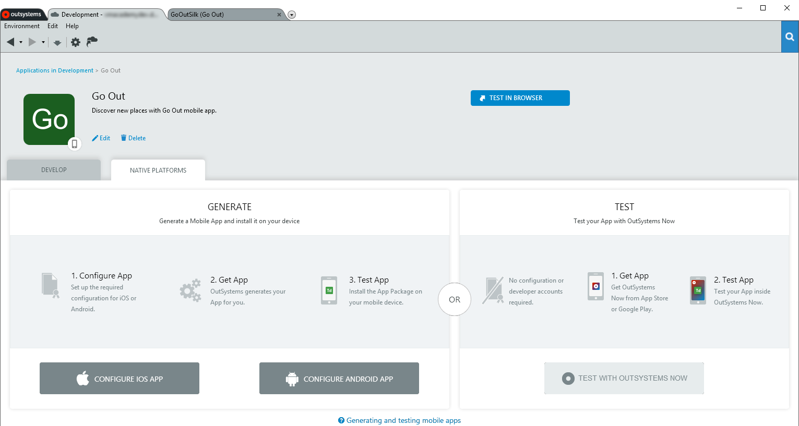
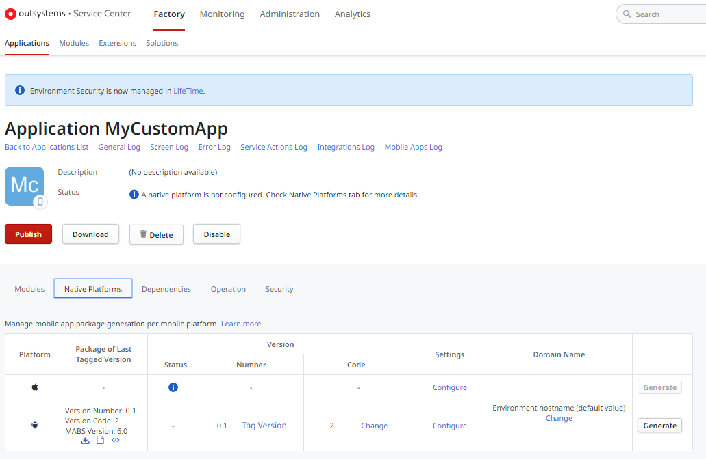

# Generate and Distribute Your Mobile App

Before generating your mobile app for the first time, you will have to configure specific iOS and/or Android settings. Check the [topics listed at the end of this page](#Articles_in_this_Section) for details about different scenarios, such as development tests, distributing your app to a limited group of end users or publishing your app in Mobile App Stores.

The following sections show how to configure and generate iOS and Android application packages of your mobile apps in Service Studio or in Service Center.

For additional information about generating and distributing iOS and Android application packages, see [More Information on Generating and Distributing Mobile Apps](more-information-on-generating-and-distributing-mobile-apps.md).

## Configure and Generate a Mobile App Package in Service Studio

To configure or generate your mobile app package (iOS or Android) in Service Studio, do the following:

1. Navigate to the app detail screen of your mobile app. 

1. Select the **Native Platforms** tab. 

1. When configuring your mobile app for the first time for a given platform (iOS or Android), click on the **Configure iOS App** or **Configure Android App** button, according to the platform. Follow the configuration steps for your desired scenario, described in the [topics listed at the end of this page](#Articles_in_this_Section). If you have previously defined your mobile app's iOS or Android configuration settings, click on the cog icon for the correct platform to change your configuration. 

1. After defining or changing your mobile app iOS or Android settings, click on the **Generate App** button.

    

## Configure and Generate a Mobile App Package in Service Center

To configure or generate your mobile app package (iOS or Android) in Service
Center, do the following:

1. Open the Service Center console of the environment (`https://<environmentdomain>/ServiceCenter`) and navigate to **Factory**.

1. Click on the **Applications** tab, open your mobile application from the applications list and select the **Native Platforms** tab.

1. To configure your mobile app package for the first time or to change the current configuration for a given platform (iOS or Android), click on the **Configure** link for the iOS or Android entry. Follow the configuration steps for your desired scenario, described in the [topics listed at the end of this page](#Articles_in_this_Section).

    

1. After defining or changing your mobile app iOS or Android settings, click on the **Save** button.

1. At the end of the configuration settings page, select the MABS version you wish to use for generating the mobile app package for the mobile platform you're configuring (iOS or Android) in the current environment.  
    For more information check [Choosing the MABS Version to Build Your Mobile Packages](<#choosing-the-mabs-version-to-build-your-mobile-packages>).

1. Click **Save and Generate** and wait a few moments while your mobile app is being generated.

    

### Customizing the Mobile App Domain Name

This feature is only available in OutSystems on-premises installations.

In some cases, you might need to change the domain name associated with your mobile app, like when you have internal security policies dictating that different mobile apps should have different associated domain names and SSL certificates.

You can customize the domain name for each mobile app in Service Center. By default, OutSystems uses the hostname set for the environment in Administration > Environment Configuration.

**Note:** The domain name set for your mobile app should match the Common Name (CN) or a Subject Alternative Name (SAN) specified in the SSL certificate you have configured in your web server for serving HTTPS requests.

To define a different domain name for your mobile app, do the following:

1. In **Native Platforms** tab, click the **Change** link in the Domain Name column.

    

1. Enter the new domain name for the mobile app and click **Apply**.

You will need to regenerate the mobile app for the changes to take effect.

### Customizing the Mobile App Version Code

The mobile app version code is an internal number associated to the generation of the mobile app package. This number is used by the app store to determine whether one version is more recent than another. See more detailed information in [Android](https://developer.android.com/studio/publish/versioning) and [iOS](https://help.apple.com/app-store-connect/#/dev82a6a9d79) documentation.

By default, OutSystems **increments the version code by one** every time the mobile app package is generated.

In some cases, you might need to change the default mobile app version code. For example, if you are migrating an existing mobile app from other technology to OutSystems, the current version code of your app in the app store will be higher than the first OutSystems app version code. In this case, you can the set version code of your OutSystems mobile app to a different value.

To set a different version code for your mobile app, do the following:

1. In **Native Platforms** tab, click the **Change** link in the Code column for the iOS or Android entry.

    

1. Enter the new code for the mobile app and click **Apply**.

The next time you generate a new application package, the version code will be incremented by one.

### Choosing the MABS Version to Build Your Mobile Packages { #choosing-the-mabs-version-to-build-your-mobile-packages }

The [Mobile Apps Build Service (MABS)](<../mobile-apps-build-service/intro.md>) is a **cloud service** used by OutSystems to generate the mobile packages of your mobile apps developed in OutSystems for iOS and Android. 

Though MABS is being continuously improved and OutSystems regularly makes available new versions of this cloud service, you might not want to use the latest version, since different MABS versions support different mobile stacks and therefore different ranges of devices and mobile platform versions.

You can select the MABS version used to generate the mobile packages **by mobile app** and **by mobile platform** (iOS and Android), for a given environment. This selection is done in Service Center at the application level.

To choose a MABS version do the following:

1. In Service Center, click on the **Applications** tab, open your mobile app from the applications list and select the **Native Platforms** tab.

1. Click on **Configure** link for the iOS or Android entry. 

1. At the end of the configuration settings page, select the MABS version you wish to use for generating the mobile app package for the mobile platform you're configuring (iOS or Android) in the current environment, either the latest available version or a specific version (see below for details).

    

    _Note:_ The MABS version selection is only available for applications whose native platform settings are already configured.

1. Click **Save and Generate** and wait a few moments while your mobile app is being generated.

When choosing a MABS version you have the following options available:

* **Always use the latest version available**: Always use the most recent MABS version available to generate the mobile package of the app for the current platform and in the current environment.

* **Specific version _(select from list)_**: Generate mobile app packages (in the current environment) with the MABS version selected from the list.

Regardless of whether you selected the option of using the latest MABS version or using a specific MABS version for the app package generation when you generate and tag a mobile app version, the OutSystems platform will record the MABS version used to generate the mobile package. 

**To fully understand the impacts of this setting, be sure to check [Understanding MABS Versions](<../mobile-apps-build-service/intro.md#understanding-mabs-versions>).**

## Download Mobile App Build Logs

You can obtain the build logs of your mobile apps in Service Center. Build logs are available for both successful and unsuccessful builds, and each platform (Android and iOS) has its own build log.

To obtain a mobile app build log:

1. Access the Service Center of the environment (`https://<environmentdomain>/ServiceCenter`).
1. Go to **Factory** and click the Applications tab.
1. Click your mobile app name to navigate to the mobile app detail page.
1. In the Native Platforms tab, click the log icon for the desired platform to download the build log.

## Updating Your Mobile App Package

In most occasions, the users of your mobile app will not have to update it manually after installing it in their devices, since OutSystems will automatically push the updates to their devices when you publish a new mobile app version.

However, in some situations, the users will have to install a new mobile app package. For more information check [Mobile App Update Scenarios](<../mobile-app-update-scenarios.md>).
