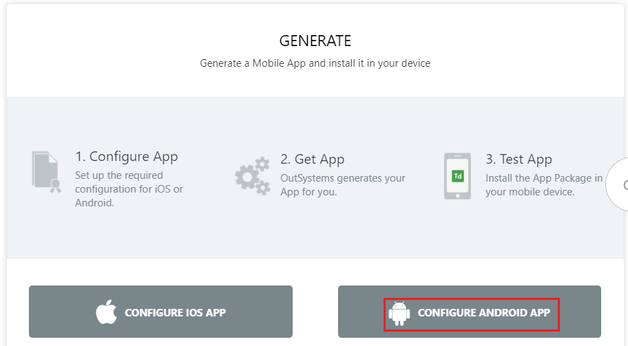
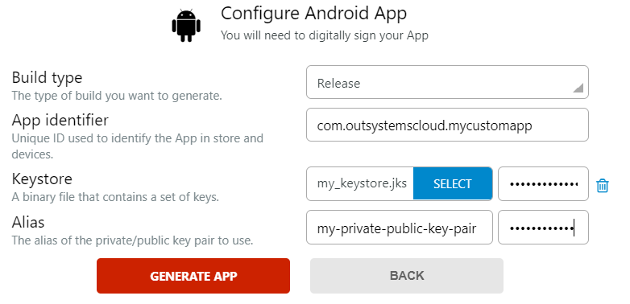
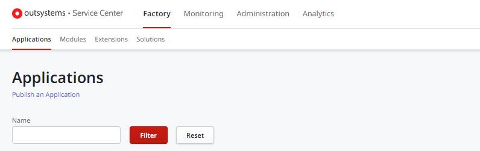
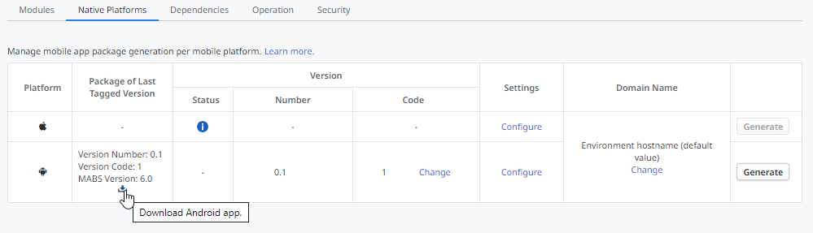

# Publish Your Mobile Android Application to the Google Play Store

This article describes the process you must follow to publish your application to the Google Play Store. Before you proceed, ensure your app fulfills the general [pre-requirements](generate-and-publish-your-mobile-app-to-the-mobile-app-stores.md).

To publish your app to the Google Play store you must have a developer account. If you don't, [create a new Google Developer Account here](https://developer.android.com/distribute/googleplay/start.html).

## Preparation Checklist

Google [provides a checklist](https://developer.android.com/distribute/best-practices/launch/launch-checklist) with instructions to ensure your application is compliant with the publishing rules and the quality required.

Pre-requirements for Android include [graphics assets](https://developer.android.com/distribute/best-practices/launch/store-listing.html#best-practices) and an [app package](https://support.google.com/googleplay/android-developer/answer/113469?hl=en).

Google also provides a video with a [list of 10 tips](https://www.youtube.com/watch?v=psu3pPdfYSM) you should  follow to ensure the success of your application.

## Publishing Android Applications to Google Play

### Generate the Android App Package (APK)

You can generate the release (final) version of your mobile app in Service Studio or Service Center.

#### Service Studio

To generate the Android App Package in the Service Studio, perform the following steps:

1. Go to the app detail screen of the mobile application for which you want to generate the mobile application package. Open the **Distribute** tab.

1. Click on the **Generate Android App** button, or the Android cog icon button if you've already generated a previous Android app.

    

1. In the **Build type** list, select the **Release** option.

1. Keep the default app identifier assigned by OutSystems or write your own (matching reverse domain name notation, for example, **com.domain.appname**).

1. Select the keystore to sign your app and introduce the passwords. If you don't have a keystore to sign your Android apps, [check here](more-information.md#For_Android) how to do it.

1. Fill in the alias name and password of the private/public key pair to use. The alias you must use is the one generated when creating the keystore.

1. Click **GENERATE APP**.

        

#### Service Center

 To generate the Android App Package in the Service Center, perform the following steps:

1. Access Service Center console of the environment (`https://<environmentdomain>/ServiceCenter`).

1. Go to **Factory**, click on the **Applications** tab, and open your application from the applications list.

    

1. Select the **Distribute** tab and click on the **Configure** link for the Android entry in the **Native Platforms** section.

    

1. In the **Build type** drop-down menu, select the **Release** option.

    Keep the default app identifier assigned by OutSystems or write your own (matching reverse domain name notation, for example, **com.domain.appname**).

1. Select the keystore to sign your app and introduce the passwords. If you don't have a keystore to sign your Android apps, [check here](more-information.md#For_Android) how to do it.

1. Fill in the alias name and password of the private/public key pair to use. The alias you must use is the one generated when creating the keystore.

    

1. Click **Save** to save your settings.

1. Click **Save and Generate** and wait a few moments while the app is being generated.

    

1. After the app is generated, click the **download** icon near the version information to download the Android app package (APK).

    

## Distribute the Mobile App through the Google Play store

After the generation has been completed, scan the QR code or copy the created installation link using your device to download the Android app package (APK).

You need now to access the [Google Play Console](https://play.google.com/apps/publish) to upload your mobile app.

You have to provide the following information: 

* To create the application:
    * the name;
    * the default language;

* To release the application:
    * choose whether to roll out to Beta testing or Production;
    * calculate the content rating by answering a few questions;
    * define the pricing;
    * define the countries and regions where it’s going to be available;
    * define a few more requirements.

* To define the store listing:
    * the title, short description, and full description;
    * the application screenshots;
    * your contacts;
    * The URL of your privacy policy, if any;

At the final steps, you need to release the app to Beta Testing or Production, according to your choice, confirm the version and APK, and start the rollout.

After completing this process your application is published and available for download at the Google Play Store.
