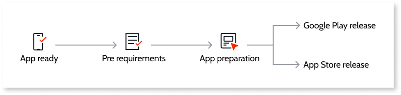

# Generate and Publish Your Mobile App to the Mobile App Stores

At some point your mobile app is ready for production and so, to be used by end users. One of the ways you can distribute your production-ready mobile app is by providing it in the mobile stores for the general public.

In OutSystems, you can generate a mobile application package to publish your mobile app in the App Store and Google Play stores.

The following diagram shows a typical publishing process:

## Pre-requirements

When you have your application ready, it's time to publish it. Unlike publishing an app in OutSystems with one single click, publishing an app to a store requires several steps. Here are some pre-requirements to follow.

### Screenshots

Each application can have up to five screenshots and three previews, and you must provide at least one. If you are developing a universal app that runs on multiple devices, [you need to provide separate screenshots for each device](../customize-mobile-app/use-custom-splash-screens.md).

### Metadata

Before you submit your application, have your application's metadata at hand to use it later when publishing to stores. This includes:

* Your application's name
* The version number
* The primary (and an optional secondary) category. For example,  Finance / Mobile Banking
* A concise description
* Keywords
* A support URL

If you are submitting an update, then you can also provide some information in the **What's New** section.

### Product details

The product details are the app name, a short description and a full description of the application. You need to add these to the stores when publishing your app.

## Publish to the Google Play Store (Android applications)

Proceed  to the following page to learn about the publishing process for the Google Play Store:

* [Publish Your Mobile App to the Google Play Store](publish-google-play-store.md)

## Publish to the Apple App Store (iOS applications)

Proceed  to the following page to learn about the publishing process for the Apple App Store:

* [Publish Your Mobile App to the Apple App Store](publish-apple-app-store.md)
