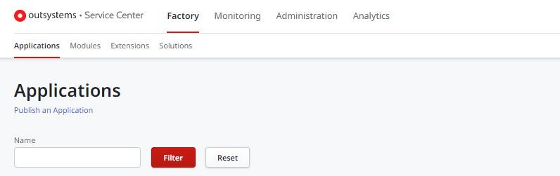
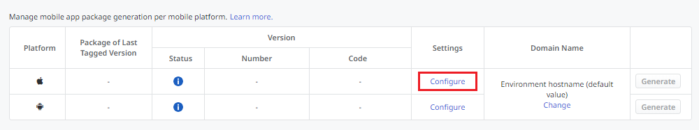
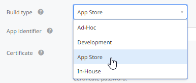
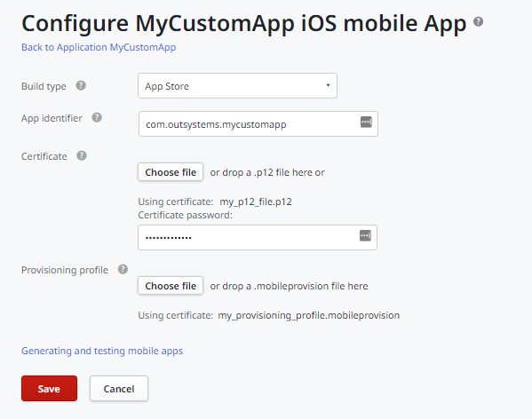
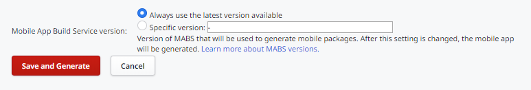
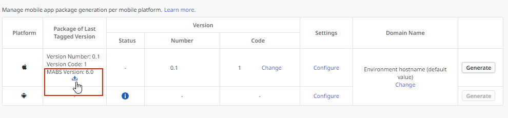

# Publish Your Mobile iOS Application to the Apple App Store

Applies only to Mobile Apps.

This article describes the process you must follow to publish your application to the Apple App Store. Before you proceed, ensure your app fulfills the general [pre-requirements](publish-app-stores.md).

## Application preparation

You need to prepare your application for publishing. This means that you have to ensure that your application meets some rules required by the App Store.

### Specific iOS pre-requirements

iOS has graphics assets and app package requirements. Ensure you meet these pre-requirements by checking the following links:

* [App preview specifications](https://help.apple.com/app-store-connect/#/dev4e413fcb8)
* [Screenshot specifications](https://help.apple.com/app-store-connect/#/devd274dd925)
* App package: [signed IPA file with the App Store build type](#Generate_the_iOS_App_Package_(IPA)).   

### Preparation checklist

To publish in App Store, you need to ensure that your application complies to the [App Store Review Guidelines](https://developer.apple.com/app-store/review/guidelines/#before-you-submit), concerning:

* Safety
* Performance
* Business
* Design
* Legal

## Publishing iOS applications to App Store

### Before you start

To generate the release version of your iOS mobile app:

* You must enroll as an Apple Developer. If you haven’t enrolled yet, learn [how to enroll as an Apple Developer](https://developer.apple.com/programs/how-it-works/). 

* You must also have a certificate generated and configured in your Apple Developer account. The exact type of certificate depends on the developer program you enrolled in:   
— `App Store and Ad Hoc` certificate for Apple Developer Program, or  
— `In-House and Ad Hoc` certificate for Apple Developer Enterprise Program  
If you don’t have one, learn [how you can create a certificate](https://developer.apple.com/account/ios/certificate/) (login required).

* You  need a provisioning profile according to the developer program you enrolled in:   
— `App Store` provisioning profile for the Apple Developer Program, or  
— `In-House` provisioning profile for the Apple Developer Enterprise Program  

A provisioning profile allows your application to be launched on Apple devices and use app services. If you don't have one, learn how you can [create a provisioning profile](https://help.apple.com/xcode/mac/current/#/devaafd622d2). If you already have a provisioning profile **make sure it has a valid expiring date**. Don't forget to **rebuild and redistribute your app when the provisioning profile is renewed**. You can find more details about provisioning profiles and In-House distribution [here](https://support.apple.com/en-au/guide/deployment-reference-ios/apda0e3426d7/1/web/1.0). For more information about the different provisioning profiles, check out the Medium blog post "[Cruising through the Complexities of Signing Native Mobile Apps](<https://medium.com/outsystems-engineering/cruising-through-the-complexities-of-signing-native-mobile-apps-cc123eb2814b>)" by OutSystems.

You can generate a release version of your app (without debug information) using an In-House provisioning profile, but you have to handle the app distribution on your own, outside the App Store to your company's end users by sending the installation link or the app package (IPA) itself, or by using an internal enterprise store or an MDM (Mobile Device Management) solution.

If the application requires users to sign in, you must [provide Apple with a test or demo account](https://help.apple.com/app-store-connect/#/devbef8ace74) to make sure that the review team can immediately sign in and use your application without the need to sign up for an account. You must also understand how the certificates work. You can find information about how to enroll as an Apple developer, create a certificate, and create a provisioning profile here. Read it carefully to make sure you have everything in place.

Additionally, you need to run **Transporter**, an application only available for Mac, to submit the app to the App Store for distribution. This application is available for Mac running macOS 10.13.6 or later and can be obtained by downloading the [Transporter](https://apps.apple.com/us/app/transporter/id1450874784?mt=12) app from App Store.

### Generate the iOS App Package (IPA)

You can generate the release (final) version of your mobile app in Service Studio or in Service Center.

#### Service Studio

To generate your mobile app in the Service Studio, perform the following steps:

1. Go to the app detail screen of the mobile application for which you want to generate the mobile application package. Open the **Distribute** tab, and check out **Native Platforms** section.

1. Click on the **Generate iOS App** button or the iOS cog icon if you've already generated a previous iOS app.

   

1. In the **Build type** list, select one of the following options:

    * **Ad-Hoc** (for organizations to develop and deploy proprietary, internal-use apps to their employees)
    * **App Store** (for Apple Developer Program)
    * **Development** (for testing apps on registered devices only)
    * **In-House** (for Apple Developer Enterprise Program)

1. Keep the default app identifier assigned by OutSystems or write your own (matching reverse domain name notation, for example, **com.domain.appname**).

1. Provide a certificate of the correct type (see the [Before You Start](#before-you-start) section) and its password. The certificate should have a **.p12** extension.

1. Provide a provisioning profile of the correct type (see the [Before You Start](#before-you-start) section). The provisioning profile should have a **.mobileprovision** extension.

1. Click the **Generate iOS app** button.

    

1. After the generation has been completed, scan the QR code or copy the created installation link using your device to install the generated iOS app. If you need to download the generated app package (IPA), follow the procedure below in Service Center.

#### Service Center

To generate your mobile app in the Service Center, perform the following steps:

1. Access Service Center console of the environment (`https://<environmentdomain>/ServiceCenter`).

1. Go to **Factory**, click on the **Applications** tab, and open your application from the applications list.

    

1. Select the **Distribute** tab and click on the **Configure** link for the iOS entry in the **Native Platforms** section.

    

1. In the Build type drop-down menu, select **App Store** (for Apple Developer Program) or **In-House** (for Apple Developer Enterprise Program). The remaining options don’t apply to publishing.

    

1. Keep the default app identifier assigned by OutSystems or write your own (matching reverse domain name notation, for example, **com.domain.appname**).

1. Provide a certificate of the correct type (see the [Before You Start](#Before-You-Start) section) and its password. The certificate should have a **.p12** extension.

    Provide a provisioning profile of the correct type (see the [Before You Start](#Before-You-Start) section). The provisioning profile should have a **.mobileprovision** extension.

    

1. Click **Save** to save your settings.

1. Click **Save and Generate** and wait a few moments while the app is being generated.

    

1. After the app is generated, click the download icon near the version information to download the iOS app package (IPA).

    

The size of your IPA increases due to the addition of Apple's Swift libraries. This is an expected behavior in order to increase your application's compatibility across Apple devices and is not reflected in the final size of the application delivered to the end-user, who only retrieves the necessary libraries when downloading your application from the store.

### Submit the Mobile App to the App Store

Only available if you enrolled in the [Apple Developer Program](https://developer.apple.com/programs/).

Now that [your application is prepared](#Application-Preparation) and the IPA file generated you can now [submit your application for review](https://help.apple.com/app-store-connect/#/dev301cb2b3e). Apple is going to review your application before making it available in the App Store.

The process is complete. You'll receive feedback from Apple about your application submission.

______________________________________________________________
_QR CODE is a registered trademark of Denso Wave Incorporated._
