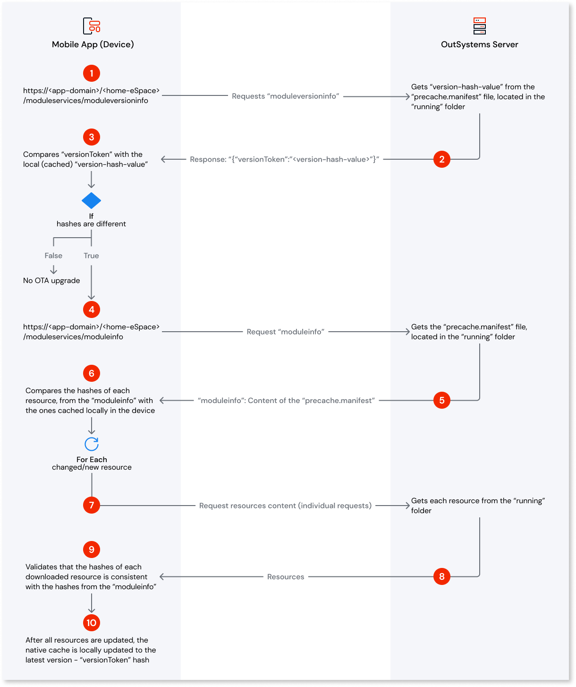

---
summary:
tags: runtime-mobile; support-application_development; support-Mobile_Apps
locale: en-us
guid: BBD8AF1F-9BF0-4162-8619-4DA257F12A72
app_type: mobile apps
platform-version: o11
---

# Over-the-air upgrades

## What are over-the-air upgrades?

Over the air (OTA) upgrades allow Mobile Apps to receive and update their versions on Mobile devices without the need to submit those new versions to the respective store.

OTA upgrades are available for all Mobile Apps developed in Outsystems. The Mobile App must be installed on the mobile device. The first installation on the device is typically performed from the respective store, but other distribution methods are available, for example, a private distribution.

By default, Mobile Apps are distributed with Hybrid Updates (OTA upgrades are allowed). However, you can change this configuration to store-only updates. For more information, see [Technical Preview - Configure Mobile Apps Updates Distribution](../deliver-mobile/manage-distribution-options/intro.md).

There is a set of situations that require you to generate a new Build and redistribute the App so that the associated changes are reflected in the Mobile App. For more details on these situations, see [Mobile Apps Update Scenarios](mobile-app-update-scenarios.md).

## Overall view of the Upgrade OTA Process

**Server Side**

* The mobile app is published in an environment, for example, when you click the **1-Click Publish** button in Service Studio or via Lifetime Deployment.

* When the deployment is completed, the frontends that are serving the requests for this mobile app must all have the new version of the app and respective resources updated.

* In the **Running** folder of the mobile app, the **precache.manifest** file contains the information used for version and integrity control during the OTA upgrade.

**Client Side**

* The mobile app has an internal mechanism that checks if there is a new version of the app available and if an OTA upgrade is needed. This check happens:

    * When the app is opened on the device
    * When the user navigates to a different screen
    * When a server action is called

* The OTA upgrades are divided into two types, **Seamless upgrades** and **Attention-requiring upgrades**. For more details on these types, see [Mobile Apps Update Scenarios](mobile-app-update-scenarios.md).

**OTA upgrade process diagram**

  

## Common issues and how to troubleshoot them

For any issues you encounter during the OTA upgrade process, see the [Troubleshooting over-the-air upgrades articles](https://success.outsystems.com/support/troubleshooting/application_runtime/troubleshooting_over_the_air_upgrades/).
