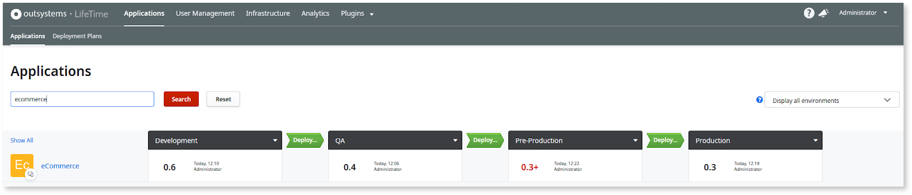
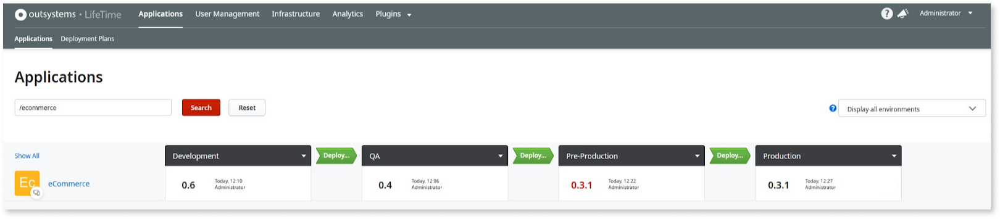
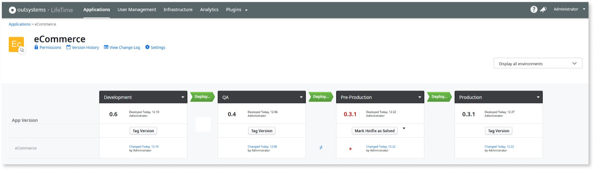
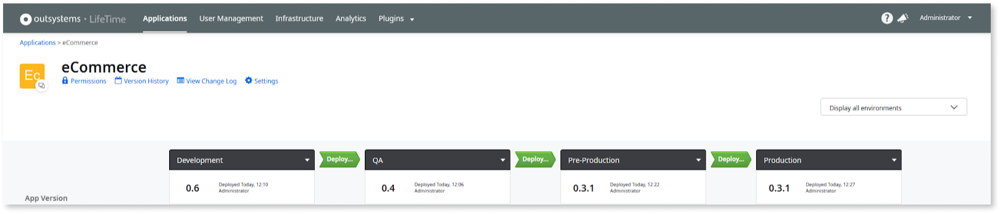

# Apply a Hotfix

In OutSystems, you can implement and resolve issues immediately using Hotfix. This helps you maintain your apps' reliability and performance while minimizing downtime.

OutSystems recommends publishing hotfixes to a Pre-Production environment fully synchronized with a Production environment rather than directly to the Production environment. Ensure that both environments have the same app version and that replicated data. This way, you can test and debug the Hotfix and then deploy it to Production without downtime.

Finally, the Hotfix is propagated backward to previous stages. The following example describes how a hotfix is applied to fix a bug in the eCommerce app.

## Fix the Defect

A severe defect was discovered in the eCommerce app in Production and has to be immediately fixed. Proceed as follows:

1. Open Service Studio.
1. Connect it to the Pre-Production environment (or one synchronized with Production).
1. Download the module with the defect.
1. Fix the defect, deploy the module to Pre-Production, and test it.

The version number in Pre-Production has changed: it is suffixed with a '+' (for new changes) and is red because it is a hotfix.

## Deploy the Hotfix to Production

To apply the hotfix to Production, [deploy the app](<deploy-an-application.md>) from Pre-Production to Production. LifeTime automatically suggests that you choose 'Tag &amp; Deploy 0.3.1'. The hotfix is tagged with a third number in Pre-Production and the app is deployed to Production.

Both Pre-Production and Production have the 0.3.1 version, and the Pre-Production version is still in red: the hotfix needs to be propagated backward.

## Propagate the Hotfix

To apply a hotfix, propagate all changes to the app back to previous environments: first to Quality Assurance, then to Development. Follow these steps:

1. Click on the eCommerce app: the modules are listed and the ones with the hotfix are marked with a red '+'.

    

1. Merge all the modules with the hotfix changes in Pre-Production to Quality Assurance: click on the compare button (the difference sign) between the environments and select the specific changes you have done to implement the hotfix.

1. In Service Studio select the hotfix changes and click **Merge**. Then publish the new versions of the modules to Quality Assurance.

1. Repeat steps 2 and 3 from Quality Assurance to Development.

1. When the fix is propagated through all environments, click the **Mark Hotfix as Solved** button on the app details screen, to signal that the fix is now implemented across all infrastructure.

The hotfix is solved, and no more app versions are marked in red.

