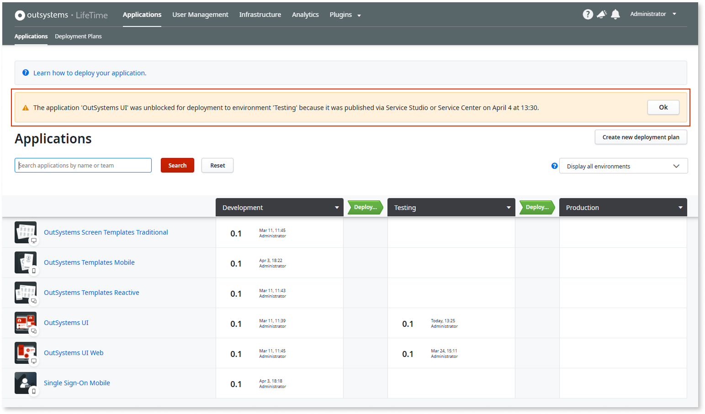

# Block an app from deployment

From LifeTime 11.27.0 version, you can block an app from being deployed to specific environments. This prevents accidental deployments to incorrect environments. For example, you can block sandbox or test apps from reaching production. Later, when necessary, you can [unblock the app](#unblock-an-app) to allow deployment to other environments. You can also use [LifeTime APIs](../ref/apis/lifetime-deployment/examples/api-block-app-deploy.md) to block and unblock an app from deploying to specific environments.

However, you can still deploy a blocked app directly from the **Service Center** or **Service Studio**. In such scenarios, LifeTime detects the deployment of blocked apps and automatically unblocks the app.

As an infrastructure manager, you can also [block all newly created apps](#block-a-newly-created-app-from-deployment) from being deployed to all environments.

This article guides how to block and unblock an app from being deployed to other environments. It is intended for any IT user who have access to LifeTime.

## Prerequisites

Before blocking an app from being deployed, ensure that:

* You have **Change & Deploy** permissions.

* The app is not published in the target environment.

* The app is not included in a deployment for that target environment.

## Block an app

To block an app from being deployed to an environment, follow these steps:

  1. Go to LifeTime.

  1. From **Applications,** access the details of the app to be blocked.
  

  1. Toggle ON corresponding to the environment where the app must be blocked.
  

  1. Enter the reason for blocking the app from being deployed to a specific environment.
  

  1. Click **Block**.

  1. Now the app is blocked from being deployed to the specific environment. A lock icon is displayed in the environment where the app is blocked.  For detailed information about how to unblock an app and allow it to be deployed, refer to [Unblock an app](#unblock-an-app).
  
  **Note:** The blocked apps in LifeTime can still be deployed to an environment through Service Center or Service Studio. When this occurs, the app is unblocked in LifeTime, and the restriction is bypassed. A warning is displayed in LifeTime for IT users with infrastructure permissions.

### Add a blocked app to the deployment plan

If the blocked app is added to the [deployment plan](deployment-plans.md), the app is set to **Do Nothing,** and the staging option cannot be modified.

If an app in the deployment plan has a dependency on a blocked app, you cannot proceed with the deployment. However, you can opt for **Continue with errors** that results in broken references in the target environment. To successfully proceed with the deployment, you must [unblock](#unblock-an-app) the dependent app.

## Block a newly created app from deployment

As an infrastructure manager if your factory needs a stricter governance model where each new app should only be deployed to specific environments then you can block all newly created apps from being deployed to all environments. To configure this setting you need **infrastructure** permissions. By default, newly created apps can be deployed to any environment in the infrastructure.

To block newly created apps from being deployed to all environments, toggle OFF.

**Allow newly created applications to be deployed to all environments** setting and enter a reason for change.

For self-managed infrastructures, you can find the setting in **Infrastructure > LifeTime Settings > Deployment**.

For cloud environments, go to  **Environment > Options** and select **LifeTime Settings**.

By turning off this setting, all the new apps that are created from the time the setting was turned off are blocked by default in all the environments. To deploy them, you must first unblock them.

When you toggle this setting on or off, you must always enter a reason for the change for auditing purposes.

## Unblock an app

To unblock an app and allow the app to be deployed to an environment,  follow these steps:

  1. From the **Applications** screen, click the app to be unblocked.
  **Note**: You can unblock an app directly from the deployment plan. However, you must refresh the staging screen to have the app available to be deployed.

  1. Toggle OFF corresponding to the environment where the app must be unblocked.
  

  1. Enter the reason for unblocking an app. This reason is used for auditing.

  1. Click **Unblock**.

  1. Now the app is unblocked and is allowed to be deployed to that specific environment.
  

## Additional resources

* [Deploy an application](deploy-an-application.md)

* [Deploy an app with dependencies](deploy-an-application-with-dependencies.md)
