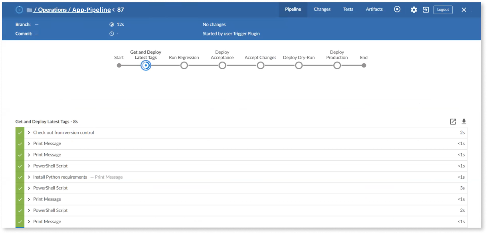

# Application Lifecycle Management in OutSystems CI/CD

As with Agile methodology and DevOps culture, the concept of continuous integration/continuous delivery (CI/CD) gradually developed to answer specific business needs and meet demands for innovation, new features, and a frictionless user experience. At the same time, it allows developers to move quickly—with the confidence not to break anything.

To paraphrase [Martin Fowler](https://martinfowler.com/aboutMe.html), a leading writer and thinker about building useful software, CI is a practice to use automation to frequently test, verify, and integrate changes into application code, and CD a discipline that allows software to be released to production at any time.

A picture painted with such broad strokes leaves plenty of room to accommodate the needs and requirements of many different kinds of enterprises that leverage CI/CD to create a wide variety of applications.

This article discusses how to implement CI/CD in an OutSystems factory using a combination of native features, supported testing tools, and integration of leading third-party testing suites and deployment orchestration platforms.

## The CI/CD continuous delivery pipeline

Though enterprises may define CI/CD differently, its implementation invariably uses elements of Agile and DevOps mixed with a generous amount of automation for testing and delivery—all with the goal of quickly and reliably bringing software from development to production.

A delivery pipeline, of course, is not just the means to an end: a conduit to convey code from business at one end to users on the other. For members of DevOps teams, it is also an ever-evolving work-in-progress. A flaw that shows up after release triggers a two-pronged effort: first to correct the code, and then to improve the pipeline to prevent such errors from appearing in the future.

As might be expected, there is no one-size-fits-all CI/CD and no infallible toolset for a delivery pipeline. The scope of a pipeline may vary from enterprise to enterprise—and even among products within the same factory. Successful configurations can include unitary or parallel flows, varying levels of automation, different criteria for acceptance, and testing via a single suite or _à la carte_ tools.

As a basis for discussion in this article, the delivery pipeline figured below is used to explore how testing and automation can be integrated in an OutSystems factory.

This delivery pipeline comprises the following:

* **Development (DEV)**: primary development environment
* **Regression (REG)**: regression test environment
* **Acceptance (ACC)**: environment for manual exploratory testing. Promotion to the two environments in the automatic deployment lane requires manual approval.
* **Pre-Production (PRE)**: a dry-run environment to rehearse deployment in a production-like environment. If no problems are detected the release candidate is automatically promoted.
* **Production (PRD)**: Ready for release

If your enterprise is in the early stages of adapting DevOps to ramp-up CI/CD, bear in mind that the solution offered here is illustrative only. While similar workflows have been implemented successfully throughout the industry, matching your particular needs may require minor tweaking—or major modifications.

On the other hand, your enterprise may already be well along the CI/CD journey, and you are now ready to check out options in order to up your game. However, your DevOps team probably has a toolset already in place that has served them well up till now and which, naturally, they would be loath to change. So, in this case, you would need a very good reason to adopt OutSystems for your software factory.

Here are three:

* The OutSystems platform eliminates the need for many of the tests required by traditional software development technologies. For example, [Service Studio](https://success.outsystems.com/Documentation/11/Getting_started/Service_Studio_Overview), the OutSystems visual development environment, prevents the introduction of faulty logic and broken dependencies into code.
* [LifeTime](https://success.outsystems.com/Documentation/11/Managing_the_Applications_Lifecycle), the OutSystems infrastructure environment console that manages deployment, automatically assesses the impact of moving an application to a target environment. It checks software package integrity and validates the overall quality of the application before promoting a release candidate to the next level.
* OutSystems generates standard, platform-agnostic applications, so any testing framework, automation platform, or orchestration server—from any vendor—can be integrated into your OutSystems CI/CD pipeline using easily accessed [APIs](https://success.outsystems.com/Documentation/11/Reference/OutSystems_APIs).

The workflow described in this article leans heavily on OutSystems core functionality and OutSystems-supported tools—along with a pair of free, open-source, third-party tools: [Selenium](https://www.selenium.dev/), a platform for E2E testing with over 50,000 users, and [Jenkins](https://www.jenkins.io/), an orchestration server with over 150,000 active installations.

The toolset in this example only touches on the wealth of available tools that have been [cataloged in exuberant detail](https://landscape.cncf.io/?fullscreen=yes) by the [Cloud Native Computing Foundation](https://www.cncf.io/). The
[appendix](#appendix) to this article includes an extensive, though not exhaustive, list of testing and automation solutions that have been successfully integrated into OutSystems factories.

## Continuous integration

In traditional software technologies, continuous integration (CI) describes the development practice of frequent and early merging of code changes to the main branch or repository. When accompanied by a robust testing framework, conflicts can be identified and addressed well before the end of a project or sprint.

[Service Studio](https://success.outsystems.com/Documentation/11/Getting_started/Service_Studio_Overview), the OutSystems visual development environment, has CI baked in with the [TrueChange™](https://success.outsystems.com/Support/Enterprise_Customers/Handling_technical_debt_with_OutSystems#TrueChange™) engine. It monitors every modification to the code in real time, inspecting the model for consistency, checking if it is well-formed and well-typed, detecting problems that may lead to performance issues, and marking errors and warnings for followup. All of the marked errors must be cleared before **1-Click Publish** can deploy the module—directly into the working code—using a process called publishing, which consolidates code validation and building with a combination of automation, AI, and analytics.

OutSystems thus eliminates a whole slew of tests that are required by traditional development technologies. It automates some of the most painstaking and error-prone tasks associated with compiling and assembling code. And, because of its trunk-based development model, it removes many of the headaches involved in merging branches and tracking down inconsistencies.

Just as OutSystems increases productivity with [AI-assisted development](https://success.outsystems.com/Documentation/11/Developing_an_Application/Implement_Application_Logic/AI-assisted_development),  it also frees the DevOps team from many rote testing tasks and mechanical automation setups. They can then concentrate on designing useful tests and incorporating them into a reliable automated system.

The ultimate success of CI/CD is based on automation, and, for testing, the success of automation depends on writing testable code. In OutSystems, this means distributing self-contained modules into discrete layers. Adopting an[ architecture canvas](https://success.outsystems.com/Support/Enterprise_Customers/Maintenance_and_Operations/Designing_the_Architecture_of_Your_OutSystems_Applications/The_Architecture_Canvas) promotes the correct abstraction of reusable services and components so they can be modified independently—a crucial factor for an accelerated release cycle. Moreover, segregating functionality and services also makes it easier to write a comprehensive set of easily automatable tests to cover critical business functionality.

[AI Mentor Studio](https://success.outsystems.com/Support/Enterprise_Customers/Handling_technical_debt_with_OutSystems) provides an integrated, bird’s eye view of an entire portfolio of applications and the interdependencies between modules in the developers’ environment. It classifies every architecture module into its correct class, identifies problems, and gives guidance for how to fix them.

The goal is not to test everything—you can’t. But you can test everything important, like all of the business logic, essential connectivity with external resources, and critical journeys in the user interface. And you can’t automate every test, either—or perhaps it is better to say that such an effort would likely prove self-defeating. For example, designing tests to validate the functionality of every possible user interaction would be complex to write, difficult to maintain, and take a long time to run.

Designing a test suite, and then deciding what to automate, requires a cost-benefit analysis to make sure that the results will justify the effort of writing and maintaining automated test scripts. The [OutSystems Testing Guidelines](https://success.outsystems.com/Documentation/Best_Practices/OutSystems_Testing_Guidelines) give a detailed overview, and a step-by-step work plan, for developing a testing strategy.

The core of that strategy is the [test pyramid](https://martinfowler.com/articles/practical-test-pyramid.html), as illustrated below. It shows how segregated testing facilitates creation of a healthy, fast, and maintainable test suite.

The test pyramid comprises:

* A base of many [component tests](https://success.outsystems.com/Documentation/Best_Practices/OutSystems_Testing_Guidelines/Component_Testing) to validate the behavior of single units of code that implement business logic
* A smaller number of [integration tests](https://success.outsystems.com/Documentation/Best_Practices/OutSystems_Testing_Guidelines/Integration%2F%2FAPI_Testing) to validate integration with external systems, such as exposed APIs
* A select few [E2E tests](https://success.outsystems.com/Documentation/Best_Practices/OutSystems_Testing_Guidelines/Web_UI_Testing) to validate complete functionality from an end-user or system perspective

### Component tests

[Component tests](https://success.outsystems.com/Documentation/Best_Practices/OutSystems_Testing_Guidelines/Component_Testing), or unit tests, validate the behavior of single units of code, such as action elements that implement business logic. Component tests are easy to write and, because they are limited in scope, they are ideal candidates for automation.

Behavior-driven development (BDD) lends itself to component testing—and it can also be adapted for integration tests and even some E2E tests.

A typical BDD test script uses the following syntax:

* **Scenario**: The specific scenario that illustrates a business rule
* **Given**: The initial scenario context—the required pre-conditions to conduct the action/event being tested
* **When**: A specific action/event
* **Then**: The expected outcome of conducting the action/event in the system

Because BDD tests are based on a human-readable language,[ such as Gherkin](https://www.guru99.com/gherkin-test-cucumber.html), all participants in a software project can collaborate on defining a common understanding of how the software should behave.

Two OutSystems components for creating BDD tests are available for free download from the Forge:

* [BDDFramework](https://www.outsystems.com/forge/component-overview/1201/bddframework) (for server-side tests)
* [BDDFramework Client Side](https://www.outsystems.com/forge/component-overview/10917/bddframework-client-side) (for client-side tests) 

Using these components, developers use **Service Studio** to create a testing app in parallel to the module to be tested. The screen below illustrates a typical BDD scenario for a business rule that has successfully passed.

See [The Complete Guide To BDD Testing In OutSystems](https://www.outsystems.com/blog/posts/bdd-testing/) for full instructions about setting up a BDD framework. 

### Integration tests

[Integration tests](https://success.outsystems.com/Documentation/Best_Practices/OutSystems_Testing_Guidelines/Integration%2F%2FAPI_Testing), often called API tests, validate integration with external systems, such as a middleware layer or applications that expose APIs to external parties.  

For this example, the BDD test framework, described above, is also used to write integration tests.

### E2E tests

[End-to-End (E2E) tests](https://success.outsystems.com/Documentation/Best_Practices/OutSystems_Testing_Guidelines/Web_UI_Testing), also called system tests or UI tests, validate complete functionality from an end-user or system perspective. End-to-end tests are typically executed through a web or mobile user interface. Because of the complexity of developing a testing script and the high maintenance required, such tests are typically limited to critical use cases, particularly ones with happy paths.

Among the leading tools for E2E tests is [Selenium](https://www.selenium.dev/), a portable software testing framework for web applications that provides a record/playback tool for authoring tests without learning a test scripting language. Complete instructions about how to set up Selenium in an OutSystems factory can be found [here](https://success.outsystems.com/Documentation/How-to_Guides/DevOps/How_to_do_UI_testing_with_Selenium).

## Continuous delivery

Continuous delivery is the principle of building applications that can be safely released on demand, at any time. This requires a method to rapidly move applications from development to production, testing functionality, assessing the impact of changes on other applications, and making them available for release with the least amount of intervention by a human operator. This is commonly called a delivery pipeline.

Among its many roles in the application lifecycle, [LifeTime](https://success.outsystems.com/Documentation/11/Managing_the_Applications_Lifecycle) handles deployment processes across all environments, analyzing the exact impact an application will have in production. When a suite of tests is in place and a release candidate is ready for promotion, all that is missing is a way to automate the journey.

The [OutSystems-pipeline](https://github.com/OutSystems/outsystems-pipeline), an open-source accelerator developed and maintained by OutSystems, is a Python package[ distributed on PyPI.org](https://pypi.org/project/outsystems-pipeline/). It allows you to extend the built-in capabilities of **LifeTime** and [LifeTime APIs](https://success.outsystems.com/Documentation/11/Reference/OutSystems_APIs/LifeTime_API_v2/LifeTime_API_Examples?_gl=1%2A143xumj%2A_ga%2AMjA1MDQ1MDcwLjE2MDE1MzExNjY.%2A_ga_ZD4DTMHWR2%2AMTYyNTU2OTU0MC41ODYuMS4xNjI1NTY5NTc1LjI1) to trigger automatic testing and deployment in complex application portfolios, and can be used to create an OutSystems CI/CD pipeline using any DevOps automation tool that can read Python scripts.

The OutSystems-pipeline project comes with example scripts and pipeline templates, including detailed instructions for building an Outsystems pipeline with [Jenkins](https://github.com/OutSystems/outsystems-pipeline/wiki/Building-an-OutSystems-pipeline-with-Jenkins) or [Azure DevOps](https://github.com/OutSystems/outsystems-pipeline/wiki/Building-an-OutSystems-pipeline-with-Azure-DevOps).

The OutSystems Professional Services team provides hands-on services to help customers set up CI/CD pipelines in their own factories by leveraging available accelerators, as well as training services for customers who want to gain hands-on experience in a controlled OutSystems infrastructure.

## The OutSystems delivery pipeline

When developers have completed work on a release candidate, it is ready to begin the journey through the pipeline to production.

In the examples below, Jenkins is used at the pipeline’s orchestration server.

### Development

**Development (DEV)** is the primary environment for developing OutSystems applications and BDDFramework apps to test component functionality.

Typically, the **DEV** environment uses mock data, so that developers can publish changes frequently and verify that everything functions correctly and has no negative impact on existing code.

Developers may use [Feature Toggle](https://www.outsystems.com/forge/component-overview/9664/feature-toggle-management), a component available for free download from the Forge, to hide unfinished code or exclude deployment of a feature that is not intended for the current release.

Once the development of a new feature or change request is complete, the app is ready to be promoted from **Development** to **Regression**. In the **App** screen in **LifeTime**, as seen below, the developer creates a release candidate by clicking **[Tag Version](https://success.outsystems.com/Documentation/11/Managing_the_Applications_Lifecycle/Deploy_Applications/Tag_a_Version)**.

The image is not wide enough to show all five environments.

In the **Tag Version** screen developers give the app a major version number along with a description about the changes. The description can also include other information, such as a tracking number, as seen below.

When the information has been keyed in the developer clicks **Tag Version**.

In the screen below you can see that the BDD test app (**App_Tests**) has already been tagged and is also being promoted to **Regression**. 

Since BDD apps are only used for regression testing, they are not promoted beyond the **Regression** environment.

In the **Plugins** menu select **Trigger Pipeline** to open the **Pipeline** screen.

  

The screen below shows all of the pipelines that have been created for the OutSystems factory. **Pipelines/App-Pipeline@Jenkins** indicates that both the app and BDD test app have newer versions available. Click **Trigger Pipeline**. 

In the Jenkins pipeline screen you can track the progress of the actions specified for the deployment as they run.

### Regression

The **Regression (REG)** environment is where BDD regression tests are performed. The regression suite includes unit tests and integration tests written during the development phase to check a change made to the codebase has no negative impacts on critical application features.

Other tests, such a E2E tests, code validation checks, static code analysis tools, dynamic code analysis tools, and others, can also be added to the automated testing in the regression environment as long as it doesn’t compromise the speed of the feedback loop.

Regression tests automatically begin to run when Jenkins is informed that the app has been successfully deployed.

If all regression tests are successful the release candidate is automatically promoted to the **Acceptance (ACC)** environment.

However, if one or more of the regression tests fail, the problem must be fixed immediately. The pipeline is blocked, and nothing else can be promoted, until the error is fixed.

### Acceptance

If the regression suite is executed successfully, the release candidate is automatically deployed to the **Acceptance (ACC)** environment.

In contrast to previous and subsequent environments, promotion of a release candidate from **Acceptance** requires the approval of an authorized user, often a business representative. This allows for smoke tests, sanity tests of newly developed features, exploratory testing, lengthy automated tests, complex UI tests, load and security testing, and others—depending on the needs and requirements of the enterprise.

To run these manual and exploratory tests, go to **LifeTime** and select **Open in browser** from the dropdown menu in the **Acceptance** environment.

When the release candidate has been approved, the authorized representative clicks **Proceed** in the Jenkins pipeline window.

### Pre-Production

**Pre-production (PRE)** is considered a dry-run deployment, using data that closely matches the production environment and real-world data. It is also aligned with PRD in terms of code. This allows for rehearsing deployments in a production-like environment, with the same version of dependencies as there are in **Production**.

If the deployment is successful the pipeline automatically promotes the app to **Production (PRD)**.

### Production

And there you have it. The release candidate has gone through the deployment pipeline. The enterprise can go forward with high confidence that users will have an error-free experience with the newly released app.

As mentioned above, a CI/CD journey can be made with more or fewer environments, a different deployment orchestration platform running another suite of tests with additional manual promotions or with no human intervention at all. The best choice is the one that works.

## Appendix: other testing and automation tools {#appendix}

The testing and automation platforms used in this example are easily available and field-tested, but they do not represent a comprehensive list by any means. Because OutSystems generates standard applications, any testing framework or vendor can be integrated into your OutSystems CI/CD pipeline, including the popular third-party tools below.

The[ OutSystems Forge](http://www.outsystems.com/Forge/) includes accelerators to integrate many of these tools into your OutSystems installation.

* [Ghost Inspector](https://www.outsystems.com/forge/component-overview/1316/ghost-inspector) is an automated website testing and monitoring service that checks for problems with your website or application. It carries out operations in a browser, the same way a user would, to ensure that everything is working properly.
* [Applitools](https://applitools.com/) is designed to test and monitor critical functional and visual aspects of any web, mobile, and native app in a fully automated way.
* [Appium](http://appium.io/) is an open-source automation tool where you can run scripts and test native, mobile, web, and hybrid applications on Android or iOS using a web driver.
* [Azure DevOps](https://azure.microsoft.com/en-us/services/devops/) is an automation tool that covers the entire application lifecycle, providing version control, reporting, requirements management, project management, automated builds, testing, and release management capabilities.
* [Browserstack](https://www.browserstack.com/) is a cloud web and mobile testing platform that enables developers to test their websites and mobile applications across on-demand browsers, operating systems and real mobile devices, without requiring users to install or maintain an internal lab of virtual machines, devices or emulators.
* [Elastic](https://www.elastic.co/pt/) is used for monitoring and analytics, Elastic is the most popular enterprise search engine that provides a distributed, multitenant-capable full-text search engine with an HTTP web interface and schema-free JSON documents.
* [Katalon®](https://katalon.com/) provides a complete web testing solution to set up test projects, test suites, test cases, test objects for UI or API testing, custom keywords, test data files, and reporting. It easily integrates with Git for versioning and has plugins for integration with other tools like Jira®, Jenkins®, and Slack®.
* [SauceLabs](https://saucelabs.com/) allows users to run tests in the cloud, providing a comprehensive test infrastructure for automated and manual testing of desktop and mobile applications using Selenium, Appium, and JavaScript unit testing frameworks. It also provides a secure testing protocol, Sauce Connect, for testing applications behind customer firewalls.
* [Tricentis Tosca](https://www.tricentis.com/) is used to automate end-to-end testing for applications. It combines multiple aspects of software testing, such as test case design, test automation, test data design and generation, and analytics to test GUIs and APIs.
