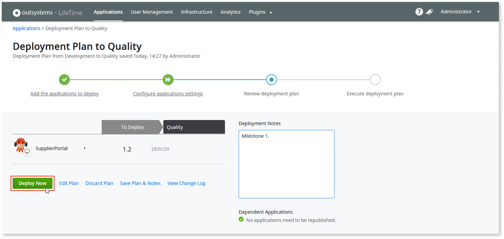

# ALM in OutSystems: configuration management

The discipline of configuration management originated in the US Department of Defense  during the 1950s to handle changes to their hardware systems. The DoD developed policies, procedures, techniques, and tools to evaluate proposed changes, track their status after implementation, keep their system inventory up-to-date, and maintain the required support documentation.

When configuration management was first used for software development, it also dealt primarily with hardware: mainframes, punchcards, and magnetic tapes. Only with advances in software engineering and programming methods did configuration management begin to cope with code: access, authorization, automation, deployment, versioning, and reliability.

It is not surprising, then, that adapting a discipline meant for tanks and planes for massive computing systems—and then refining it for Agile development methods built on DevOps and CI/CD—required a major redefinition of what configuration management means for modern enterprise software.  

In the same way that OutSystems has its own take on classical software development—replacing coding gruntwork with[ AI-assisted development](https://success.outsystems.com/Documentation/11/Developing_an_Application/Implement_Application_Logic/AI-assisted_development) and integration hassles with one-click compilation and integration—it has also reimagined configuration management.

Built on a streamlined deployment process that includes an automated versioning system, OutSystems gives complete control over configuration management of critical systems in every environment in your factory, including database connections, site properties, batch jobs, web-service endpoints, and business processes—all of which can be modified without changing source code or redeployment.

## Versioning

Keeping track of system component versions has always been the core concern of configuration management, and it remains of critical importance for software development today, especially where large teams work on many interdependent pieces of code that must be merged before release—a process often called “integration hell.”

In an OutSystems factory, developers working in tandem are encouraged to frequently publish their changes, “publish” being a one-click process that validates and merges code using a combination of automation, AI, and analytics.

The **Service Center** console (https://&lt;environment_name>/ServiceCenter) gives every module an incremental version number as it is published. These versions can be accessed by going to **Factory>Modules**, clicking a published module, and viewing the **Versions** column.

In the module detail screen, you can see the module’s **Version** number **(A)**, the date and time it was **Uploaded** **(B)**, and the developer **(C)** who published it.

Clicking **Publish (D)** in the row of any earlier version replaces the browser output and rolls the code back in **Service Studio** for further development from the previous state of the app. 

Similar rollback functionality is also available in **Service Studio** in the **Module>Open Other Version** menu.

### Version tagging

When an OutSystems development team achieves a milestone, they generally create a snapshot of the application by [tagging](https://success.outsystems.com/Documentation/11/Managing_the_Applications_Lifecycle/Deploy_Applications/Tag_a_Version) it with a major and minor version number and a description of its new features. This tagged app is then ready for deployment in [LifeTime](https://success.outsystems.com/Documentation/11/Managing_the_Applications_Lifecycle), the OutSystems unified console for all environments in your infrastructure.

A tagged app can be also used to [rollback](https://success.outsystems.com/Documentation/11/Managing_the_Applications_Lifecycle/Deploy_Applications/Rollback_to_a_Previous_Version) to a previous version in case a critical bug is detected. 

To tag an app, go to **LifeTime** (https://&lt;environment_name>/Lifetime), search for the app you wish to tag, and then click it.

The application screen shows that changes have been made in the development environment, as indicated by the **+** mark by both the version number and the link to the app in **Service Center**. Click **Tag Version**.

Type a new **Version** number and a meaningful **Description**, and then click **Tag Version**.

The dropdown control at the top of the **Deployment** pane gives a list of the module’s publication history.

### Deploy a tagged app

To promote a tagged app from **Development** to **Quality**, open **LifeTime** (https://&lt;environment_name>/Lifetime) and click the **Deploy** button between the current environment and the one to which it is to be promoted.

In the **Deployment Plan** screen you are prompted to select an app for deployment.

A [Deployment Plan](https://success.outsystems.com/Documentation/11/Managing_the_Applications_Lifecycle/Deploy_Applications/Deployment_Plans) may consist of a number of related or dependant apps that are deployed at the same time.

When the app has been selected, click **Add to Deployment Plan**. 

In the next screen, click **Validate Now**.

At the end of the validation process the available deployment options change from blue to green. Click **CONTINUE** to initiate immediate deployment or the **Deploy** dropdown for additional options.

After adding any relevant **Deployment Notes**, click **Deploy Now** to continue.

**LifeTime** verifies the deployment process, retrieves the application from version control, analyzes the impact on running business processes, generates the compiled code, analyzes the database, distributes the compiled application to front-end servers, and deploys the app to the new environment.

See [Deploy applications](https://success.outsystems.com/Documentation/11/Managing_the_Applications_Lifecycle/Deploy_Applications) for more information, including additional steps required for mobile app deployment. 

For software factories using CI/CD methodology, OutSystems facilitates automatic deployment by integrating leading third-party orchestration platforms to build a continuous delivery pipeline.

See[ How to build an OutSystems continuous delivery pipeline](https://success.outsystems.com/Documentation/How-to_Guides/DevOps/How_to_build_an_OutSystems_continuous_delivery_pipeline) for information about automating deployment from development to production with a minimum of human intervention.

## Configuration management

As apps are deployed from environment to environment, they carry with them the default configurations that were set up during development, which typically use mock data, such as sample databases and example web-service endpoints.

Naturally, an app in the production environment must be integrated with real-world data before release. OutSystems allows you to override default values for the following configurations in every environment, as needed—all without modifying or redeploying code:

* [Database connections](#db)
* [Site properties](#siteproperties)
* [Timers](#timers)
* [Web service endpoints](#endpoints)
* [Business processes](#businessproperties)

Configuration management is handled in **Service Center**, which is opened in the environment where the modification is required. For a typical installation with three environments—development, quality, and production—the URL addresses would be something like:

* https://&lt;development_environment_name>/ServiceCenter
* https://&lt;quality_environment_name>/ServiceCenter
* https://&lt;production_environment_name>/ServiceCenter

Typical scenarios for configuration management follow.

### Database connections {#db}

OutSystems provides out-of-the-box capabilities to rapidly and efficiently integrate external databases, using a wizard-like tool that guides the developer through the entire process, including:

* Setting up the connection properties and user credentials
* Selecting a database and tables to import
* Giving it a logical database name for binding to physical connections
* Adjusting entity and attribute properties

The developer then publishes the integration to the development environment. In **Service Studio** the integration’s logic database is then bound to the app’s database connection.

Instructions for external database integration for industry leaders such as SAP and Salesforce can be found in [Use Integration Builder](https://success.outsystems.com/Documentation/11/Extensibility_and_Integration/Integration_Builder/Use_Integration_Builder#Create_a_connection_for_the_integration). For other external databases see [Integrate with an external database](https://success.outsystems.com/Documentation/11/Extensibility_and_Integration/Integrate_with_an_External_Database).

Database integration is specific to the environment to which it is published, so, as apps are deployed to the next environment, **LifeTime** prompts the user to supply the logical database name required by the app’s database connection.

Typically, mock data is used for development, so the sample database is replaced when the app is deployed to the quality environment. However, replacing an external database doesn’t require any additional coding. Instead, a new integration is created, using the new database connection properties and user credentials, and then adjusting the imported entity and attribute properties according to what is expected by the app’s database connection. By giving this new integration the same logical database name, it is automatically bound to the physical connection of the app after deployment.

When the same external database is to be integrated in a subsequent environment, such as from quality to development, you can save time by clicking **Copy from Source for a new configuration**. 

### Site properties {#siteproperties}

[Site Properties](https://success.outsystems.com/Documentation/11/Developing_an_Application/Use_Data/Use_Site_Properties_to_Configure_Behaviors_at_Runtime) are global variables with constant values, such as a maximum application parameter, that are configured in **Service Studio** during development. These site properties can be changed for the target environment during the deployment process.

After the initial deployment step has been completed click **Configure application settings**.

In the next window the default site properties are displayed. Type in a new value for the target environment. The change is saved automatically. Click **Continue**.

The changed site properties are now overwritten in the **Quality** environment. The original default values are used in subsequent environments unless you modify them during deployment.

However, while this is the easiest way to modify default site properties for different environments, you do not have to redeploy an app should you decide to modify a value.

For example, to change a site property at run time, open **Service Center** in the production environment (https://&lt;production_environment_name>/ServiceCenter), go to **Factory>Modules**, click the published module, select **Site Properties**, and then click the site property that requires a configuration change.

In the **Site Property** screen you can see the default value. Change the current value, as needed, and then click **Apply**. No redeployment is necessary.

### Timers {#timers}

A **Timer** is a tool that periodically executes asynchronous logic at a scheduled time, such as sending a daily afternoon email to subscribers, or running a resource-intensive process—like archiving database records—every month when traffic is known to be low. 

In classical coding **Timers** are called batch jobs.

A [timer’s](https://success.outsystems.com/Documentation/11/Developing_an_Application/Use_Timers) schedule, priority, and timeout are configured during development in **Service Studio**. Using the example of a daily email blast, it is impractical to wait all day to verify the timer’s functionality. For testing purposes, open **Service Center** in the development environment (https://&lt;development_environment_name>/ServiceCenter), go to **Factory>Modules**, click the published module, select **Timers**, and then click the timer you wish to test.

With the timer selected, click **Run Now**. When it is finished you can view the **Timer reports** to verify that it is working as expected.

Another typical scenario is to override default properties permanently in a single environment. For example, during QA testing it is inconvenient to wait an entire cycle just to see if a timer works as expected.

In this case, open **Service Center** in the quality environment (https://&lt;quality_environment_name>/ServiceCenter), go to **Factory>Modules**, click the published module, select **Timers**, and then click the timer which requires a configuration change.

Change all of the timer parameters required for testing in the quality environment. No redeployment is necessary. When the app is promoted to the next environment the default timer parameters apply.

### Web-service endpoints {#endpoints}

During development and QA, the functionality of exposed or consumed SOAP web services or REST APIs are often tested by using internal resources or one of the many end-to-end testing sites available for free use.

Once an app has been deployed to production and becomes a candidate for release, example SOAP web services or REST APIs must be replaced with the real thing. This is easily done by opening **Service Center** in the production environment (https://&lt;production_environment_name>/ServiceCenter), going to **Factory>Modules**, clicking the published module, selecting **Integrations**, and then clicking the service which requires a change in configuration.

Make the required changes in all exposed and consumed integrations as required. No redeployment is necessary. When the app is released calls go to and from the modified endpoints.

### Business processes {#businessproperties}

A final configuration management deals with suspending a specific business process that has been developed and brought through to production, only to be held for a later release.

In this case, open **Service Center** in the production environment (https://&lt;production_environment_name>/ServiceCenter), go to **Monitoring>Processes**, and click the process you wish to halt.

In the **Process** screen click **Lock Process**. This process will not run until it is unlocked.

