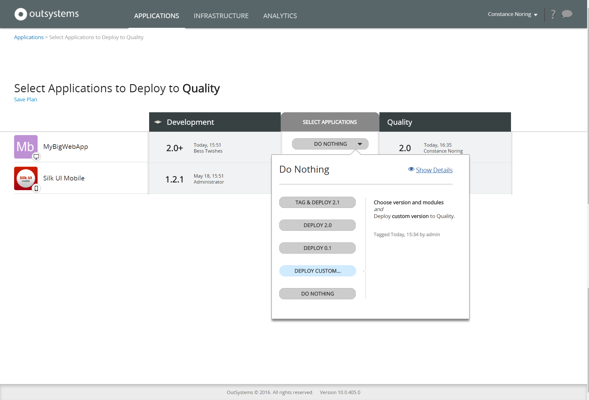
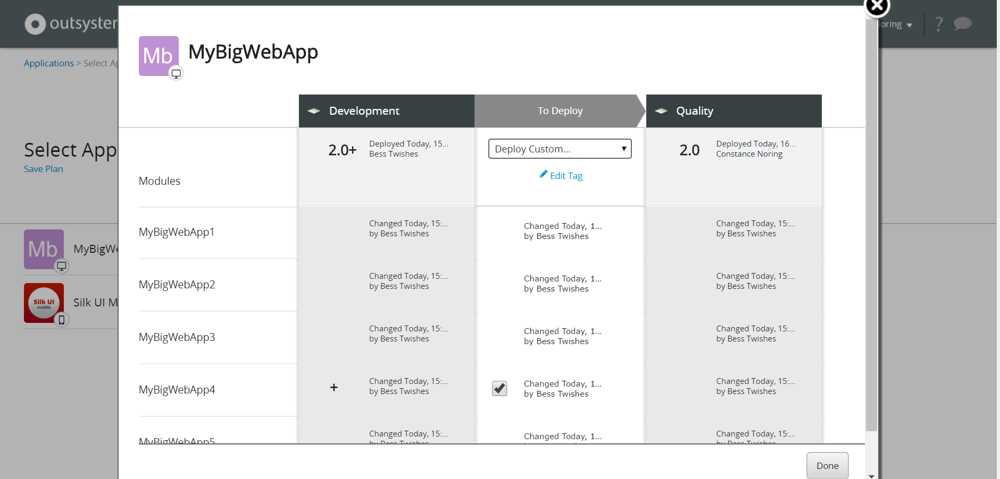
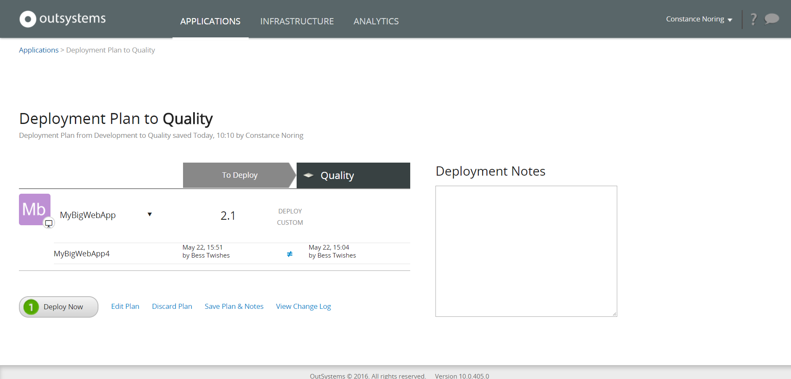

# Deploy a Single Module

Applies only to Traditional Web apps.

To decrease the deployment time, it's sometimes useful to deploy a single module of an application, instead of [deploying the entire application](<deploy-an-application.md>). This feature is only available for Web applications.

Here's an example of how to do it.

## Deploy one module of an app to Quality

In this example, MyBigWebApp is a web application with several modules. It has changes in one module (MyBigWebApp4) and we only want to deploy this module to Quality.

### Choose the module to deploy

In the 'Application' tab, click the **Deploy...** green button between Development and Quality.

In the MyBigWebApp application, click the **Do Nothing** dropdown menu, and select **Deploy Custom...**.

A pop-up opens, displaying all modules of the MyBigWebApp application. Notice the modules with a '+'(plus) sign, signaling that they have been changed.

Check the MyBigWebApp4 module to deploy its latest version to Quality. Confirm the choice by pressing **Done**.

### Deploy the Module

Back to the deployment screen, click **Validate Now** to validate if just deploying module MyBigWebApp4 from MyBigWebApp has no impact on other applications in Quality. All it's OK, so click on the **Continue** button to review the deployment plan. 

Add a note like 'Deploying module MyBigWebApp4 from MyBigWebApp' and click on **Deploy Now**.
