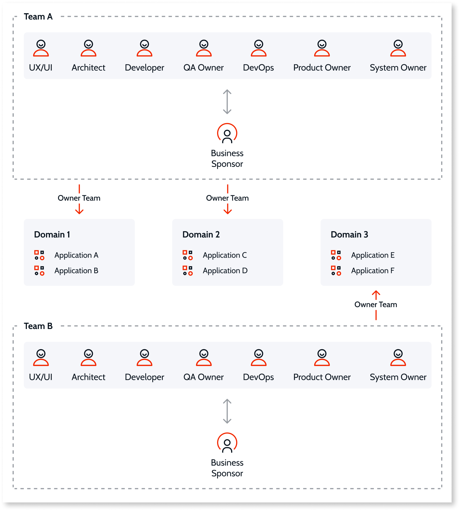

# Development and delivery at scale

As you start having more developers, teams, and applications, it’s important to keep development and delivery agility, ensuring you can keep delivering at the high pace of a modern development platform.
        
At OutSystems, we aim for high productivity, even in mission critical scenarios. As such, our vision is to enable organizations to be elite software delivery performers, always ready to answer business demand. We believe the best way to achieve this goal is to promote an effective continuous integration/continuous delivery (CI/CD) approach ensuring you reduce the lead time and deploy on demand.

Developing and delivering at scale poses challenges regardless of the technology stack. Dealing with concurrent releases and maintaining multiple environments at different paces can bring their own challenges. There can be too many dependencies between teams and applications, a lack of collaboration between teams working at different paces, and a slow feedback loop on validations in the development and delivery process. Additionally, with multiple applications reaching production at the same time, there can be an excessive amount of merging problems and emergency fixes. Physical branching is the traditional industry response to these challenges, but has several drawbacks which are amplified in long-lived branching scenarios. What empirical data shows ([The State of DevOps Report](https://services.google.com/fh/files/misc/state-of-devops-2019.pdf)) is that the best answer to these challenges is applying a CI/CD approach and DevOps practices.

For an organization to deliver quality at a high pace, opting for short or logical isolation using proven software engineering patterns such as feature toggling, together with appropriate guardrails and checkpoints to mitigate developer error (for example, code reviews and regression test automation) is imperative. For some organizations, logical isolation can be a mindset shift, but it pays off in the end.

According to our research, the following sections outline the challenges organizations can face when scaling a development team and the various ways OutSystems can tackle them.

## Team structure and architecture 

A team's  productivity is highly dependent on its ability to be independently aligned with business goals. Having independent, isolated teams, increases delivery speed and is beneficial in terms of independent development, independent delivery, aligning with business goals, as well as maintaining a loosely coupled architecture. For effective team isolation to take place, the following aspects of the factory architecture and organization must be in place. 

### Domain-driven design

With the growth of a software factory, it becomes more difficult to isolate developments and deployments, as they become more and more complex and slow, small change requests become harder to implement, planning becomes hard, resulting in the teams playing with odds. The teams start facing growing pains to cope with the interests of the business because everything becomes interdependent, impacts on other businesses becomes harder to address as more decision makers are involved. Therefore, the need to decouple the large monolith into small serviceable pieces becomes imperative, providing team isolation and lifecycle independence. 

[Domain-driven-design](https://www.outsystems.com/tk/redirect?g=0ed36ce5-66fe-4507-ba42-a554c522e0ca) (DDD) is a recommended approach for building **loosely coupled architectures**. A loosely coupled architecture **isolates different pieces of software** (self-contained domains) by reducing the dependencies between them to a minimum. Building and deploying apps using a loosely coupled architecture provides benefits such as, more **scalability**, **resilience**, **maintainability**, and **less dependencies between development teams**. A DDD approach to architecture structures a software system as a set of business-domain-aligned components. Also aligning the ownership model with business domains, means each domain is owned by one team (and one team may own several systems or components related to the same domain). This allows each business domain to evolve at a different speed, based on the change rate appropriate for that domain.

OutSystems [AI Mentor Studio](../../monitor-and-troubleshoot/manage-tech-debt/intro.md) provides a bird-eye-view of the entire application’s architecture, facilitating the correct domain assessment by detecting unexpected dependencies between applications and wrong architecture patterns.

### Team structure 

The way teams communicate and establish relations and dependencies is reflected in the teams architecture, independence, and consequently speed of delivery. According to **Conway’s Law**, organizations tend to mirror their communication structure with the systems they design, therefore, if an organization is structured as a set of technical departments, this leads to a **technically-focused architecture**. A technically-focused organization, is made up of a set of teams that each have a technical specialty who tend to create applications with a technically-focused architecture, that is, each part of the architecture is its own silo, and implementing changes requested by the business often means touching every architecture area and requires tremendous communication and coordination overhead between the technical teams. A technically-focused team, can for example, have separate teams for building UIs, APIs, and data models (within the same functional domain). 

By reversing Conway's Law in favor of building a good **business-oriented** architecture, the structure of the organization needs to be set-up with teams that are specialized in business domains instead of technology topics. This type of organization prevents silos and removes communication overhead through the added autonomy brought about by having all the skills it needs. A business-centric type of organization produces business-oriented architecture designs, better aligned with business goals, and better prepared to grow and scale with the business. For this approach to work effectively, **cross-functional teams** are required. 

Having cross-functional teams benefits communication, quality, speed, and innovation and contributes to autonomy and independence. A cross-functional team contains all the roles and profiles necessary to cover the entire lifecycle of the application or component.  As such, **a cross-functional team is fully independent and autonomous to promote code changes from development to production**, and quickly act upon any feedback collected along the way. This is in stark contrast to mono/single-functional teams, where there are silos containing each of the lifecycle functions, that require multiple handovers for a single change and that rely on formal communication channels that end up creating queues that impact lead time.

### Ownership and governance

By not having the correct ownership and governance model in place, you are left open to pitfalls such as multiple teams making changes to the same module leading to an increase in team and lifecycle collision, ineffective execution due to unclear responsibilities, and conflicting governance within the organization. Having clear ownership streamlines the development and deployment lifecycle by centralizing knowledge and decision-making. It reduces team collision and development overlap and can also promote responsibilities and  increase morale.

Team ownership models can be adopted according to the business organization, factory maturity and size, and available capabilities. By defining a clear **strong ownership** of shared components, where for example, **only one team is the owner of each software domain**, no software domain is without an owner, and the owner executes all changes, then team collision is reduced. A well defined  ownership model is more scalable and helps in the streamlining of independent development and release lifecycles. The ownership model should be aligned with the team structures and the governance model should reflect both.

## Collaboration 

As the application portfolio, number of teams, and the number of developers grow, finding the right balance between work isolation (develop and test without impact) and collaboration is key to keeping a high pace of delivery, while managing different releases. One common practice for handling this challenge is branching. While branching enables a complete isolation of ongoing work and allows you to keep maintaining major releases, it can also bring other tasks, such as managing extra environments to get runtime isolation for testing different releases. On the other hand, branching potentials the merge hell by reducing the frequency of code integration. *"We used to draw branching as parallel lines, but actually we should redraw as diverging lines to show the effective merge pain over time…"* ([Jonny LeRoy](https://twitter.com/jahnnie/status/937917022247120898))

Part of OutSystems’ vision is to provide capabilities that remove developers' effort of managing different feature branches, avoid merging problems, while ensuring a true **continuous integration** approach. This includes providing a short-lived branching capability where developers can work and test in isolation before sharing, ensuring that only small batches of completed code are shared. Feature isolation allows developers to manage work in progress. Incomplete features can be safely promoted to the next stage using trunk-based development patterns (such as, feature toggling mechanism)  which manage incomplete features that are merged, increasing the collaboration between  developers and the feedback from business, while experimenting with new incomplete solutions.

### Small batch approach 

The small batch approach allows developers to decompose complex solutions into smaller components that can be deployed incrementally and tested independently. Instead of months of coding that requires months of testing, small batches of code, such as a single user story, can be tested and released quickly. Developing in small batches lowers the risk in development and means less waste as you can get quick feedback from the customer and adjust accordingly. 

Working in small batches is one of a set of capabilities that drives higher software delivery and organizational performance. These capabilities were discovered by the [DORA State of DevOps research program](https://www.devops-research.com/research.html), an independent, academically rigorous investigation into the practices and capabilities that drive high performance. As per the [The State of DevOps Report](https://services.google.com/fh/files/misc/state-of-devops-2019.pdf), the following image shows how higher performers compare to low performers: 

Working in small batches helps anticipate failures. At the same time it lowers the deployment risk since the amount of change applied in each deployment is smaller and therefore less likely to go wrong. Smaller parts can be tested immediately after they are merged into the code base. It allows issues to be spotted and solved straight away. Consistently integrating code to the code base for deployment  **accelerates the release rate which helps realize business value faster** (in contrast to an infrequent release rate). Additionally, it helps **enhance productivity** by ensuring fewer errors. Less errors means less time spent fixing them and more time on developing a quality product. 

### Trunk-based development patterns

Trunk-based development is more than just a branching strategy, it is a set of techniques that enables efficient development. Trunk-based development allows you to **release apps at any time**, even with unfinished work in the code base, while still enabling a clear distinction between different release types (for example, major release, minor releases, hotfix, code increments or enhancements). By frequently committing small changes directly to the trunk, developers reduce the number of **merge conflicts** and deal with them much earlier in the development process. With release patterns such as feature toggles there is the possibility to deliver features independently without impacting other ongoing developments, avoiding the merge conflicts usually experienced at the end of the development process. Trunk-based development also improves **collaboration**; knowledge dissemination within a team is a direct consequence of performing code reviews or using a pair-programming model. Trunk-based development also reduces the **feedback loop**, for example, the fact that the CI-cycle is run much more frequently when using a trunk-based development approach.

#### API/UI versioning

Versioning is helpful in specific scenarios, namely when you want to introduce a breaking change (changing core modules/producers) in an API or a UI component, and you don't want to impact consumers straightaway. Most of the time, this applies when you cannot sync the release of a producer change and consumers, or it can be a lack of ensuring consumer quality on time for its release (probably due to lack of automated regression testing to ensure the new change will not impact the previous behavior). 

API/UI versioning applies when a change is restricted to a specific code element, (for example, a new authentication service or a new product catalog widget) and you want to ensure that any breaking changes (in the signature or the expected behavior) don't immediately impact existing consumers (each consumer can opt to switch to the new version when it makes sense to them).

With multiple versions, the best way to approach version management is to have clear technical guidance about such as, when to create a new version, how to mark a version as deprecated and naming convention rules. For an example on how versions can be managed, see [Microservices Lifecycle — Managing Versions](https://success.outsystems.com/documentation/best_practices/architecture/designing_the_architecture_of_your_outsystems_applications/microservices_architecture_in_outsystems/#microservices-lifecycle-managing-versions).

#### Feature toggles

Feature toggles are application-based release patterns that provide the mechanism to modify system behavior by selectively enabling and disabling features without requiring a production code deployment. Generally, feature toggles are implemented by wrapping application logic or UI elements with a conditional statement, where the feature is enabled or disabled based on a configuration setting stored somewhere, for example, business feature toggles that enable progressive rollouts of new behaviors to the end-users (Canary releases) or feature fencing to ensure that any consumer or just part of them can use the new behavior or keep the old behavior. Feature toggling is a code pattern that enables trunk-based development and, ultimately, continuous delivery which is a fundamental trait of elite performers. As per the [The State of DevOps Report](https://services.google.com/fh/files/misc/state-of-devops-2019.pdf), higher performers can deliver high quality software faster than lower performers and they also have the ability to recover quicker from any kind of production incidents.

When dealing with multiple simultaneous parallel developments on the same code-base, trunk-based-development together with **feature toggles are faster and more flexible than branching and merging**. However, they also add complexity to the development process (for example, toggle-specific code and backward-compatibility concerns) and require a scalable approach for managing toggles.

Technical feature toggling applies when you're implementing a feature or behavior in an application (for example, a new checkout process) that uses multiple code elements (screens, widgets, services, entities) and you'd like to logically isolate this work from other devs and testers until it's finished (meaning they won't see the new behavior while interacting with the application). Because feature toggling requires backward-compatibility between the current and new behaviors, it may require the use of API/UI versioning as well, and changes to the database model must be incremental.

You can find the [Feature Toggle Library](https://www.outsystems.com/forge/component-overview/9663/feature-toggle-library) component in the OutSystems Community. To learn more about how to implement and use feature toggles, see [Feature toggle in OutSystems](https://www.outsystems.com/tk/redirect?g=4de797a5-dc79-459a-9244-8eab786b0fcf). 

#### Branching by abstraction

When various parts of a software system are dependent on a module, library, or framework that you want to replace, you can branch by abstraction by creating an abstraction layer that captures the interaction between one section of the client code and the current supplier. You start by building a wrapper around the component you want to replace which allows you to route-call from the old implementation to the new one, for example, replacing a connector that integrates with JIRA with another one that integrates with Azure DevOps. Or, you might want to keep the same signature/interface for your customers but change the implementation radically, for example switching between different DLL versions, or switching between different CRM systems. The key benefit of branching by abstraction is that your code is working at all times throughout the refactoring, enabling continuous delivery. 

For a more in depth example of branching by abstraction, see [Integration Patterns for Core Services Abstraction](https://www.outsystems.com/tk/redirect?g=94c591a5-e7a6-4015-af21-ad87c1012fc7), which creates an abstraction layer around an external system.

## Quality validations 

One of the principles that’s at the heart of continuous delivery is the **build in quality**. 

According to W. Edwards Deming, "[it’s much cheaper to fix problems and defects if we find them immediately - ideally before they are ever checked into version control, by running automated tests locally. Finding defects downstream through inspection (such as manual testing) is time-consuming, requiring significant triage. Then we must fix the defect, trying to recall what we were thinking when we introduced the problem days or perhaps even weeks ago.](https://continuousdelivery.com/principles/#build-quality-in)"
The build in quality principle is all about catching and fixing defects early during development stages to lower maintenance costs and prevent undesirable impacts for end-users (if reaches production). As development scales, it also increases the possibility of introducing defects (or technical debt) into your codebase.

Part of OutSystems vision is to keep providing capabilities that empower easy code validations at early stages while reducing effort, supported by high traceability of code. A good deployment pipeline has numerous feedback loops. At each stage of the pipeline, tests are run. If the tests are passed, the pipeline continues, but if they fail or fall under a certain threshold, the pipeline stops and the team responds to the feedback. This fast feedback in a well-designed pipeline prevents poor quality code reaching production. 

### Code quality

#### TrueChange

TrueChange is a Service Studio built-in analysis engine that provides real-time feedback to developers, provides warnings, and prevents the publishing of invalid code.

#### AI Mentor Studio

The AI Mentor Studio can detect potential issues in the areas of architecture, performance, security, and maintainability. The maintainability analysis flags complex undocumented code and missing descriptions of reusable elements to help teams produce well-documented code that other developers can quickly understand and enhance in the future. The AI Mentor Studio validates technical debt,  ensures the delivery of quality code, and limits the risk of issues slipping through into the application code. 

#### Static-code analysis (automated)

For an independent analysis of OutSystems code, (for example, for advanced security audits), static code analysis tools can be used to supplement AI Mentor Studio and TrueChange. These tools are available through third-party partners, such as [SIG](https://www.outsystems.com/news/sig-accelerate-application-security-quality/), [BONCODE](https://www.outsystems.com/news/boncode-code-analysis-service-reduce-application-risk/), and [Omnext](https://www.outsystems.com/news/omnext-launch-application-risk-analysis-services/).

#### Code review (manual)

Code reviews help teams build a maintainable code base and gather feedback quickly. 
To ensure adherence to coding best practices and technical standards, senior developers or technical leads should perform regular code reviews. During these reviews the technical design is validated, the code is checked to ensure that it meets the business requirements, and that it is aligned with the architecture design. Code reviews can also be carried out by other developers and conducted on-the-fly as code is being written. The technical solution and code are validated and checks are carried out to ensure that the code complies with best practices. While AI Mentor Studio validates code quality, a code review validates code correctness and is a great way to ensure the ‘four eyes principle’, where the code gets checked by a couple of people before it gets approved. Code reviews are also a great way to share responsibility among the team and are also a good way to disseminate knowledge within the team about the technical solution.

### Functional quality 

#### Automated testing

The most common feedback loop in any deployment pipeline is the execution of automated tests. Automating important processes such as testing for regression errors allow teams to reduce the lead time for delivering applications and software changes to customers. Automation allows applications to be deployed quickly, reliably, and safely.

By defining an automated testing strategy, it helps the efficiency of the overall software delivery and it ensures robust software quality. Automated tests run significantly faster than manual tests done by human users which will help ensure **quick feedback** even as your systems grow and scale.  Automated tests can run virtually unattended as many times you want and whenever you need. Although it has an initial setup cost, you’ll achieve a sharp drop in the amount of time used for your testing activities. This enables **faster validation**, **shorter lead times** for changes and more **frequent deploys to production**. Additionally, automated testing ensures **delivery quality** and provides actionable data to help improve applications and reduce the number of issues that reach production.

There are many different types of **functional testing** that can be automated and help ensure that application code is working as expected, for example, and regression testing. Regression tests are any tests that validate a previously accepted behavior, regardless of test scope (unit, integration, or E2E). **Unit/component tests** verify your application at the most granular level, typically actions. They are fast, easy to maintain, and support rapid change of your application. [Unit tests](https://success.outsystems.com/documentation/11/testing_apps/component_testing/) should be the foundation of your automation strategy. A **regression test** collection verifies that your entire application still works as intended after being changed. This suite adds value to the deployment pipeline. 

For more information about automated testing guidelines and tools, see [OutSystems Testing Guidelines](../../testing-apps/automated-testing/testing-guidelines.md).

## Production hotfixes 

Anytime software is released, the risk of vulnerabilities, issues, and bugs are introduced. If a serious bug appears in production, then it might need to be fixed as soon as possible. By applying the practices described above you may be in a position where production hotfixes are effectively emergency fixes; they are rare and don’t represent a new urgent feature from the business (where the release pace is in months and not in days or weeks). Nevertheless, because it depends on how you've applied the previous practices, there’s no silver bullet on this topic, and we recommend adapting to your scenario while taking the following topics into consideration.

### Release/deployment pace

If you go to production on-demand (multiple times per day) you might be ready to use the main delivery process to deliver hotfixes. Otherwise, you might need to set up a concrete hotfix process.

### Application criticality

Your application might already require additional validations (as business acceptance, process upgrade simulation, load testing) in a production-like environment so a hotfix process with a pre-production environment will fit. On the other hand, typically for non-critical applications the usage of development and a quality assurance environment can be evaluated to create and test an hotfix, assuming a good architecture of your application is in place and the use of trunk-based development patterns to hide incomplete work. This can also apply to critical applications in a scenario, for example, where you have good test coverage and canary releases. At the end of the day is all about managing risk and ensuring you have the right safety net in-place.

### Hotfix process with pre-production environment

Everytime you use a different delivery process, and even though you’ll use similar delivery steps as develop, test, and deploy, you might end-up requiring more environments to support a parallel validation. For this scenario, we recommend a pre-production environment that supports the development and test steps:

* The environment should have the same version as in production.
* Depending on the application criticality this environment might mimic the production environment giving you an always ready setup to troubleshoot.
* The environment should also be used in the main pipeline for other purposes as:
    * Simulate the same deployment before production (dry-run).
    * Production like data for troubleshooting and testing before deploying to production.
    * Smoke tests or a validation step done by business users with some manual tests.
    * Load and performance tests.
* Ensure the necessary validations steps in your process (manual tests, regressions test).
* Ensure the correct governance (who has permissions).
* Merge your fixes back to the start of the pipeline.
    * [LifeTime](../apply-a-hotfix.md) highlights which hotfixes have yet to be merged to the start of the OutSystems pipeline.
    * Ensure the person doing the hotfix is responsible for it.
    * Ensure that there are no pending merges after deploying the fix to production.

    You should also consider preparing a rollback process, adopting a canary release practice/progressive rollout, and a kill-switch when using feature toggles.
