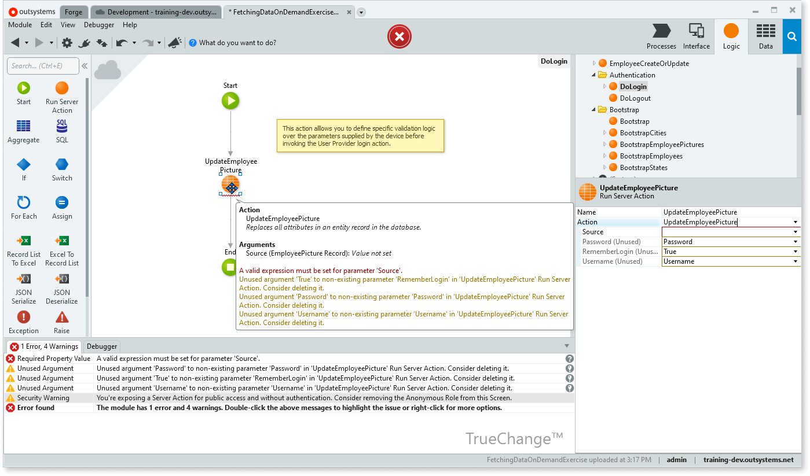
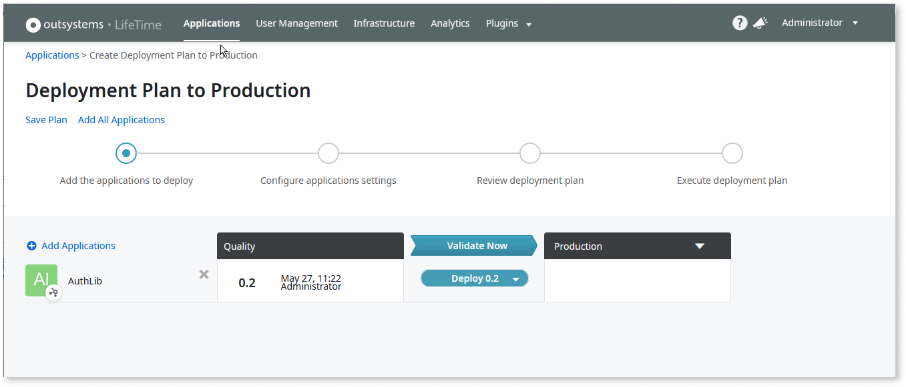

# DevOps and ALM in OutSystems

An article about DevOps typically begins with a short discussion about the history of the term, the philosophy behind its practice, the benefits of its use, and the elements of its culture. It also invariably features some version of the DevOps infinity loop, like the one pictured below.

At the risk of bucking tradition—and in the spirit of efficiency and asset reuse—the theory part of this introduction has been replaced with the following links. You are invited to click through to review the [history](https://en.wikipedia.org/wiki/DevOps#History), [philosophy](https://aws.amazon.com/devops/what-is-devops/), [benefits](https://www.atlassian.com/devops), and [culture](https://azure.microsoft.com/en-us/overview/what-is-devops/) of DevOps at your leisure.

One observation, however, before jumping in. Software development and infrastructure operations are commonly described as “robust,” “efficient,” and “cutting-edge,”—or, all too often, “monolithic,” “sluggish,” and “rigid.” Neither “Dev,” nor “Ops,” alone, inspires the kind of lofty language used for “DevOps.”

On its face, this rather awkward blended word conjures up the joining of development and operations in a marriage-of-convenience: two silos that adopt a shared name and agree to frequent meetings for hand-offs.  

However, for an enterprise beginning to implement [DevOps for legacy modernization](https://www.outsystems.com/blog/posts/applying-devops-to-legacy-modernization/), it is a journey to increase agility, deliver applications at high velocity, improve products at a faster pace, and serve customers better than the competition. And enterprises that have fully embraced the DevOps vision know that the search for continuous improvement never stops—not only to provide the best user experience, but also to refine the process that brings apps from planning to release.

There are no hard-and-fast rules, no “best” way, no ideal toolchain. Every enterprise designs a workflow that suits their specific needs. However, there is a broad consensus about the basic guidelines for building successful DevOps, and this article discusses one good starting point in this journey: using a development platform that provides built-in DevOps capabilities, supports the entire application lifecycle, and facilitates easy integration with major third-party systems.

## DevOps implementation in OutSystems

OutSystems has changed the way enterprise software is built, and, in the same way, the traditional DevOps infinity loop has been reimagined to make it simpler, streamlined, and more elegant.

If you compare this model with the one pictured after the opening paragraph, you’ll notice a number of differences, such as fewer steps and different names. But what truly sets this model apart is that these stages don’t loop around the negative spaces of an infinity symbol. Instead they circle the core of the OutSystems platform, which provides a set of out-of-the-box capabilities that reduce the complexity of implementing a DevOps approach in a software factory.

One of the highest bars to implementing DevOps is choosing [what tools to use](https://www.logicworks.com/blog/2019/11/stop-arguing-about-devops-tools/)—decisions that must be taken before even getting started. OutSystems lets you start building from day one by using the fundamental DevOps practices and patterns built into the OutSystems core:

* Fast development with low-code
* Easy integration with any external enterprise system
* Integrated version control
* Embedded build server
* Cross-environment deployment
* Access control policy
* Real-time monitoring
* Full extensibility through plugins and APIs

To be clear, OutSystems does not pretend to be all things to all people. Our DevOps model was defined to best capitalize on the platform’s strength, flexibility, and extensibility. It has been successfully implemented by many of our customers in major factories, but it continues to evolve and improve—in the DevOps spirit—based on input from real-world experience. And an integral part of the OutSystems core is easy integration with major third-party tools to supplement, or elevate, built-in functionality.

## Plan

Planning is a crucial first step for any complex endeavor, and for a software factory it is the crux of the DevOps loop. There is a plethora of resources available that outline planning methods and techniques. Among the most useful for software development is prototyping: translating business requirements and workflows into a wireframe working model, using it as a basis to create high-fidelity mockups and provide a good overview of the application’s look and feel—and only then proceed with development.

Read [Front-End Journey: From Mockups to Code](https://success.outsystems.com/documentation/best_practices/development/front_end_journey_from_mockups_to_code/) for a description of prototyping in Outsystems.

## Develop

In factories using traditional software methods, development comprises two stages in the DevOps loop: coding followed by building:

1. **Code**: Writing classical code, not unlike composing classical music, is an art that requires years of practice and experience to learn the requisite skills. For an enterprise beginning to modernize legacy systems—or for those with DevOps already in place—finding reinforcements for the development team can be daunting, particularly in an ever-changing business environment that requires agility and speed to meet customer needs.
1. **Build**: Building an app using classical programming methods typically comprises modifying database files, pre-processing code, compiling it, assembling it, and then linking the result to all of its function calls. Bugs in any step may only be revealed as the result of a failed compilation, which triggers a manual code review for troubleshooting.

To fill this expertise gap, many companies have adopted low-code software development platforms with drag-and-drop interface design, pre-built components, and push-button database integration. While OutSystems is a visual domain specific language, it is built on top of standard third generation language (3GL) programming elements, effectively sidestepping pre-built [4GL](https://en.wikipedia.org/wiki/Fourth-generation_programming_language) drawbacks, which can include sluggish performance, cybersecurity risks, and inaccessible support for third-party components.

The OutSystems platform straddles multiple steps of the DevOps loop by consolidating coding, validation, and building using a combination of automation, AI, and analytics.

[Service Studio](https://success.outsystems.com/Documentation/11/Getting_started/Service_Studio_Overview), the Outsystems visual development environment, is not meant to replace experienced coders. Instead, it vastly increases their productivity with [AI-assisted development](https://success.outsystems.com/documentation/11/developing_an_application/implement_application_logic/code_mentor_logic_suggestions/), which predicts what is needed as logic or workflow is being built—and even gives a choice of the most likely properties for newly created nodes. At the same time, colleagues with different skill sets can develop anything from simple departmental applications to more complex mission-critical enterprise apps—all without the need to write a single line of code. And, unlike many low-code offerings, OutSystems does not lock developers into a limited number of blocks, modules, and components. OutSystems is endlessly extensible, and developers with expertise in classical coding can use their skills to expand built-in capabilities to fulfill specific use cases.

Here are the steps of the OutSystems **Develop** stage:

1. **TrueChange™** acts as an “always-on-call” QA department, identifying architecture errors, faulty logic, and broken dependencies—during development, in real time—directing developers to the source of the problem along with suggestions on how to correct it.
1. **1-Click Publish** deploys a module to the current environment only after all detected errors have been fixed.
1. **Compare and Merge** identifies any conflicts that may have been previously published by other developers so they can be corrected.

### [TrueChange™](https://success.outsystems.com/Support/Enterprise_Customers/Handling_technical_debt_with_OutSystems#TrueChange™)

When a developer makes changes to a model, the **TrueChange™** engine provides immediate feedback on its impact. By inspecting the model for consistency—a method similar to syntactic and semantic analysis used in classical coding—**TrueChange** checks if the model is well-formed and well-typed, and, at the same time, detects many other problems, including those that may lead to performance issues, marking them accordingly for followup.

In the image below, **TrueChange** has identified two errors, noted three unused arguments, and given a warning about a security concern. Clicking links in the **TrueChange** tab brings the developer to the issue to be corrected.

Most importantly, the module cannot be built until all errors have been resolved.

### 1-Click Publish

**1-Click Publish** does what it says: replaces the pain of compilation, integration, troubleshooting, and bug hunting with a single click, encouraging frequent publication so developers can verify that none of their changes, large or small, will break anything.

### Compare and Merge

In environments where many developers work on the same module at the same time, [Compare and Merge](https://success.outsystems.com/documentation/best_practices/lifecycle/handling_technical_debt_with_outsystems/#compare-and-merge) first tries to merge new code with the changes that other developers published in the meantime. If automatic integration is not possible, the developer can review the results in the **Compare and Merge** window, as seen in the image below. Drilling down into conflicts, shown in red, displays the changes between the versions. Once the conflicts have been reconciled and all of the merges approved, the app can then be published.

To supercharge the development process, OutSystems offers the following design tools:

* For reactive Web apps, **Workflow Builder** empowers business experts, analysts, and process owners to solve their own internal productivity challenges through an easy-to-use wizard that abstracts the development process.

### Workflow Builder

[Workflow Builder](https://success.outsystems.com/documentation/11/developing_an_application/create_case_management_and_workflow_apps/create_workflow_apps_with_workflow_builder/) is an IT-governed tool that allows anyone in the organization who designs and manages workflows to quickly build apps for task management and automation, thus extending the team of in-house app developers.

**Workflow Builder** generates reactive web apps and deploys them on your development environment, going through the same application development lifecycle as any other OutSystems app, with proper architecture, and following all the best practices.

When published in the target environment, **Workflow Builder** bootstraps the app's configurations, which includes creating groups of users and app roles.

While a workflow app can be designed from scratch, **Workflow Builder** includes templates to accelerate development for the following use cases:

* Project request
* Approval request
* Issue report

A workflow app, as it evolves, may outgrow its original design. For example, its scope may expand to require a feature that is not available in **Workflow Builder**, such as integration with an outside service like SAP or Salesforce. In this case, [the workflow app can be converted](https://success.outsystems.com/documentation/11/developing_an_application/create_case_management_and_workflow_apps/create_workflow_apps_with_workflow_builder/converting_a_workflow_builder_app_to_service_studio/) to **Service Studio**, where it can continue to be developed with all of the capabilities available in the OutSystems platform.

Once stakeholders are satisfied with the user journeys of the mobile app, it can be [opened for further development](https://success.outsystems.com/documentation/11/developing_an_application/create_mobile_apps_with_experience_builder/extend_your_experience_builder_app_in_service_studio/) in **Service Studio**.

## Test

No one disputes the importance of testing throughout the application lifecycle. The heat in the discussion comes from details about automation, techniques, priorities, budget allocations, and team resources. However, everyone agrees that, if there were an ideal solution, it would be fast, efficient, automatic—and would catch that bug lurking in production which will soon be discovered by a dissatisfied user.

OutSystems gives your factory a step up in this testing quest. Self-healing capabilities automatically correct problems and notify developers of any issues they must handle. Continuous integrity validation tracks dependencies, automates database updates, and analyzes the impact on running applications throughout their lifecycles, ensuring that nothing is broken at deployment time. A [deployment plan](https://success.outsystems.com/documentation/11/managing_the_applications_lifecycle/deploy_applications/deployment_plans/) assesses the impact of moving applications to a target environment, checks software package integrity, validates the overall quality of application—including a set of functional, performance, and security criteria.

When compared to traditional development technologies, the OutSystems platform results in fewer bugs, reduced test-and-fix cycles, and a more streamlined development and deployment pipeline. However, this does not eliminate the need for testing during the application lifecycle. So the original questions remain: how and where and when.

### The test pyramid

While the specifics vary, there is a general consensus about testing. Especially with agile development practices, DevOps culture, and continuous integration and continuous deployment, a strategy to integrate automated tests is vital so teams can move fast—and move with confidence.

There is no way to automate everything, and such an effort would prove self-defeating. Deciding which tests to automate requires a cost-benefit analysis: to make sure that the results will justify the effort of writing and maintaining automated test scripts. The [OutSystems Testing Guidelines](https://www.outsystems.com/tk/redirect?g=5b8189ce-c413-481c-ba0a-ef1598996630)give a detailed overview, and a workplan, for setting up automatic testing.

A key concept for successful testing is to write testable applications: distributing functionality into small, testable pieces. In OutSystems, this means adopting a multi-layer framework architecture that promotes the correct abstraction of reusable services and components. [AI Mentor Studio](../../monitor-and-troubleshoot/manage-tech-debt/intro.md) provides an integrated, bird’s eye view of an entire portfolio of applications and the interdependencies between modules in the developers’ environment, classifying every architecture module into its correct class.

The [test pyramid](https://martinfowler.com/articles/practical-test-pyramid.html), as illustrated below, shows how segregated testing facilitates creation of a healthy, fast, and maintainable test suite. Delivery teams can write a comprehensive set of easily automatable unit tests to cover critical business functionality, prepare a set of integration tests to define the scope of regression for each application deployment, and save more complicated automated UI tests for critical UI flows.

The tests described below are easily available and field-tested, but they don't represent a comprehensive list by any means. OutSystems generates standard applications, so any testing framework or vendor can be used, according to customer needs.

### Component tests

[Component tests](https://www.outsystems.com/tk/redirect?g=0f836bfe-225b-41b0-851e-91b04544362c) validate the behavior of single units of code. These tests correspond to unit tests in traditional high-code technologies. In OutSystems, these map to action elements that implement business logic.

#### BDD test framework

Many enterprises, especially those with CI/CD pipelines, use some form of behavior-driven development, or BDD, to frequently analyze various test results. Anyone building with OutSystems can take advantage of BDD frameworks, where all participants in a software project, both technical and non-technical—developers and business analysts—can collaborate to define a common understanding of how the software should behave.

To implement BDD testing, OutSystems provides two components from the Forge to create separate apps for test scenarios, [BDDFramework](https://www.outsystems.com/forge/component-overview/1201/bddframework) for server-side tests, and [BDDFramework Client Side](https://www.outsystems.com/forge/component-overview/10917/bddframework-client-side) for client-side tests.

Each test is built using the following syntax:

* **Scenario**: the specific scenario that illustrates a business rule
* **Given**: the initial scenario context—the required pre-conditions to conduct the action/event being tested
* **When**: a specific action/event
* **Then**: the expected outcomes of conducting the action/event in the system

See the [Complete Guide To BDD Testing In OutSystems](https://www.outsystems.com/blog/posts/bdd-testing/) for instructions about setting up a BDD framework.

#### Unit Testing Framework

[Unit Testing Framework](https://www.outsystems.com/forge/component-overview/387/unit-testing-framework), an open-source application freely available from the Forge, allows you to easily develop and run unit tests for your OutSystems projects.

### Integration tests

[Integration tests](https://success.outsystems.com/documentation/11/testing_your_application/outsystems_testing_guidelines/integration/api_testing/#api-integration-tests), often called API tests, validate integration with external systems, such as a middleware layer, or a direct integration with any other independent system, such as applications that expose APIs to external parties.  

#### BDD test framework

[BDDFramework](https://www.outsystems.com/forge/component-overview/1201/bddframework), described above, can also be used to write integration tests.

#### TestFramework

[TestFramework](https://www.outsystems.com/forge/component-overview/2464/testframework), an open-source application freely available from the Forge,  offers simple management and automated execution of OutSystems unit and API tests. With seamless integration with [BDDFramework](https://www.outsystems.com/forge/component-overview/1201/bddframework) and [Unit Testing Framework](https://www.outsystems.com/forge/component-overview/387/unit-testing-framework), it provides automated setup and execution of regression tests, and with [Ghost Inspector](https://www.outsystems.com/forge/component-overview/1316/ghost-inspector) integration, it allows the inclusion of automated UI tests in the test suites.

### E2E tests

[End-to-End (E2E) tests](https://www.outsystems.com/tk/redirect?g=7b8f66bb-5f78-4ff7-8248-85d4a25b6589), also called system tests, validate complete functionality from an end-user or system perspective. End-to-end tests are typically executed through a web or mobile user interface, though not all E2E tests are UI tests. Because of the complexity of developing a testing script and the high maintenance required, typically such tests are limited to critical use cases, particularly ones with happy paths.

#### BDD test framework

[BDDFramework](https://www.outsystems.com/forge/component-overview/1201/bddframework), described above, can also be used to write E2E tests.

#### Ghost Inspector

[Ghost Inspector](https://www.outsystems.com/forge/component-overview/1316/ghost-inspector) is an automated website testing and monitoring service that checks for problems with your website or application. It carries out operations in a browser, the same way a user would, to ensure that everything is working properly.

### Other testing tools

Because OutSystems generates standard applications, any testing framework or vendor can be integrated into your OutSystems DevOps testing workflow, including the popular third-party tools below:

* [Applitools](https://applitools.com/) is designed to test and monitor critical functional and visual aspects of any web, mobile, and native app in a fully automated way.
* [Appium](http://appium.io/) is an open-source automation tool where you can run scripts and test native, mobile, web, and hybrid applications on Android or iOS using a web driver.
* [Azure DevOps](https://azure.microsoft.com/en-us/services/devops/) is an automation tool that covers the entire application lifecycle, providing version control, reporting, requirements management, project management, automated builds, testing, and release management capabilities.
* [Browserstack](https://www.browserstack.com/) is a cloud web and mobile testing platform that enables developers to test their websites and mobile applications across on-demand browsers, operating systems and real mobile devices, without requiring users to install or maintain an internal lab of virtual machines, devices or emulators.
* [Elastic](https://www.elastic.co/pt/) is used for monitoring and analytics, Elastic is the most popular enterprise search engine that provides a distributed, multitenant-capable full-text search engine with an HTTP web interface and schema-free JSON documents.
* [Jenkins](https://www.jenkins.io/) is an open-source automation tool for monitoring the execution of repeated tasks that can be used with any operating system.
* [Katalon®](https://www.katalon.com/) is a free tool that provides a complete web testing solution to set up test projects, test suites, test cases, test objects for UI or API testing, custom keywords, test data files, and reporting. It easily integrates with Git for versioning and has plugins for integration with other tools like Jira®, Jenkins®, and Slack®.
* [Selenium](https://www.selenium.dev/) is a portable software testing framework for web applications that provides a record/playback tool for authoring tests without learning a test scripting language. It also provides a test domain-specific language (Selenese) to write tests in many popular programming languages, including Java, C#, Groovy, Perl, PHP, Python, and Ruby.
* [SauceLabs](https://saucelabs.com/) allows users to run tests in the cloud, providing a comprehensive test infrastructure for automated and manual testing of desktop and mobile applications using Selenium, Appium, and JavaScript unit testing frameworks. It also provides a secure testing protocol, Sauce Connect, for testing applications behind customer firewalls.
* [Tricentis Tosca](https://www.tricentis.com/) is used to automate end-to-end testing for applications. It combines multiple aspects of software testing, such as test case design, test automation, test data design and generation, and analytics to test GUIs and APIs.

## Deploy

In OutSystems, deployment means moving a [tagged version](https://success.outsystems.com/documentation/11/managing_the_applications_lifecycle/deploy_applications/tag_a_version/) of an application from one environment to another, starting in development and ultimately reaching production and the outside world.

[LifeTime](https://success.outsystems.com/documentation/11/managing_the_applications_lifecycle/), the OutSystems unified console for all environments in your infrastructure, plays an important part in every stage of DevOps. Among its [deployment](https://success.outsystems.com/documentation/11/managing_the_applications_lifecycle/deploy_applications/deploy_an_application/) functions are the following:

* [Tagging published modules](https://success.outsystems.com/documentation/11/managing_the_applications_lifecycle/deploy_applications/tag_a_version/): Developers can take a snapshot of the application and its modules, tag it with a version number, and then use it for deployment.
* [Deploying an Application](https://success.outsystems.com/documentation/11/managing_the_applications_lifecycle/deploy_applications/deploy_an_application/): Developers select a tagged application to move from one environment to another.
* [Rollback to a Previous Version](https://success.outsystems.com/documentation/11/managing_the_applications_lifecycle/deploy_applications/rollback_to_a_previous_version/): An application can be rolled back to its previous version in case a critical bug is detected.

The figure below shows the first step of deploying a tagged app to production:

## Release

But wait—isn’t release part of the “deploy” stage? Isn’t that what “deploy” means in the first place?

Well, yes and no—or, in other words, it depends. The confusion may stem from an [ambiguity of the meaning of CI/CD](https://www.outsystems.com/blog/posts/continuous-delivery-vs-continuous-deployment/). The “D” is sometimes said to refer to “deploy,” sometimes to “deliver.” Occasionally what one enterprise calls “deliver” another calls “deploy,” and vice versa.

“Release” is a modest attempt to clear up the confusion.

In the OutSystems DevOps model, a deployed app means that it has been moved to the next environment—but the timing of the final step, to production, is a business decision. Some enterprises do not want to leave this stage to an automated CI/CD pipeline. For these companies, a release candidate is first deployed to a pre-production environment where it can get a real workout, with real users and real data, where it can undergo additional load testing and performance testing—and, only then, will an authorized person manually approve it for release.

[Apache JMeter](https://jmeter.apache.org/) can be used to perform load tests and performance tests. You can see [this presentation](https://www.outsystems.com/training/lesson/1122/how-to-set-up-a-load-test-in-5-minutes) that demonstrates how this can be done.

## Secure

OutSystems dramatically accelerates the development of secure applications, and their deployment in a secure runtime environment. OutSystems’ built-in application lifecycle management capabilities promote a clear assignment of responsibilities in the DevOps processes, laying the foundation for a secure Software Development Lifecycle (SDLC).

Applications built with OutSystems benefit from an extra level of security in the application code itself. As visual application models are translated into standard .NET code, OutSystems uses secure code patterns that protect applications from the common web and mobile application vulnerabilities. Read [this article](https://success.outsystems.com/support/security/develop_secure_outsystems_apps/how_outsystems_helps_you_address_owasp_top_10/) to see how OutSystems helps you address the vulnerabilities defined by the Open Web Application Security Project foundation ([OWASP](https://owasp.org/)).

When new code vulnerabilities are found in generated code, fixes are included in subsequent releases of OutSystems. After upgrading their current OutSystems release, customer applications automatically incorporate the new security fixes, reducing the cost of maintaining OutSystems applications.

### OutSystems built-in security tools

OutSystems complies with, and accelerates the implementation of, common security requirements using built-in security tools.

#### [Application security checks](https://www.outsystems.com/evaluation-guide/outsystems-security-overview/#security-checks)

[Service Studio](https://success.outsystems.com/documentation/11/getting_started/service_studio_overview/) warns the developer at design time about potentially unsafe application patterns. Detected risks include code injection attacks, cross-site scripting, unvalidated redirects, and violation of data isolation when querying different databases.

#### [Identity management](https://www.outsystems.com/evaluation-guide/outsystems-security-overview/#identity-mgmt)

OutSystems automatically includes built-in logic for the following[end-user authentication](https://success.outsystems.com/documentation/11/developing_an_application/secure_the_application/end_users/end_users_authentication/) methods, including [single sign-on](https://success.outsystems.com/documentation/how_to_guides/integrations/how_to_configure_outsystems_to_use_identity_providers_using_saml/) (SSO):

* **Internal** authentication, the default method, stores end user information in the OutSystems database, but not the credentials. Instead, a cryptographic hash function is computed using the credentials—and only its result is stored. When the end user attempts to log in, the hash function is computed again and its result is compared with the database.
* **[Active Directory](https://success.outsystems.com/documentation/11/developing_an_application/secure_the_application/end_users/end_users_authentication/configure_active_directory_authentication/)** uses your Active Directory to authenticate end users. It is available only in self-managed installations.
* **[LDAP](https://success.outsystems.com/documentation/11/developing_an_application/secure_the_application/end_users/end_users_authentication/configure_ldap_authentication/)**, the Lightweight Directory Access Protocol method, authenticates the end user against your LDAP server, using either LDAP configured for Active Directory or standard LDAP.
* **[SAML 2.0](https://success.outsystems.com/documentation/11/developing_an_application/secure_the_application/end_users/end_users_authentication/configure_saml_2.0_authentication)**, Security Assertion Markup Language, is used in both traditional web apps and reactive web apps to authenticate end users with Single Sign-On (SSO) provided by commercial identity provider companies, such as [OneLogin](https://www.onelogin.com/) and [PingFederate](https://www.pingidentity.com/en/resources/downloads/pingfederate.html).
* **[Azure AD](https://success.outsystems.com/documentation/11/developing_an_application/secure_the_application/end_users/end_users_authentication/configure_azure_ad_authentication/)** uses SAML-based authentication to authenticate end users with Single Sign-On (SSO) provided by the Azure AD Identity Provider.
* **[Okta](https://success.outsystems.com/documentation/11/developing_an_application/secure_the_application/end_users/end_users_authentication/configure_okta_authentication/)** uses SAML-based authentication to authenticate the end users with Single Sign-On (SSO) provided by Okta.
* **[IdP Connector](https://www.outsystems.com/forge/component-overview/599/idp)** and [IdP Mobile](https://www.outsystems.com/forge/component-overview/2044/idp-mobile), community-supported connectors available from the Forge, can be downloaded and modified for use in mobile applications.

The OutSystems Forge includes community-supported connectors for integration with other authentication services, such as[OAuth2](https://www.outsystems.com/forge/component-overview/2647/google-services-oauth2) and[JWT tokens](https://www.outsystems.com/forge/component-overview/9043/jwt-token). External IdPs for identity management and access control for providers such as,[IAM OAuth](https://www.outsystems.com/forge/component-overview/5075/auth0-web-connector)/[SAML](https://www.outsystems.com/forge/component-overview/4312/saml-platform-authentication-plugin), and[OpenID Connect](https://www.outsystems.com/forge/component-overview/5823/okta-sso-with-openid-connect) can also be found on the Forge.

#### [Access control](https://success.outsystems.com/Documentation/Best_Practices/Architecture/Use_Access_Control_List_(ACL)_to_set_up_permission-based_access_to_data)

Role-based access control restricts access to your application’s pages depending on specific application level roles. Developers define application-level permissions for roles using visual building blocks. As an example, a role might restrict access to every application page that involves changing a specific database table.

Users can be provisioned and granted access to one or more roles. Users can be managed with OutSystems directly, or through applications using APIs that are available to developers. The definition of a user role is completely dynamic and independent of the application development phase.

#### [Encryption](https://www.outsystems.com/evaluation-guide/outsystems-security-overview/#encryption)

OutSystems enforces HTTPS/SSL encryption for native mobile applications, and recommends it for web and responsive applications. A system-wide setting allows you to either enforce HTTPS/SSL encryption for all web applications, or adjust it on each page or web service.

OutSystems Cloud allows full database encryption at rest. On self-managed infrastructures, system administrators can use the database vendor’s technology to activate encryption of data at rest and while in transit to the database. Alternatively, developers may build encryption in sensitive fields and tables, typically leveraging Forge components, such as the [Crypto API](https://www.outsystems.com/forge/component/437/cryptoapi/).

#### AI Mentor Studio

When [AI Mentor Studio](https://success.outsystems.com/documentation/11/managing_the_applications_lifecycle/manage_technical_debt/) analyzes your application code and runtime performance it also scans for security issues, including:

* SQL injection
* Visible disabled buttons
* Anonymous access screens
* Exposed unsecured REST services
* JavaScript or HTML injection (Traditional Web apps)
* Compromised mobile apps: rooted (Android) or jailbroken (iOS)

Along with each identified issue, AI Mentor Studio explains its impact and gives instructions for how to fix it. A list of all code analysis patterns can be found [here](https://success.outsystems.com/documentation/11/managing_the_applications_lifecycle/manage_technical_debt/code_analysis_patterns/#Security).

### Third-party tools

OutSystems generates standard applications from its runtime, enabling standard security assessment tools, such as static code analysis, to vet the runtime code.

To systematically ensure high-security standards for generated applications, OutSystems leverages security assessment tools as part of the automated quality assurance process for every product release. Integration with market-leading static code analysis tools has been set up for automatic code vulnerability scans during regression testing. These tests support an aggressive criteria for release acceptance, which requires fixes to all critical, high, and medium reported code vulnerabilities. This ensures that the generated code is inherently secure.

#### Static application security testing

Static application security testing (SAST) is used to secure software by reviewing the source code of the software to identify sources of vulnerabilities. You can [export the source code of your OutSystems apps](https://success.outsystems.com/support/security/static_application_security_testing/) and use it to run SAST using third-party tools such as [Omnext](https://www.omnext.com/), [Boncode](http://www.boncode.net/boncode-connector), and [SIG](https://www.softwareimprovementgroup.com/).

The same exported source code can be used by [Veracode](https://www.veracode.com/) to perform dynamic app security testing.

#### Penetration testing

A penetration test, also called a pen test or ethical hacking, can be used used to identify, test, and highlight vulnerabilities in your code in the OutSystems cloud using such third-party tools as [Neotys](https://www.neotys.com/) and [Tricentis](https://www.tricentis.com/).

To perform penetration tests, and vulnerability scans, authorization from OutSystems must be requested at least five business days before the start date for each test.

## Monitor

The true test of an app’s usability is revealed only once it has been released, when real users interact with it in real time, and expect a quick response to every request. To judge how you’re doing you need data—and OutSystems logs everything.

Applications are automatically instrumented to create over a dozen types of access and error logs, and the DevOps team has access to all of them—without having to write a single line of code.

### Logging

[Service Center](https://success.outsystems.com/documentation/11/managing_the_applications_lifecycle/monitor_and_troubleshoot/view_the_environment_logs_and_status/) includes logging information about main indicators, including the following:

* **General**: System and application activity
* **Traditional Web Requests** and **Screen Requests**: Server delays
* **Service Actions**: Service action delays
* **Integrations**: Execution delays of the actions of exposed and consumed integrations
* **Extensions**: Extension action delays
* **Timers**: Asynchronous logic irregularities
* **Emails**: Application logic involved in sending emails
* **Processes**: Business process errors
* **Mobile Apps**: App packages requested per application
* **Environment Health**: Status of the OutSystems services, asynchronous tasks, and environment.
* **Security**: Blocked IP addresses

A **Error Log** is shown below:

Each log entry is identified by a timestamp, the module where the error occurred, the actual error message, and a Detail link to view additional information.

The **Error detail** page includes the error ID, the session ID, environment information, and a stack trace.

In addition, the **Request Key** can be used to correlate all log and performance events. Click it to see the Request Log.

Here you can see that a particular web screen request generated two different errors, both in the same module. You have identified a probable source for this particular error; now your developers know where to go to begin fixing it.

### Analytics

Service Center Analytics contains a number of pre-aggregated reports, all of which can be filtered by type and by date.

The screen below shows the **Top Errors** report, arranged according to the number of errors and the module in which the errors occurred.

By clicking through to the module you can pinpoint the source of the problem and begin the process of correcting the error.

These metrics are captured asynchronously at run time, so application performance isn't compromised while creating a constant stream of metrics. Events captured include:

* Errors in all application layers
* Batch processing executions
* Inbound and outbound web services invocations
* Adapters, integration and custom API invocations
* Page accesses
* Database accesses
* External database accesses
* Client side screen access times

These logs are stored in a standard database that users can access to build their own dashboards.

While **Service Center** presents monitoring logs and analysis reports by way of numbers, which can make it difficult to parse,[LifeTime](https://success.outsystems.com/documentation/11/managing_the_applications_lifecycle/monitor_and_troubleshoot/troubleshoot_the_performance_of_an_application/) provides much the same data in a unified graphic console for analytics across all of your environments for traditional web apps.

The analytics dashboard for one app in the environment, covers all aspects of the[end-user experience](https://www.outsystems.com/evaluation-guide/what-kind-of-monitoring-and-analytics-does-outsystems-offer/#End-user_experience_analytics), a metric based on industry standard indicators of user satisfaction. By regularly checking **LifeTime**, developers can detect, troubleshoot, and solve performance issues even before end users report them.

The **End User Experience** tab displayed above shows the execution times of all queries, web service invocations, screen renderings, schedulers and invocations to adapters, external systems and custom APIs, which are all tracked asynchronously.

The **Application Performance Index** pane shows a downward trend, and the **Screen Action** pane shows that the[APDEX](https://success.outsystems.com/documentation/11/managing_the_applications_lifecycle/monitor_and_troubleshoot/the_apdex_performance_score/) value for Preparation is 59%, which indicates the source of the problem.

To investigate further click the problematic module and drill down to see more information to direct your developers’ troubleshooting efforts.

In a like manner, you can analyze the other three tabs, which, taken together, comprise the end-user experience:

* The **Client** dashboard displays performance issues per web page or screen action.
* The **Network** dashboard identifies performance issues with certain network conditions, so developers can optimize the application accordingly.
* The **Server** dashboard displays server response times by logging and reporting slow queries, integration responsiveness, or custom code invocation time.

Some additional built in tools:

* [Asynchronous Logging API](https://success.outsystems.com/documentation/11/reference/outsystems_apis/asynchronous_logging_api/): Your OutSystems applications can be instrumented for more advanced monitoring by referencing theAsynchronous Logging API module which provides actions to insert records into the database register request events of your applications. This captured information and data is then easily—and without any extra effort—made accessible with the rest of OutSystems logs and monitoring data.
* [App Feedback](https://success.outsystems.com/documentation/11/managing_the_applications_lifecycle/gather_user_feedback/enable_user_feedback_for_apps/): This service can be configuredin LifeTime so key users, during the acceptance stage, deployment, and after release, can send suggestions or report problems.

### Forge monitoring components

The[OutSystems Forge](http://www.outsystems.com/Forge/) includes the following monitoring and analytics tools:

#### Analytics APIs

All the insights from the analytics capability of OutSystems are publicly exposed in a flexible, easy-to-use, REST API that allows access to all registered events in real-time for seamless integration with other enterprise management solutions, and it also enables applications to register custom events.

For instance, the API can be used to extend the dashboard with business data, such as adoption monitoring per department. It's also possible to add a device’s GPS information to the events sent by applications to OutSystems for an exact understanding of where customers or employees were when they performed a specific action.

#### Business activity monitoring

OutSystems supports business process modeling so teams can quickly create a process on top of an existing application or set of applications. This is often used to guide users throughout existing business processes, such as order approvals, claims handling and other actions.

The[Business Activity Monitoring](http://www.outsystems.com/forge/component/132/business-activity-monitoring/) dashboard, an Outsystems-supported extension from the Forge, enables developers to start monitoring and optimizing their processes right after deploying them for the first time without the need for any development effort. Reports can be easily modified and extended to align with the business language of the organization using them.

#### MonitorProbe

[MonitorProbe](https://www.outsystems.com/forge/component-overview/4559/monitorprobe), an open-code component available for free download from the Forge, can be used to expose all the relevant OutSystems monitoring data through a set of REST APIs of a specific environment.

Like **Performance Monitoring API**, **MonitorProbe** gives you access to data that is otherwise accessible only through a direct query to the OutSystems platform database, such as logs and timers.

**MonitorProbe** presents the raw data about application behavior and performance in an easily accessible manner for monitoring and troubleshooting. In addition, using a tool that can import the exposed data, such as[Microsoft Excel](https://support.microsoft.com/en-us/office/import-data-from-external-data-sources-power-query-be4330b3-5356-486c-a168-b68e9e616f5a), you can build your own visualizations and create alerts on top of the OutSystems monitoring data.

#### Infrastructure Monitoring

For installations on the[OutSystems Cloud](https://www.outsystems.com/evaluation-guide/does-outsystems-monitor-customer-cloud-infrastructures/), resources, events, and availability are monitored on a 24/7 schedule. Alerts about relevant events enable proactive actions, and self-healing capabilities automatically start when needed to maintain the availability of a customer's systems.

Organizations that deploy their systems on a public cloud service take advantage of the infrastructure services offered.

For self-managed installations,[Infrastructure Monitoring](https://www.outsystems.com/forge/component-overview/1178/infrastructure-monitor), a LifeTime plugin available for free download from the Forge, provides quick and simple infrastructure monitoring, surfacing key performance metrics of your servers and creating alerts when these metrics reach thresholds that may compromise the performance or stability of your environments.

### Third-party monitoring and analysis tools

A great number of monitoring use cases can be served by the out-of-the-box tools. However, OutSystems demonstrates its strength as a development platform by making it easy to integrate this wealth of logged data with leading industry-strength monitoring and analysis platforms provided by third-party vendors. A representative example follows.

[Elastic](https://www.elastic.co/infrastructure-monitoring) is a powerful monitoring and observability tool that you can use to leverage OutSystems monitoring data and, if needed, even do real user monitoring (RUM) and application performance monitoring (APM).

**Elastic** allows you to monitor software services and applications in real time, collecting detailed performance information on response time for incoming requests, database queries, calls to caches, external HTTP requests, among others.

With **Elastic** integrated into your monitoring workflow, as seen above, you can extract extensive data logs for web and mobile apps, capturing log formats, networks, and firewalls from both cloud and on-premises sources that enriches the data collected by OutSystems.

In the example above, **logstash** monitors all queries from every environment so that **elasticsearch** can display it in a unified dashboard. Developers can use this dashboard to set thresholds for slow queries which can be checked at regular intervals. If deviations are detected, an alert is sounded.

#### Other RUM and APM integrations

The example above describes only one of the many monitoring and analysis tools and workflows that can easily be integrated into your OutSystems apps.

Moreover, the choice of third-party tools is often based on what an enterprise is already using. These tools increase the level of monitoring, providing more information regarding client and server performance for your applications. Most of them require a user license, and application instrumentation for them to function.

The[Forge](https://www.outsystems.com/forge/) includes many pre-built extensions for the most popular RUM and APM third-party tools that can be used as-is or as accelerators to create a custom connector to suit your particular needs.

Below are some popular extensions for third-party tools that you can use to accelerate integration of your OutSystems installation:

* [Pendo](https://www.outsystems.com/forge/component-overview/10203/pendo-for-outsystems)
* [Power BI](https://www.outsystems.com/forge/component-overview/10463/power-bi-embed-reports-reactive)
* [Splunk](https://www.outsystems.com/forge/component-overview/5822/splunk-hec-integration)
* New Relic:
    * [Traditional Web](https://www.outsystems.com/forge/component-overview/6849/new-relic-rum-for-web)
    * [Reactive Web / Mobile](https://www.outsystems.com/forge/component-overview/6849/new-relic-rum-for-web)
* AppDynamics:
    * [Traditional Web](https://www.outsystems.com/forge/component-overview/7124/appdynamics-rum-for-web)
    * [Reactive Web / Mobile](https://www.outsystems.com/forge/component-overview/7129/appdynamics-rum)
* Dynatrace:
    * [Traditional Web](https://www.outsystems.com/forge/component-overview/6851/dynatrace-rum-for-web)
    * [Reactive Web / Mobile](https://www.outsystems.com/forge/component-overview/6850/dynatrace-rum)
* Elastic:
    * [Traditional Web](https://www.outsystems.com/forge/component-overview/7236/elastic-rum-for-web)
    * [Reactive Web / Mobile](https://www.outsystems.com/forge/component-overview/7341/elastic-rum)
* Datadog:
    * [Traditional Web](https://www.outsystems.com/forge/component-overview/7330/datadog-rum-for-web)
    * [Reactive Web / Mobile](https://www.outsystems.com/forge/component-overview/7328/datadog-rum)

## Conclusion

A loop does not have a conclusion. Everything learned from monitoring circles right back to the beginning. The planning stage now serves as a backlog for the next incremental release, containing data generated by testers, feedback from users, issues discovered during monitoring, feature requests from business—and bug fixes to fast track through the loop and reach the general public as soon as possible.

The goal is not only to improve the product, but also to improve the DevOps process: to make them both faster, easier to use, and more reliable.
