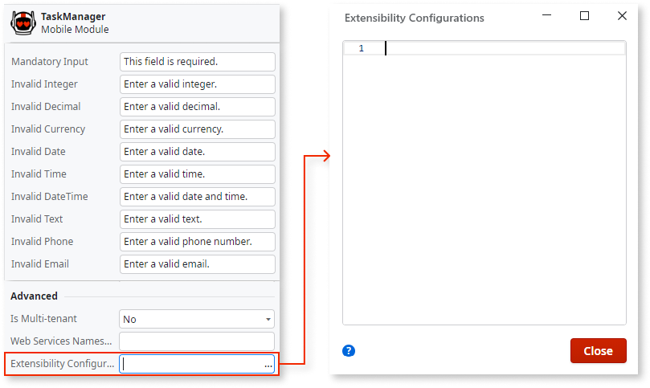
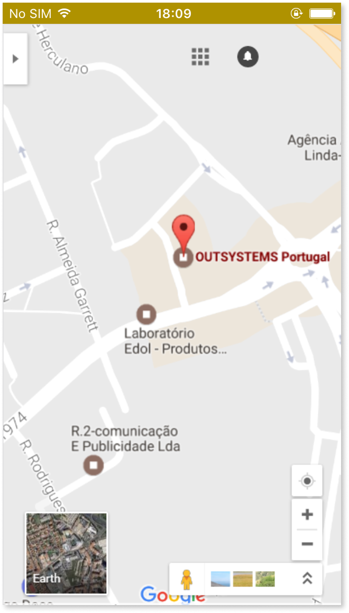

# Customize the application system bars with edge-to-edge display

<div class="info" markdown="1">

Applies only to Cordova mobile apps.

</div>

Mobile App Build Service (MABS) 12 introduces changes to how mobile apps handle system bars on Android 16 devices due to Android's new edge-to-edge enforcement. Edge-to-edge display extends your app content to the full screen, including areas behind the status bar and navigation bar. This document explains the preference changes from MABS 11 and how to migrate your app.

## Preference changes

| Property | Status |
| --- | --- |
| AndroidEdgeToEdge | Added |
| NavigationBarBackgroundColor | Added |
| StatusBarBackgroundColor | Unchanged |
| StatusBarDefaultScrollToTop | Removed/Ignored |
| StatusBarOverlaysWebView | Removed/Ignored |
| StatusBarStyle | Removed/Ignored |

## JavaScript API changes

| Property | Status |
| --- | --- |
| window.OSNavigationBar.setNavigationBarColor | Added |
| window.statusbar.visible | Added |
| window.statusbar.setBackgroundColor | Added |
| window.StatusBar.backgroundColorByHexString | Removed |
| window.StatusBar.backgroundColorByName | Removed |
| window.StatusBar.hide | Removed |
| window.StatusBar.isVisible | Removed |
| window.StatusBar.overlaysWebView | Removed |
| window.StatusBar.show | Removed |
| window.StatusBar.styleDarkContent | Removed |
| window.StatusBar.styleDefault | Removed |
| window.StatusBar.styleLightContent | Removed |

## CSS changes

| Variable | Status |
| --- | --- |
| --safe-area-inset-bottom | Added |
| --safe-area-inset-left | Added |
| --safe-area-inset-right | Added |
| --safe-area-inset-top | Added |
| --status-bar-height | Removed |

## Customizing the system bars

1. Go to Service Studio.

1. Open the **home module** of your mobile app.

1. In the module tree, select the module and, in the properties editor, open the **Extensibility Configurations** editor window:

    

1. Add the JSON properties to customize your application system bars according to the reference information presented below.  
    If you already have some extensibility configurations defined in the module, add the new content making the necessary adjustments.

1. After customizing the system bars you must install an [updated build of the mobile app](<../mobile-app-update-scenarios.md#situations-when-the-user-must-install-a-new-build>) on the devices for the changes to take effect.

## System bars customization reference

| Property | Values | Description |
| --- | --- | --- |
| AndroidEdgeToEdge | `True` or `False` | Whether the WebView will reach edge-to-edge or just between the system bars on Android devices.<br/>- If set to `True`, the app reports the safe area insets through the `--safe-area-inset-*` CSS variables. For more information, refer to [Safe area inset support](#safe-area-inset-support-safe-area-inset-support).<br/>- If set to `False`, the style of the status bar icons is automatically managed by the system.<br/>- If not set, defaults to `False`. |
| NavigationBarBackgroundColor | `#000000` to `#FFFFFF` or `#00000000` | The background color of the navigation bar.<br/>- If set to `#00000000`, the navigation bar follows the device theme.<br/>- If set to any other hex color, the navigation bar uses that color and it does not change when the device theme changes.<br/>- If not set, it matches the color defined in the `BackgroundColor` preference, which by default is your application's primary color.<br/>- Has no effect when `AndroidEdgeToEdge` is set to `True` on android 15+.<br/>- Expected color format: `#RRGGBB` or `#00000000`. |
| StatusBarBackgroundColor | `#000000` to `#FFFFFF` or `#00000000` | The background color of the status bar. Operates the same way as `NavigationBarBackgroundColor`, with the addition that the status bar style (light or dark text and icons) is automatically determined based on the color for optimal contrast. |

## System bars JSON template

Use the following template as a reference for defining a custom background color for the application status bar and navigation bar:

```javascript
{
    "preferences": {
        "global": [{
            "name": "StatusBarBackgroundColor",
            "value": "<#RRGGBB>"
        },
        {
            "name": "NavigationBarBackgroundColor",
            "value": "<#AARRGGBB>"
        }],
        "android": [{
            "name": "AndroidEdgeToEdge",
            "value": "<boolean>"
        }]
    }
}
```

## Examples

### Status bar using app primary color

If `StatusBarBackgroundColor` is not set, the status bar automatically uses your app's primary color with appropriate text styling for optimal contrast.

No extensibility configuration is required for this default behavior.

### Status bar with a custom color



```javascript
{
    "preferences": {
        "global": [{
            "name": "StatusBarBackgroundColor",
            "value": "#AF9200"
        }],
        "android": [{
            "name": "AndroidEdgeToEdge",
            "value": "False"
        }]
    }
}
```

## Safe area inset support {safe-area-inset-support}

To ensure your app content does not overlap with system UI elements such as the status bar, camera notch/cutout and navigation bar, the following custom CSS variables are available on both Android and iOS to expose the safe area insets:

```css
--safe-area-inset-bottom
--safe-area-inset-left
--safe-area-inset-right
--safe-area-inset-top
```

These variables report the value `0` under the following scenarios:

1. `AndroidEdgeToEdge` preference is set to `True` -- all variables return `0`
1. `window.statusbar.visible` is `false` -- some variables return `0` depending on the device orientation

Due to some quirks on older Android versions it is recommended to use injected variables with the standard [MDN environment variables](https://developer.mozilla.org/en-US/docs/Web/CSS/Reference/Values/env#parameters) as a fallback:

```css
var(--safe-area-inset-bottom, env(safe-area-inset-bottom))
var(--safe-area-inset-left, env(safe-area-inset-left))
var(--safe-area-inset-right, env(safe-area-inset-right))
var(--safe-area-inset-top, env(safe-area-inset-top))
```

**Example:**

```css
.your-class {
    margin-top: calc(var(--space-base) + var(--safe-area-inset-top, env(safe-area-inset-top)));
}
```

<div class="info" markdown="1">

For the best results, ensure OutSystemsUI / MobileUI is updated to the latest version.

</div>
