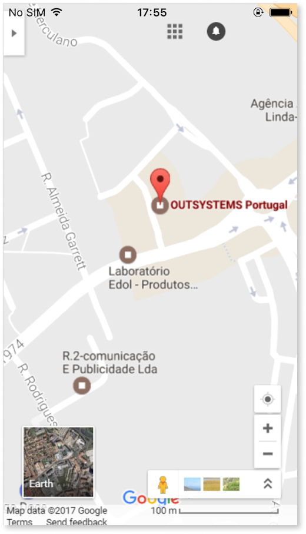

# Customize the application status bar

<div class="info" markdown="1">

Applies only to Mobile Apps. Apps built using MABS 12 and later versions, refer to [Customize the application systems bars with edge-to-edge display](customize-edge-to-edge.md).

</div>

In MABS 11, the native status bar in mobile apps is transparent and appears in front of the app content by default. This behavior can be customized without using any plugin.

In MABS 10 and earlier versions, the status bar is black and above the app content by default.

## Customizing the status bar

1. Go to Service Studio.

1. Open the **home module** of your mobile app.

1. In the module tree, select the module and, in the properties editor, open the Extensibility Configurations property editor window:

    

1. Add the JSON properties to customize your application status bar according to the reference information presented below.  
    If you already have some extensibility configurations defined in the module, add the new content making the necessary adjustments.

1. After customizing the status bar you must install an [updated build of the mobile app](<../mobile-app-update-scenarios.md#situations-when-the-user-must-install-a-new-build>) on the devices for the changes to take effect.

## Status bar customization reference

| Property | Values | Description |
| --- | --- | --- |
| StatusBarOverlaysWebView | `true` <br/> `false` | Defines whether the content of your app starts after the status bar or can appear behind the status bar.<br/>If set to `true` or **not set** in MABS 11 or newer, the content appears behind the status bar.<br/>If set to `false` or **not set** in MABS 10, the content starts after the status bar. |
| StatusBarBackgroundColor | `#000000` to `#FFFFFF` | The background color of the status bar. This is only used when the app content starts after the status bar.<br/>Expected color format: `#RRGGBB`. |
| StatusBarStyle | `default` <br/> `lightcontent` <br/> `darkcontent` | Defines the style of the status bar text and icons.<br/>When set to `default` (or **not set**), the status bar text and icons appear with the mobile platform's default color.<br/>When set to `lightcontent` or `darkcontent`, the status bar text and icons appear in a light or dark color defined by the mobile platform. |

## Status bar JSON template

Use the following template as a reference for defining a custom behavior for the application status bar. Depending on your use case, you can include just one of the properties in your extensibility configurations:

```javascript
{
    "preferences": {
        "global": [{
            "name": "StatusBarOverlaysWebView",
            "value": "<value>"
        },
        {
            "name": "StatusBarBackgroundColor",
            "value": "<#RRGGBB>"
        },
        {
            "name": "StatusBarStyle",
            "value": "<value>"
        }]
    }
}
```

## Examples

### Transparent status bar in full screen app



```javascript
{
    "preferences": {
        "global": [{
            "name": "StatusBarOverlaysWebView",
            "value": "true"
        }]
    }
}
```

### Status bar with a different color


```javascript
{
    "preferences": {
        "global": [{
            "name": "StatusBarOverlaysWebView",
            "value": "false"
        },
        {
            "name": "StatusBarBackgroundColor",
            "value": "#AF9200"
        }]
    }
}
```

## Known issues

Here are some known issues in customizing the status bar.

* In iOS 13, when using dark mode, it's not possible to use a status bar text color other than white, even when setting the StatusBarStyle to `default`. This is an [issue in Cordova's Status Bar plugin](https://github.com/apache/cordova-plugin-statusbar/issues/148).
* If your status bar customization doesn't show, you may be using an outdated version of OutSystems UI. Try updating OutSystems UI from Forge.
