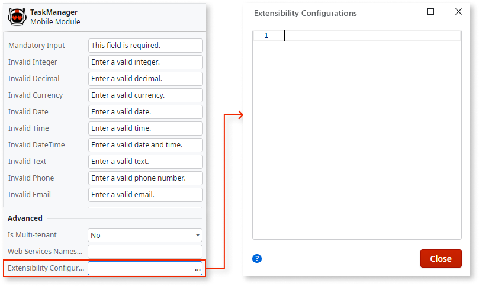
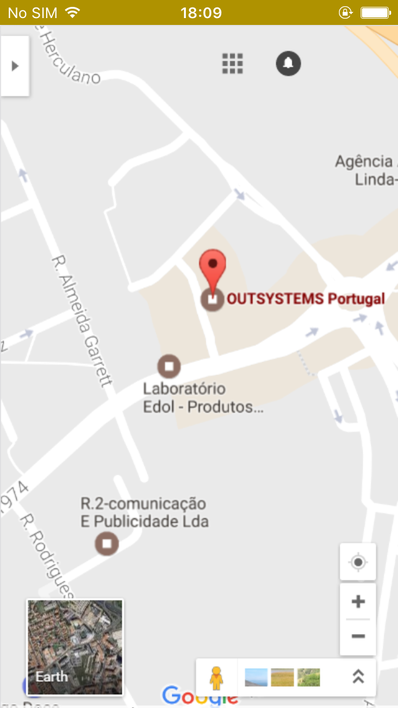

# Customize the Application Status Bar

<div class="info" markdown="1">

Applies only to Mobile Apps.

</div>

Since MABS 11, the native status bar in mobile apps has been transparent and appears in front of the app content by default. This behavior can be customized without using any plugin by following the instructions presented in the next section.

For previous MABS versions, the status bar is black and above the app content by default.

## Customizing the Status Bar

1. In Service Studio, open the **home module** of your mobile app.

1. In the module tree, select the module and, in the properties editor, open the Extensibility Configurations property editor window:

    

1. Add the JSON properties to customize your application status bar according to the reference information presented below.  
    If you already have some extensibility configurations defined in the module, add the new content making the necessary adjustments.

1. After customizing the status bar you must install an [updated build of the mobile app](<../mobile-app-update-scenarios.md#situations-when-the-user-must-install-a-new-build>) on the devices for the changes to take effect.

## Status Bar Customization Reference

| Property  |  Values  |  Description |
| ---|---|--- |
| StatusBarBackgroundColor  |  `#000000` to `#FFFFFF` |  The background color of the status bar. The status bar style (light or dark text and icons) is automatically determined based on this color for optimal contrast.<br/>If not set, the status bar uses your application's primary color.<br/>Expected color format: `#RRGGBB`. |

## Status Bar JSON Template

Use the following template as a reference for defining a custom background color for the application status bar:

```javascript
{
    "preferences": {
        "global": [{
            "name": "StatusBarBackgroundColor",
            "value": "<#RRGGBB>"
        }]
    }
}
```

## Examples

### Status Bar Using App Primary Color

When no `StatusBarBackgroundColor` is set, the status bar automatically uses your application's primary color with appropriate text styling for optimal contrast.

No extensibility configuration is required for this default behavior.

### Status Bar with a Custom Color



```javascript
{
    "preferences": {
        "global": [{
            "name": "StatusBarBackgroundColor",
            "value": "#AF9200"
        }]
    }
}
```

## Known Issues

Here are some known issues in customizing the status bar.

* If you choose to opt into `AndroidEdgeToEdge` (which is not the default) by manually changing the cordova preference, the style of your icons will not be up-dateable.
* On android 15, if you opt into `AndroidEdgeToEdge` there is a conflicting preference `android:windowOptOutEdgeToEdgeEnforcement` in `cdv_themes.xml` that will cause strange behavior, so be sure to remove that preference if you opt into `AndroidEdgeToEdge`
* Before setting `window.statusbar.visible` to `false`, set a background color that sets the style of the icons to match your preference.
